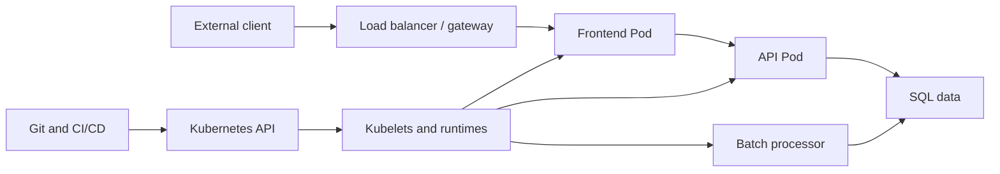
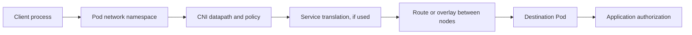

## Hacking Kubernetes — Complete Study Guide & Updated Reference

> 📘 **Start here:** Read Chapters 1–3 to establish the threat model and Linux isolation model. Continue through Chapters 4–8 for preventive controls, then Chapters 9–10 for detection and organizational ownership. Use Appendix A to connect configuration to observable evidence.

This is a source-grounded, rewritten study guide to **Hacking Kubernetes: Threat-Driven Analysis and Defense**, Andrew Martin and Michael Hausenblas, O’Reilly, first release October 13, 2021 (copyright 2022), ISBN 978-1-492-08173-9. It follows every heading in the PDF’s outline, including both appendices. Source references use printed pages; for the main text, PDF page = printed page + 16.

**Editorial approach.** The explanations below synthesize the supplied book rather than reproduce its prose. Outdated operational guidance is replaced in place and marked **Updated from the book**. Historical attacks remain historical examples. Additional exercises and explanations are identified as study material. Tool choices, performance, and provider defaults depend on the installed version and environment; the linked official documentation is authoritative for those details. Updates checked September 23, 2026.

**Confidence:** High for the source structure and documented mechanisms; Moderate for portability of illustrative configurations; Unknown for behavior in your own cluster, which was not inspected or changed. Commands are study examples, not a claim of successful execution. Use an isolated training cluster for write operations and failure tests. No attacks or cluster changes were performed while making this page.

> 🧪 **Hands-on practice:** Complete Lab 0 below, then follow the 10 labs embedded immediately after their related theory sections. The roadmap lists each location. Each lab includes the relevant YAML or Dockerfile, commands, expected evidence, troubleshooting, and cleanup.

<details>
<summary>Open the full table of contents</summary>

- [Lab Setup and Roadmap](#lab-setup-and-roadmap)
  - [Lab 0 — Prepare a disposable environment](#lab-0-prepare-a-disposable-environment)
    - [1. Start one Bash session and select the lab context](#1-start-one-bash-session-and-select-the-lab-context)
    - [2. Check the real image used throughout the labs](#2-check-the-real-image-used-throughout-the-labs)
    - [3. Define the namespace helper](#3-define-the-namespace-helper)
  - [Lab completion record](#lab-completion-record)
- [Cover](#cover)
- [Copyright](#copyright)
- [Table of Contents](#table-of-contents)
- [Preface](#preface)
  - [About You](#about-you)
  - [About Us](#about-us)
  - [How To Use This Book](#how-to-use-this-book)
  - [Conventions Used in This Book](#conventions-used-in-this-book)
  - [Using Code Examples](#using-code-examples)
  - [O’Reilly Online Learning](#oreilly-online-learning)
  - [How to Contact Us](#how-to-contact-us)
  - [Acknowledgments](#acknowledgments)
- [Chapter 1. Introduction](#chapter-1-introduction)
  - [Setting the Scene](#setting-the-scene)
  - [Starting to Threat Model](#starting-to-threat-model)
    - [Threat Actors](#threat-actors)
    - [Your First Threat Model](#your-first-threat-model)
  - [Attack Trees](#attack-trees)
  - [Example Attack Trees](#example-attack-trees)
  - [Prior Art](#prior-art)
  - [Conclusion](#conclusion)
- [Chapter 2. Pod-Level Resources](#chapter-2-pod-level-resources)
  - [Defaults](#defaults)
  - [Threat Model](#threat-model)
  - [Anatomy of the Attack](#anatomy-of-the-attack)
    - [Remote Code Execution](#remote-code-execution)
    - [Network Attack Surface](#network-attack-surface)
  - [Kubernetes Workloads: Apps in a Pod](#kubernetes-workloads-apps-in-a-pod)
  - [What’s a Pod?](#whats-a-pod)
  - [Understanding Containers](#understanding-containers)
    - [Sharing Network and Storage](#sharing-network-and-storage)
    - [What’s the Worst That Could Happen?](#whats-the-worst-that-could-happen)
    - [Container Breakout](#container-breakout)
  - [Pod Configuration and Threats](#pod-configuration-and-threats)
    - [Pod Header](#pod-header)
    - [Reverse Uptime](#reverse-uptime)
    - [Labels](#labels)
    - [Managed Fields](#managed-fields)
    - [Pod Namespace and Owner](#pod-namespace-and-owner)
    - [Environment Variables](#environment-variables)
    - [Container Images](#container-images)
    - [Pod Probes](#pod-probes)
    - [CPU and Memory Limits and Requests](#cpu-and-memory-limits-and-requests)
    - [DNS](#dns)
    - [Pod securityContext](#pod-securitycontext)
    - [Pod Service Accounts](#pod-service-accounts)
    - [Scheduler and Tolerations](#scheduler-and-tolerations)
    - [Pod Volume Definitions](#pod-volume-definitions)
    - [Pod Network Status](#pod-network-status)
  - [Using the securityContext Correctly](#using-the-securitycontext-correctly)
    - [Enhancing the securityContext with Kubesec](#enhancing-the-securitycontext-with-kubesec)
    - [Hardened securityContext](#hardened-securitycontext)
    - [Lab 1 — Prove the Pod filesystem boundary](#lab-1-prove-the-pod-filesystem-boundary)
  - [Into the Eye of the Storm](#into-the-eye-of-the-storm)
  - [Conclusion](#conclusion-1)
- [Chapter 3. Container Runtime Isolation](#chapter-3-container-runtime-isolation)
  - [Defaults](#defaults-1)
  - [Threat Model](#threat-model-1)
  - [Containers, Virtual Machines, and Sandboxes](#containers-virtual-machines-and-sandboxes)
    - [How Virtual Machines Work](#how-virtual-machines-work)
    - [Benefits of Virtualization](#benefits-of-virtualization)
    - [What’s Wrong with Containers?](#whats-wrong-with-containers)
    - [User Namespace Vulnerabilities](#user-namespace-vulnerabilities)
  - [Sandboxing](#sandboxing)
    - [gVisor](#gvisor)
    - [Firecracker](#firecracker)
    - [Kata Containers](#kata-containers)
    - [rust-vmm](#rust-vmm)
  - [Risks of Sandboxing](#risks-of-sandboxing)
  - [Kubernetes Runtime Class](#kubernetes-runtime-class)
  - [Lab 9 — Verify an installed sandbox runtime](#lab-9-verify-an-installed-sandbox-runtime)
    - [1. Inspect the configured class](#1-inspect-the-configured-class)
    - [2. Launch the bounded test](#2-launch-the-bounded-test)
    - [3. Clean up](#3-clean-up)
  - [Conclusion](#conclusion-2)
- [Chapter 4. Applications and Supply Chain](#chapter-4-applications-and-supply-chain)
  - [Defaults](#defaults-2)
  - [Threat Model](#threat-model-2)
  - [The Supply Chain](#the-supply-chain)
    - [Software](#software)
    - [Scanning for CVEs](#scanning-for-cves)
    - [Ingesting Open Source Software](#ingesting-open-source-software)
    - [Which Producers Do We Trust?](#which-producers-do-we-trust)
  - [CNCF Security Technical Advisory Group](#cncf-security-technical-advisory-group)
    - [Architecting Containerized Apps for Resilience](#architecting-containerized-apps-for-resilience)
    - [Detecting Trojans](#detecting-trojans)
  - [Captain Hashjack Attacks a Supply Chain](#captain-hashjack-attacks-a-supply-chain)
    - [Post-Compromise Persistence](#post-compromise-persistence)
    - [Risks to Your Systems](#risks-to-your-systems)
  - [Container Image Build Supply Chains](#container-image-build-supply-chains)
    - [Software Factories](#software-factories)
    - [Blessed Image Factory](#blessed-image-factory)
    - [Base Images](#base-images)
    - [Lab 6 — Demonstrate why image tags are not immutable identities](#lab-6-demonstrate-why-image-tags-are-not-immutable-identities)
  - [The State of Your Container Supply Chains](#the-state-of-your-container-supply-chains)
    - [Third-Party Code Risk](#third-party-code-risk)
    - [Software Bills of Materials](#software-bills-of-materials)
    - [Human Identity and GPG](#human-identity-and-gpg)
  - [Signing Builds and Metadata](#signing-builds-and-metadata)
    - [Notary v1](#notary-v1)
    - [sigstore](#sigstore)
    - [in-toto and TUF](#in-toto-and-tuf)
    - [GCP Binary Authorization](#gcp-binary-authorization)
    - [Grafeas](#grafeas)
  - [Infrastructure Supply Chain](#infrastructure-supply-chain)
    - [Operator Privileges](#operator-privileges)
    - [Attacking Higher Up the Supply Chain](#attacking-higher-up-the-supply-chain)
  - [Types of Supply Chain Attack](#types-of-supply-chain-attack)
    - [Open Source Ingestion](#open-source-ingestion)
    - [Application Vulnerability Throughout the SDLC](#application-vulnerability-throughout-the-sdlc)
  - [Defending Against SUNBURST](#defending-against-sunburst)
  - [Conclusion](#conclusion-3)
- [Chapter 5. Networking](#chapter-5-networking)
  - [Defaults](#defaults-3)
    - [Intra-Pod Networking](#intra-pod-networking)
    - [Inter-Pod Traffic](#inter-pod-traffic)
    - [Pod-to-Worker Node Traffic](#pod-to-worker-node-traffic)
    - [Cluster-External Traffic](#cluster-external-traffic)
    - [The State of the ARP](#the-state-of-the-arp)
    - [No securityContext](#no-securitycontext)
    - [No Workload Identity](#no-workload-identity)
    - [No Encryption on the Wire](#no-encryption-on-the-wire)
  - [Threat Model](#threat-model-3)
  - [Traffic Flow Control](#traffic-flow-control)
    - [The Setup](#the-setup)
    - [Network Policies to the Rescue!](#network-policies-to-the-rescue)
    - [Lab 4 — Verify NetworkPolicy with one allowed and one denied client](#lab-4-verify-networkpolicy-with-one-allowed-and-one-denied-client)
  - [Service Meshes](#service-meshes)
    - [Concept](#concept)
    - [Options and Uptake](#options-and-uptake)
    - [Case Study: mTLS with Linkerd](#case-study-mtls-with-linkerd)
  - [eBPF](#ebpf)
    - [Concept](#concept-1)
    - [Options and Uptake](#options-and-uptake-1)
    - [Case Study: Attaching a Probe to a Go Program](#case-study-attaching-a-probe-to-a-go-program)
  - [Conclusion](#conclusion-4)
- [Chapter 6. Storage](#chapter-6-storage)
  - [Defaults](#defaults-4)
  - [Threat Model](#threat-model-4)
  - [Volumes and Datastores](#volumes-and-datastores)
    - [Everything Is a Stream of Bytes](#everything-is-a-stream-of-bytes)
    - [What’s a Filesystem?](#whats-a-filesystem)
    - [Container Volumes and Mounts](#container-volumes-and-mounts)
    - [OverlayFS](#overlayfs)
    - [tmpfs](#tmpfs)
    - [Volume Mount Breaks Container Isolation](#volume-mount-breaks-container-isolation)
    - [The /proc/self/exe CVE](#the-procselfexe-cve)
  - [Sensitive Information at Rest](#sensitive-information-at-rest)
    - [Mounted Secrets](#mounted-secrets)
    - [Lab 5 — Compare Secret files with environment variables](#lab-5-compare-secret-files-with-environment-variables)
    - [Attacking Mounted Secrets](#attacking-mounted-secrets)
  - [Storage Concepts](#storage-concepts)
    - [Container Storage Interface](#container-storage-interface)
    - [Projected Volumes](#projected-volumes)
    - [Attacking Volumes](#attacking-volumes)
    - [The Dangers of Host Mounts](#the-dangers-of-host-mounts)
    - [Other Secrets and Exfiltraing from Datastores](#other-secrets-and-exfiltraing-from-datastores)
  - [Conclusion](#conclusion-5)
- [Chapter 7. Hard Multitenancy](#chapter-7-hard-multitenancy)
  - [Defaults](#defaults-5)
  - [Threat Model](#threat-model-5)
  - [Namespaced Resources](#namespaced-resources)
    - [Node Pools](#node-pools)
    - [Node Taints](#node-taints)
  - [Soft Multitenancy](#soft-multitenancy)
  - [Hard Multitenancy](#hard-multitenancy)
    - [Hostile Tenants](#hostile-tenants)
    - [Sandboxing and Policy](#sandboxing-and-policy)
    - [Public Cloud Multitenancy](#public-cloud-multitenancy)
  - [Control Plane](#control-plane)
    - [API Server and etcd](#api-server-and-etcd)
    - [Scheduler and Controller Manager](#scheduler-and-controller-manager)
  - [Data Plane](#data-plane)
  - [Cluster Isolation Architecture](#cluster-isolation-architecture)
  - [Cluster Support Services and Tooling Environments](#cluster-support-services-and-tooling-environments)
  - [Security Monitoring and Visibility](#security-monitoring-and-visibility)
  - [Conclusion](#conclusion-6)
- [Chapter 8. Policy](#chapter-8-policy)
  - [Types of Policies](#types-of-policies)
  - [Defaults](#defaults-6)
    - [Network Traffic](#network-traffic)
    - [Limiting Resource Allocations](#limiting-resource-allocations)
    - [Resource Quotas](#resource-quotas)
    - [Lab 8 — Distinguish quota rejection from scheduling failure](#lab-8-distinguish-quota-rejection-from-scheduling-failure)
    - [Runtime Policies](#runtime-policies)
    - [Lab 2 — Reject an unsafe Pod before it runs](#lab-2-reject-an-unsafe-pod-before-it-runs)
    - [Access Control Policies](#access-control-policies)
  - [Threat Model](#threat-model-6)
  - [Common Expectations](#common-expectations)
    - [Breakglass Scenario](#breakglass-scenario)
    - [Auditing](#auditing)
  - [Authentication and Authorization](#authentication-and-authorization)
    - [Human Users](#human-users)
    - [Workload Identity](#workload-identity)
  - [Role-Based Access Control (RBAC)](#role-based-access-control-rbac)
    - [RBAC Recap](#rbac-recap)
    - [A Simple RBAC Example](#a-simple-rbac-example)
    - [Authoring RBAC](#authoring-rbac)
    - [Analyzing and Visualizing RBAC](#analyzing-and-visualizing-rbac)
    - [RBAC-Related Attacks](#rbac-related-attacks)
    - [Lab 3 — Demonstrate indirect Secret access through Pod creation](#lab-3-demonstrate-indirect-secret-access-through-pod-creation)
  - [Generic Policy Engines](#generic-policy-engines)
    - [Open Policy Agent](#open-policy-agent)
    - [Kyverno](#kyverno)
    - [Other Policy Offerings](#other-policy-offerings)
    - [Lab 7 — Enforce a scoped native CEL policy](#lab-7-enforce-a-scoped-native-cel-policy)
  - [Conclusion](#conclusion-7)
- [Chapter 9. Intrusion Detection](#chapter-9-intrusion-detection)
  - [Defaults](#defaults-7)
  - [Threat Model](#threat-model-7)
  - [Traditional IDS](#traditional-ids)
  - [eBPF-Based IDS](#ebpf-based-ids)
    - [Kubernetes and Container Intrusion Detection](#kubernetes-and-container-intrusion-detection)
    - [Falco](#falco)
    - [Lab 10 — Follow a harmless shell event into Falco](#lab-10-follow-a-harmless-shell-event-into-falco)
  - [Machine Learning Approaches to IDS](#machine-learning-approaches-to-ids)
  - [Container Forensics](#container-forensics)
  - [Honeypots](#honeypots)
  - [Auditing](#auditing-1)
  - [Detection Evasion](#detection-evasion)
  - [Security Operations Centers](#security-operations-centers)
  - [Conclusion](#conclusion-8)
- [Chapter 10. Organizations](#chapter-10-organizations)
  - [The Weakest Link](#the-weakest-link)
  - [Cloud Providers](#cloud-providers)
    - [Shared Responsibility](#shared-responsibility)
    - [Account Hygiene](#account-hygiene)
    - [Grouping People and Resources](#grouping-people-and-resources)
    - [Other Considerations](#other-considerations)
  - [On-Premises Environments](#on-premises-environments)
  - [Common Considerations](#common-considerations)
    - [Threat Model Explosion](#threat-model-explosion)
    - [How SLOs Can Put Additional Pressure on You](#how-slos-can-put-additional-pressure-on-you)
    - [Social Engineering](#social-engineering)
    - [Privacy and Regulatory Concerns](#privacy-and-regulatory-concerns)
  - [Conclusion](#conclusion-9)
- [Appendix A. A Pod-Level Attack](#appendix-a-a-pod-level-attack)
  - [Filesystem](#filesystem)
  - [tmpfs](#tmpfs-1)
  - [Host Mounts](#host-mounts)
    - [Hostile Containers](#hostile-containers)
    - [Runtime](#runtime)
- [Appendix B. Resources](#appendix-b-resources)
  - [General](#general)
    - [References](#references)
    - [Books](#books)
  - [Further Reading by Chapter](#further-reading-by-chapter)
    - [Intro](#intro)
    - [Pods](#pods)
    - [Supply Chains](#supply-chains)
    - [Networking](#networking)
    - [Policy](#policy)
  - [Notable CVEs](#notable-cves)
- [Index](#index)
- [About the Authors](#about-the-authors)
- [Colophon](#colophon)
- [Supplementary Study Reference](#supplementary-study-reference)
  - [A complete attack-to-defense chain](#a-complete-attack-to-defense-chain)
  - [Control comparison](#control-comparison)
  - [Read-only review commands](#read-only-review-commands)
  - [Study sequence and completion criteria](#study-sequence-and-completion-criteria)
  - [Compact glossary](#compact-glossary)
  - [Review record](#review-record)

</details>

# Lab Setup and Roadmap

**Supplementary practical material · Linux workloads · Complete Lab 0 here, then study each lab immediately after its related theory section.** These are complete teaching procedures added to the book-based guide. Each lab uses dummy data, named resources, a bounded observation, and explicit cleanup. No lab was executed against your cluster during preparation.

**Reading the examples:** YAML blocks contain file contents; Bash blocks contain terminal commands; predicted results are labeled **Expected** or **Expected evidence**. Save each YAML file under the stated name before its command. Every lab image reference is complete and registry-verified; the YAML can be used without image substitution. Shell variables are assigned by the preceding commands or numbered selection menus. Do not paste a YAML block into a shell. Lab 9 writes its final manifest using the installed RuntimeClass you select.

| Lab | What you prove | Estimated study time | Location in this page |
| --- | --- | --- | --- |
| 0 · Setup | Correct cluster context and a verified, digest-pinned Python image. | 10 minutes | Start here: setup |
| 1 · Pod hardening | Root mount is read-only while scratch storage remains writable. | 15 minutes | Chapter 2 · Hardened securityContext |
| 9 · RuntimeClass | A real configured handler launches a compatible workload. | 15 minutes; requires installed sandbox | Chapter 3 · Kubernetes Runtime Class |
| 6 · Image integrity | A tag moves while the earlier content identity remains unchanged. | 15 minutes | Chapter 4 · Base Images |
| 4 · NetworkPolicy | One client succeeds while another is blocked, after both worked initially. | 20 minutes | Chapter 5 · Network Policies to the Rescue! |
| 5 · Secret rotation | Projected files refresh while environment variables retain startup values. | 15 minutes | Chapter 6 · Mounted Secrets |
| 8 · Resource quota | Admission refuses allocation beyond a namespace budget. | 10 minutes | Chapter 8 · Resource Quotas |
| 2 · Pod Security Admission | A valid Pod passes; an unsafe variant is rejected before execution. | 10 minutes | Chapter 8 · Runtime Policies |
| 3 · RBAC and indirect access | Pod creation can expose a dummy Secret despite denial of direct Secret reads. | 20 minutes | Chapter 8 · RBAC-Related Attacks |
| 7 · Native admission policy | A bound CEL rule enforces one label only in the selected namespace. | 15 minutes | Chapter 8 · Other Policy Offerings |
| 10 · Detection and evidence | A harmless shell event reaches the existing Falco alert stream. | 20 minutes; requires working Falco | Chapter 9 · Falco |

**Study order:** Follow the roadmap from top to bottom. Lab numbers remain stable identifiers; each lab appears directly after its related explanation. Complete Lab 0 first and keep its Bash session open.

## Lab 0 — Prepare a disposable environment

**Objective:** establish the prerequisites once and avoid accidental use of a production context.

**Required:** a disposable Kubernetes cluster with Linux workers and a currently supported Kubernetes release with the required APIs (1.30 is the historical minimum for these manifests, not a recommended release); a `kubectl` version supported for that server; Docker CLI with a running engine; local Python 3; and permission to create the lab namespaces and named resources. Labs 3 and 7 additionally require impersonation/RBAC and cluster-scoped policy permissions. Lab 4 requires a CNI that actually enforces NetworkPolicy. A default cluster that only stores NetworkPolicy objects is insufficient. Labs 9 and 10 are conditional on existing runtime/sensor installations.

### 1. Start one Bash session and select the lab context

Run the remaining commands in this same Bash session. The wrapper always targets the context you selected, even if your global current context changes later.

```bash
bash
set -o pipefail
mkdir -p hacking-kubernetes-labs
cd hacking-kubernetes-labs || exit 1
kubectl config get-contexts
LAB_CONTEXTS=()
while IFS= read -r context; do
  LAB_CONTEXTS+=("$context")
done < <(kubectl config get-contexts -o name)
unset LAB_CONTEXT
PS3='Select the disposable cluster by number: '
select LAB_CONTEXT in "${LAB_CONTEXTS[@]}"; do
  if [ -n "$LAB_CONTEXT" ]; then
    export LAB_CONTEXT
    break
  fi
  printf '%s\n' 'Choose one of the listed numbers.' >&2
done

k() {
  if [ -z "${LAB_CONTEXT:-}" ]; then
    printf '%s\n' 'LAB_CONTEXT is empty; repeat Lab 0.' >&2
    return 1
  fi
  kubectl --context="$LAB_CONTEXT" "$@"
}

k cluster-info
k version
k get nodes -L kubernetes.io/os
```

**Checkpoint:** recognize the cluster endpoint and Linux nodes. Stop on an unexpected cluster or failed command. Do not concatenate the entire workbook into an unattended script; expected denials deliberately return nonzero exit codes.

### 2. Check the real image used throughout the labs

The manifests use the official Python 3.13 slim image pinned to the complete registry digest below. The registry index and its Linux amd64/arm64 configurations were checked on September 23, 2026; both configurations report Python 3.13.15. Python supplies the HTTP server, client, and file-inspection commands used in the exercises. No image editing or substitution is required. [Official Python image](https://hub.docker.com/_/python)

```bash
docker pull docker.io/library/python:3.13-slim@sha256:8d9d0b8bcf6506481eae4907c18f5e3e7902e629f5f6d684f9e7c32e85e3ddf0
docker run --rm --network=none --read-only \
  docker.io/library/python:3.13-slim@sha256:8d9d0b8bcf6506481eae4907c18f5e3e7902e629f5f6d684f9e7c32e85e3ddf0 \
  python --version
```

**Expected:** the pull succeeds and the container prints `Python 3.13.15`. Stop on a failed pull or unsupported platform. The cluster workers also need access to Docker Hub; pulling on your laptop does not populate their image caches. The digest fixes the artifact identity; it is not a claim that the image is vulnerability-free.

### 3. Define the namespace helper

`new_lab` refuses to reuse an existing namespace and applies the Restricted Pod Security Standard pinned to `v1.30` for the exercise baseline. Each manifest already contains its real image reference and is applied directly with `k apply` or `k create`.

```bash
new_lab() {
  local namespace="$1"
  k create namespace "$namespace" || return 1
  k label namespace "$namespace" \
    pod-security.kubernetes.io/enforce=restricted \
    pod-security.kubernetes.io/enforce-version=v1.30 || return 1
}
```

**Finish condition:** the context is selected, the image check passes, the helpers exist, and the cluster prerequisites are understood. Cluster labs create and remove their own named namespaces; Lab 6 uses only local Docker images. Lab 7 also creates and removes its two explicitly named cluster-scoped admission objects. If namespace creation reports `AlreadyExists`, stop and inspect it; do not delete it to force a clean start.

**Troubleshooting:** `ImagePullBackOff` is a registry/architecture/access issue, not proof of a policy denial. `Pending` requires inspecting events and scheduling constraints. A forbidden API request requires the specific lab permission; do not solve it by granting workload service accounts cluster-admin.

## Lab completion record

For each lab, record **prediction → observed result → evidence → explanation → cleanup**. Mark conditional labs as “not available” when prerequisites are missing. The YAML and shell syntax in this workbook are checked statically; runtime outcomes remain hypotheses until you run the lab in the designated environment. Sleeping test Pods exit after one hour; complete each runtime comparison while its Pods are still running.

# Cover

The source is *Hacking Kubernetes: Threat-Driven Analysis and Defense*. Its fictional logistics company, BCTL, and adversary, Captain Hashjack, connect technical weaknesses into attack paths. This guide retains the scenarios where they clarify those paths.

# Copyright

Source: Andrew Martin and Michael Hausenblas, O’Reilly, first edition, copyright 2022. This is an independently rewritten study companion based on the supplied PDF, with current corrections; it is not an official publisher revision.

# Table of Contents

Use the interactive contents above to navigate this single page. The original section order is preserved. Lab 0 and the roadmap come first; the practical labs follow their related theory sections; the supplementary reference follows the book’s final sections.

# Preface

**Source: printed pp. ix–xiv.** The book assumes familiarity with containers and basic Kubernetes operation. Its distinctive approach is to examine the system from an attacker’s starting position, identify which trusted resource becomes reachable next, and choose controls that interrupt that path.

## About You

The material is intended for platform engineers, SREs, developers with operational responsibility, architects, and security practitioners. Before studying attacks, be able to explain a Pod, Deployment, Service, namespace, node, kubelet, API server, and service account. If these are unfamiliar, use the glossary at the end before proceeding. An effective learner should connect each control to a specific permission, interface, or resource—not memorize tool names.

## About Us

Martin and Hausenblas draw on experience building, operating, testing, and securing cloud-native systems. Their technical perspective combines offensive exploration with defensive engineering. Treat experience as context, not proof: a recommendation still needs to fit your kernel, runtime, distribution, cloud identity model, and threat assumptions.

## How To Use This Book

Each chapter moves from defaults and threats to mechanisms and controls. Study one trust boundary at a time. For each section, ask: what does the attacker already control, what additional authority is required, what crosses the boundary, and what observation demonstrates that the defense works? Work through the chapters in order initially; use the headings as a reference afterward.

**Updated from the book:** Its Kubernetes 1.21 baseline has been replaced with current stable API patterns and explicit prerequisites. PodSecurityPolicy, old Ingress/Deployment API versions, long-lived automatically created service-account token Secrets, and historical installation commands are not presented as current defaults.

## Conventions Used in This Book

`Monospace` denotes commands, paths, fields, and resource names. **Mechanism** explains causality; **Evidence** identifies observable behavior; **Limit** explains what a control cannot establish. Every YAML block names a complete, registry-verified image reference, so no image substitution is required. Environment-specific values such as namespace, node, and RuntimeClass names are either stated explicitly or discovered by the command that precedes them. An expected outcome is a prediction until tested.

Chapter examples outside the numbered labs are applied in three long-lived study namespaces. Create them once before working through the chapters; the numbered labs create and delete their own `hk-labNN` namespaces separately.

```bash
kubectl create namespace study
kubectl create namespace study-net
kubectl create namespace study-policy
```

## Using Code Examples

The original companion site is [Hacking Kubernetes](https://hacking-kubernetes.info). Examples here are simplified or corrected to explain their security properties. Pin dependencies and manifests before executing them; an old command that fetches a moving `master` branch or pipes a download into a shell is not a reproducible installation procedure. Review generated resources, including RBAC and host mounts, before applying them.

## O’Reilly Online Learning

The publisher’s learning platform supplies the original book and related training. This guide is designed to be independently useful for studying its technical topics; it does not replicate the publisher’s platform, illustrations, or ancillary services.

## How to Contact Us

Use the book’s publisher listing and errata mechanism for source corrections. For software behavior, use the relevant upstream documentation and security advisories. Distinguish a book erratum from a software behavior change: both may require revising your notes, but they have different causes.

## Acknowledgments

The book credits the maintainers, reviewers, security researchers, and communities whose work supports Kubernetes security. The practical lesson is that the supply chain includes people: reporting reproducible bugs, contributing fixes, and maintaining dependencies directly improves the systems you consume.

# Chapter 1. Introduction

**Source: pp. 1–13. Learning outcome:** Turn a business concern into an explicit attack path, a control, and a test.

## Setting the Scene

BCTL runs a frontend, API, batch processor, and SQL datastore on a self-managed Kubernetes cluster. Public requests arrive through a load balancer; nodes are in a private network. Deployments use GitOps, but network restrictions, workload restrictions, and inherited RBAC are inadequate. Some noisy security monitoring has been disabled. The attacker wants compute, data, or extortion opportunities.

A private node network removes direct internet exposure but does not remove paths through the public application, stolen developer credentials, the deployment pipeline, cloud APIs, or compromised dependencies. A managed control plane moves operational responsibility; it does not make an overprivileged application safe.



The diagram is a study reconstruction. Add identities, protocols, sensitive data, and control ownership to turn it into a useful threat model.

## Starting to Threat Model

A threat model is a structured argument about what can go wrong in a specific system. Define scope, assets, actors, entry points, data flows, and trust boundaries. Describe an unwanted outcome and the steps that can cause it. Prioritize by impact, exposure, feasibility, and existing controls; avoid treating a numerical score as certainty.

Patching and basic hardening remain necessary. Threat modeling adds value by exposing combinations that a vulnerability scanner cannot see—for example, an ordinary Pod-creation permission that allows use of a powerful service account. Revisit the model after architectural, identity, deployment, or tenancy changes.

### Threat Actors

The book distinguishes opportunistic attackers, motivated individuals, insiders, organized crime, cloud-provider insiders, and nation-state actors. Their motivations include curiosity, reputation, theft, ideological goals, extortion, espionage, and disruption. Capabilities range from published scripts to compromised insiders, supply-chain access, and novel exploits.

Use these categories to define plausible access and persistence, not to stereotype. An insider may have limited technical skill but valuable permissions; an external actor with a stolen SSO session inherits an insider-like position. OSINT such as job listings and public repositories can reveal technologies and attack opportunities without touching the cluster.

### Your First Threat Model

1. Choose a bounded target: for example, the public booking API and the customer records it can access.
2. Draw its inputs, outputs, identities, and dependencies, including CI/CD and cloud services.
3. Identify trust changes: internet to application, application to database, Pod to API server, container to node.
4. Brainstorm misuse with development, operations, security, and business stakeholders; cross-check against external frameworks afterward.
5. Record each threat with prerequisites, impact, preventive control, detection, owner, and a validation test.

**Worked threat:** A parser bug allows code execution in the API container. The attacker uses its database credentials to read customer records. The important boundary is application-to-data authorization; preventing container escape alone does not stop this theft. Minimize the database account’s scope, protect exposed parsers, monitor abnormal reads, and test that the account cannot access unrelated datasets.

## Attack Trees

An attack tree decomposes an attacker’s goal into prerequisites. An **OR** node means any child path succeeds; an **AND** node means all prerequisites are necessary. The book draws trees bottom-up, but direction is a presentation choice. Preserve the logical relationship.

For “steal cluster Secrets,” possible OR branches include authorized API access with stolen credentials, control-plane compromise, or reading mounted Secrets after node compromise. The API branch requires both network reachability and a credential authorized for the relevant operation. A firewall breaks reachability; RBAC restricts permission. Neither protects Secrets already readable by a compromised application.

## Example Attack Trees

From container RCE, the attacker can pursue: mounted credentials → datastore access; service-account token + API route + excessive RBAC → new workload or Secret reads; runtime socket/host access → node compromise; registry credentials → poisoned future deployments. These paths connect runtime compromise back into the software supply chain.

**Study exercise:** Draw the path “RCE → create Pod as a privileged service account → access protected API.” Mark the permission to create Pods, the ability to choose `serviceAccountName`, and the applicable admission controls. Do not assume that denying `get secrets` prevents access to Secrets mounted into attacker-created Pods.

## Prior Art

Use STRIDE to prompt threat categories: spoofing, tampering, repudiation, information disclosure, denial of service, and elevation of privilege. Use the MITRE ATT&CK Containers matrix and Microsoft Kubernetes threat matrix to check attack techniques, and Kubernetes security audits to inspect design-level assumptions. Generalized models are checklists for omissions, not evidence that every technique applies to your cluster.

**Updated from the book:** Consult the living [MITRE Containers matrix](https://attack.mitre.org/matrices/enterprise/containers/) and current [Kubernetes security guidance](https://kubernetes.io/docs/concepts/security/), rather than treating a 2021 matrix as complete.

## Conclusion

The unit of security reasoning is an attack path and its prerequisites. “Install a scanner” is not a complete mitigation statement. “Block unsigned images from this trusted builder at admission, verify rejection, and monitor bypasses” is much closer.

**Self-check:** Why is a private cluster not automatically secure? Because trusted access paths and compromised workloads can still reach sensitive interfaces. Why combine controls? Because a failure in one should not complete the whole attack path. Why update the model? Because permissions, dependencies, and reachable services change.

# Chapter 2. Pod-Level Resources

**Source: pp. 15–58. Learning outcome:** Explain exactly which Linux and Kubernetes controls constrain an attacker after application compromise.

## Defaults

A Pod is a deployment and shared-network unit, not a virtual machine. The API server accepts a desired specification; admission may validate or mutate it; the scheduler selects a node; the kubelet asks its CRI runtime to create the sandbox and containers. Network and storage integrations connect that workload to external resources.

Defaults vary by distribution and runtime. Inspect the admitted Pod and actual process state. An omitted `securityContext` does not mean every capability is granted, and Kubernetes does not make an application non-root merely because it is containerized.

**Updated from the book:** Privileged mode, root UID, host namespace sharing, and Linux capabilities are distinct settings. They are dangerous in combination but are not interchangeable. See [Linux kernel security constraints](https://kubernetes.io/docs/concepts/security/linux-kernel-security-constraints/).

## Threat Model

Start with a process compromised through an application bug or malicious dependency. Its immediate authority consists of its UID/GIDs, capabilities, mounted data, inherited credentials, network access, and allowed system calls. The attacker may seek persistence, secret access, lateral movement, node escape, resource theft, or disruption.

Ask what is available before any additional exploit. A process that legitimately reads a database password can leak it without becoming root. A workload with no API need should have no automatically mounted token and no unnecessary API network access. Protect the whole Pod, including helpers with broader permissions.

## Anatomy of the Attack

The fictional attacker investigates public DNS, object storage, application behavior, exposed versions, and API input handling. An exploitable request establishes execution inside the application’s environment. That foothold changes the attacker’s network position and gives access to whatever the application can already use.

Defend the first step with application security and patching. Defend the next steps with least privilege, data separation, admission policy, egress restrictions, and runtime monitoring. These are independent responsibilities: a hardened Pod cannot fix SQL injection, and secure application code cannot compensate for compromised build infrastructure.

### Remote Code Execution

RCE means attacker-controlled instructions run in the target process context. A shell is one manifestation; malicious library code can operate through the application runtime without spawning Bash. A reverse shell makes an outbound connection, so inbound-only firewalling is insufficient.

The Struts case illustrates how a dependency parsing hostile request input can expose the application’s authority. Rebuild the image with patched dependencies and redeploy; patching an unrelated host library does not necessarily update the bundled library. Removing shells reduces convenience but does not make arbitrary execution impossible. Observe unexpected subprocesses, outbound connections, and data access.

### Network Attack Surface

A reachable listener accepts input that may trigger bugs or abuse legitimate behavior. Public listeners are obvious, but internal administrative APIs, sidecars, metadata services, and databases become reachable after a foothold. Map actual endpoints rather than relying on Service names or intended topology.

A scan finds known vulnerabilities; it cannot prove the absence of exploitable logic. Narrow which sources can connect, authenticate callers, authorize individual operations, constrain egress, and keep components patched. Restrict the application’s access to the node and control plane independently of application-to-application traffic.

## Kubernetes Workloads: Apps in a Pod

Deployments maintain replicated application Pods; StatefulSets provide stable identities and storage relationships; DaemonSets place node-local agents; Jobs and CronJobs run bounded or scheduled work. A controller may recreate a deleted Pod, so incident response must inspect its owning workload template and deployment source.

Init containers prepare the environment. Sidecars can supply proxies, logging, or other services, but may introduce privileged setup or exposed administration interfaces. Treat co-located containers as mutually trusted for shared resources.

**Updated from the book:** Kubernetes now supports native sidecar containers using restartable init containers. Ordinary app-container startup is not a general dependency-order guarantee. See [sidecar containers](https://kubernetes.io/docs/concepts/workloads/pods/sidecar-containers/).

## What’s a Pod?

A Pod places one or more containers on one node with a shared network namespace and Pod identity. Containers can communicate over `localhost` and share volumes that are explicitly mounted into them. They normally retain separate root filesystems and mount namespaces; process-namespace sharing is a separate choice.

The runtime maintains the sandbox’s network namespace, often using an infrastructure or pause container. This separates network-sandbox lifetime from individual app-process restarts. The kubelet reconciles local workloads; the runtime executes them; the scheduler does not launch processes itself. Losing API connectivity does not immediately terminate every existing container.

**Study path:** desired Pod → authenticated and authorized API request → admission → stored state → scheduler binding → kubelet → CRI runtime → Linux processes plus CNI/CSI configuration. Every integration has credentials and an attack surface.

## Understanding Containers

A Linux container combines ordinary processes with isolation and restriction primitives. Namespaces change what resources processes see; cgroups account for and constrain resources; capabilities split privileged operations; seccomp filters system calls; AppArmor/SELinux restrict resource use; filesystem ownership and mount options control data access. The image supplies userspace files, not a private host kernel.

Image contents and runtime configuration are separate security dimensions. A minimal image run privileged with a host mount can be more dangerous than a larger image constrained correctly. Conversely, excellent runtime controls do not remove a vulnerable dependency or prevent misuse of an application’s legitimate credentials.

### Sharing Network and Storage

Every container sharing the Pod network can reach its peers’ loopback-bound services. Binding an admin interface to `127.0.0.1` keeps it away from other network namespaces, not from a hostile sibling container. A mesh sidecar admin endpoint therefore belongs in the Pod threat model.

Volumes are declared at Pod level and mounted per container. Give only the required containers access, use read-only mounts where possible, and set ownership deliberately. A shared writable directory can transfer malicious configuration or executable content. A container’s root filesystem is not automatically shared just because its network is.

### What’s the Worst That Could Happen?

The book expands the attack matrix across initial access, execution, persistence, escalation, evasion, credentials, discovery, lateral movement, command-and-control, and impact. Connect these categories: a compromised image executes on startup; a token permits creation of a CronJob; the CronJob survives the first Pod’s replacement; its permissions expose cloud storage; data theft becomes extortion.

Impact includes corrupted records, stolen data, cryptomining bills, unavailable services, poisoned customer artifacts, and overwhelmed security telemetry. Track direct and transitive authority. A GitOps controller, webhook, or registry credential may affect many future workloads even if it cannot directly read their current memory.

### Container Breakout

A breakout crosses an intended container boundary. It can result from a kernel/runtime vulnerability or from granted access such as a runtime socket, dangerous host mount, privileged mode, or shared host namespace. Misconfiguration often removes the need for an exploit.

Reduce host interaction: run as a non-root UID, drop unnecessary capabilities, set `allowPrivilegeEscalation: false`, use seccomp and an LSM, avoid host namespaces and runtime sockets, and patch the kernel/runtime. Use stronger sandboxes for hostile code. None of this prevents a compromised process from abusing data it must legitimately read.

**Important distinction:** UID 0 inside a container is not equivalent to an unconstrained host root process; effective capabilities, user namespaces, seccomp, LSMs, and exposed resources determine authority. Privileged containers are nevertheless a severe risk because many of these restrictions are relaxed.

## Pod Configuration and Threats

Review both the submitted workload template and the admitted Pod. A mutating webhook may inject containers, volumes, or credentials. Review all app, init, sidecar, and ephemeral-container paths; restricting only the first container leaves gaps. Use API inspection to understand intent, then process-level inspection to establish enforcement.

### Pod Header

`apiVersion` and `kind` determine the API schema. Metadata contains names, annotations, labels, owner references, and field-management information. It may reveal IPs, software integrations, or rollout details to a reader. Do not place secrets in annotations.

**Updated from the book:** Use `securityContext.seccompProfile` and the supported `appArmorProfile` field instead of historical seccomp/AppArmor annotations. Profile availability and host support still matter. A custom `Localhost` profile must exist on the node. [Security-context reference](https://kubernetes.io/docs/tasks/configure-pod-container/security-context/).

### Reverse Uptime

Long-running workloads may contain old dependencies, but Pod age is only a weak proxy for patch status. Restarting a month-old image gives a new Pod timestamp without fixing anything. Track the image digest, build time, dependency inventory, scanner-database freshness, and current exposure.

Rebuild and redeploy through a reproducible pipeline on dependency updates and vulnerability findings. A periodic rebuild is useful only if inputs and patches actually change. Validate the digest running in production against the approved artifact and keep rollback artifacts subject to the same vulnerability policy.

### Labels

Labels drive Service selectors, NetworkPolicy selection, admission exclusions, scheduling, and operational ownership. A typo can leave traffic unrestricted or route it to the wrong workload. A user who can modify security-relevant labels may influence policy application.

Test selector matches explicitly and govern who can change labels used as trust signals. Distinguish descriptive labels such as team names from enforcement inputs. Namespace labels used to grant cross-namespace access must not be freely editable by tenants whose access they regulate.

### Managed Fields

`metadata.managedFields` records field ownership for server-side apply. It helps investigate which field manager last managed parts of an object, but is not a tamper-proof audit trail or a complete record of human intent. Use API audit logs, version control history, and deployment provenance for attribution.

For review readability, omit managed fields unless debugging apply conflicts or field ownership. Do not confuse a manager string with a cryptographically authenticated actor.

### Pod Namespace and Owner

A namespace scopes namespaced APIs and many policies; it does not itself isolate networks, host kernels, or shared storage. Owner references connect Pods to ReplicaSets, Deployments, Jobs, or other controllers. Fixing only a live Pod often fails because its owner recreates the vulnerable specification.

Use `metadata.namespace` from the API, a downward API projection, or the configured service-account namespace file to establish context. DNS search domains are clues, not universal proof. A Pod references a Kubernetes ServiceAccount in its own namespace.

### Environment Variables

Environment variables are convenient configuration but poor places for long-lived secrets: applications may log them, crash reports may include them, and other sufficiently authorized processes may inspect them. Literal values in Pod YAML are visible to Pod readers. A Secret reference hides the value from that field but does not hide it from the consuming process.

Mounted Secret files allow per-container exposure and file permissions, and support eventual updates. Applications must reload updated files; environment values do not update in a running process. A compromised application can still read every credential it needs. Never rely on an obscure filename as the boundary.

### Container Images

Tags are mutable names; digests identify content. Pin approved image digests and verify signatures and provenance against trusted identities. A digest proves which content was requested, not that the content is benign. Compare the desired image with runtime `imageID` evidence, allowing for multi-platform manifest/index relationships.

`imagePullPolicy: Always` checks image resolution when starting a container and may reuse cached layers. It is not a host-compromise defense. Protect registries, build identities, and admission verification; treat a compromised runtime cache as a node incident.

**Updated from the book:** Do not assume all Docker Official Images remain verifiable using Notary v1. Docker is retiring Content Trust; use a supported Sigstore/Cosign or Notation verification workflow. [Docker retirement guidance](https://docs.docker.com/retired/).

### Pod Probes

Readiness controls whether a Pod should receive Service traffic; liveness can trigger container restarts; startup probes protect slow initialization from premature liveness failure. A dependency outage should not automatically trigger restart loops across healthy application processes.

HTTP/TCP probes originate through kubelet networking, while exec probes execute a command in the container. Review probe destinations and commands as security-sensitive configuration. A user allowed to deploy Pods may misuse probes to reach node-local destinations. Restrict destinations and dangerous host/network configuration through admission when the threat model requires it.

### CPU and Memory Limits and Requests

Requests guide scheduling and resource allocation; limits constrain runtime consumption. CPU limits can cause throttling, while memory-limit pressure can cause an OOM kill. Neither is a blanket denial-of-service prevention mechanism. PID exhaustion, disk pressure, network bandwidth, API requests, and application-level amplification need separate controls.

Define namespace quotas and LimitRanges to avoid unbounded tenant allocation. Size values using measurements: tiny CPU limits can damage latency and tiny memory limits can cause repeated restarts. cgroups v2 improves the resource-control model, but remains dependent on a trusted kernel and configuration. [Resource management](https://kubernetes.io/docs/concepts/configuration/manage-resources-containers/).

### DNS

DNS resolves service names and can reveal useful topology. An attacker does not need broad API read permission if DNS, environment variables, or network responses disclose endpoints. Hiding records does not prevent direct-IP access.

Allow required DNS traffic deliberately, monitor unusual lookup patterns, and constrain downstream connections. Historical wildcard enumeration techniques depend on CoreDNS versions and configuration; they are not guaranteed behavior. DNS denial can resemble an application outage, so distinguish name-resolution failure from transport or policy failure when troubleshooting.

### Pod securityContext

The Pod-level security context supplies applicable defaults such as UID, group, filesystem group, and seccomp. Container-level fields can override applicable defaults and set capabilities, privilege escalation, privileged mode, and read-only root filesystem. `hostNetwork`, `hostPID`, and `hostIPC` are Pod-spec fields, not children of a container security context.

`NET_RAW` concerns raw/packet sockets; ordinary UDP does not require it. `SYS_ADMIN` is broad; `SYS_MODULE` can affect the kernel; `SYS_PTRACE` enables powerful process inspection when access checks permit it; filesystem-related capabilities can bypass ordinary permissions. Drop all capabilities first and justify each addition.

**Updated from the book:** An empty context does not grant all capabilities. `runAsUser` is a numeric UID; `MustRunAsNonRoot` was a PSP strategy, not a valid UID. Use `runAsNonRoot: true` with an appropriate UID. [Security-context reference](https://kubernetes.io/docs/tasks/configure-pod-container/security-context/).

### Pod Service Accounts

A ServiceAccount is a namespaced API identity; its token is a credential representing that identity. RBAC determines authorization separately. Use a dedicated service account per distinct permission set, avoid granting application permissions to `default`, and disable automatic token mounting where API access is unnecessary.

**Updated from the book:** Current Kubernetes uses short-lived, bound tokens through TokenRequest/projected volumes for normal Pod access. Automatically generated long-lived token Secrets are historical behavior. Token rotation limits reuse after theft, but an attacker who remains inside the Pod can read refreshed credentials. [Service accounts](https://kubernetes.io/docs/concepts/security/service-accounts/).

### Scheduler and Tolerations

Scheduling determines which host and neighboring workloads a Pod can encounter. Node selectors and affinity select eligible nodes; taints repel Pods unless tolerated. A toleration permits placement—it does not require placement on the tainted node.

For security-sensitive pools, combine administrator-controlled node labels, enforced affinity/selectors, taints, and admission restrictions on tolerations and `nodeName`. Tenants must not be able to bypass placement rules or choose an untrusted scheduler. Separate availability constraints from security constraints, and test both.

### Pod Volume Definitions

Volumes can provide application data, configuration, credentials, host directories, and sockets. A projected volume combines selected sources into one directory; its service-account token can have an audience and requested lifetime. The kubelet renews bound tokens, so clients must reread them.

Review which containers mount each volume, whether it is writable, whether file permissions are useful, and whether the source is sensitive. A read-only credential remains readable and usable. Decimal mode `420` means octal `0644`; explicitly choose access modes rather than copying unexplained numbers.

### Pod Network Status

`status.podIP`, `podIPs`, and `hostIP` reveal placement and addressing. They help correlate network evidence, but status can be stale relative to rapidly changing workloads. A Pod IP is not a durable identity and can be reused.

Correlate traffic with Pod UID, namespace, node, time, and workload identity. A Running phase does not prove application readiness, connectivity, or security-policy enforcement.

## Using the securityContext Correctly

Apply controls as a coherent set. Non-root reduces privileged paths; dropping capabilities removes discrete operations; `allowPrivilegeEscalation: false` sets `no_new_privs`; seccomp restricts syscall access; an LSM governs resource use; a read-only root filesystem narrows modification opportunities. Explicit writable scratch storage keeps these controls compatible with legitimate behavior.

**Limit:** `no_new_privs` does not remove privileges already held, block kernel exploits, or remove credentials. Read-only roots do not stop in-memory execution or writes to separate writable mounts. Host namespace sharing and mounted runtime sockets can invalidate assumptions even when other fields look strict.

### Enhancing the securityContext with Kubesec

Kubesec statically reviews manifests and points out risky configuration or missing hardening. Similar configuration-audit tools can support CI and cluster review. Treat a score as triage, not certification: it cannot show whether the image is malicious, a policy is enforced by the CNI, or application credentials are excessive.

A useful workflow is manifest linting → schema validation → admission tests → admitted-object inspection → runtime evidence. Maintain explicitly reviewed exceptions for platform agents rather than lowering the whole cluster baseline.

### Hardened securityContext

**Illustrative Linux Pod template.** It uses the same registry-verified Python image as the labs, runs as UID/GID 10001, and serves static files from the writable `/tmp` volume, so it can be applied as written. Resource values are examples, not sizing advice.

```yaml
apiVersion: v1
kind: Pod
metadata:
  name: hardened-app
  namespace: study
  labels:
    app: hardened-app
spec:
  automountServiceAccountToken: false
  hostNetwork: false
  hostPID: false
  hostIPC: false
  securityContext:
    runAsNonRoot: true
    runAsUser: 10001
    runAsGroup: 10001
    fsGroup: 10001
    seccompProfile:
      type: RuntimeDefault
  containers:
    - name: app
      image: docker.io/library/python:3.13-slim@sha256:8d9d0b8bcf6506481eae4907c18f5e3e7902e629f5f6d684f9e7c32e85e3ddf0
      command:
        - python
        - -m
        - http.server
        - '8080'
        - --directory
        - /tmp
      ports:
        - name: http
          containerPort: 8080
      securityContext:
        privileged: false
        allowPrivilegeEscalation: false
        readOnlyRootFilesystem: true
        capabilities:
          drop: [ALL]
      resources:
        requests:
          cpu: 100m
          memory: 64Mi
        limits:
          cpu: 500m
          memory: 256Mi
      volumeMounts:
        - name: scratch
          mountPath: /tmp
  volumes:
    - name: scratch
      emptyDir:
        sizeLimit: 64Mi
```

Review additional LSM requirements and consider `hostUsers: false` on a compatible Linux/runtime stack. Do not add unsupported fields blindly. AppArmor `RuntimeDefault` is appropriate only on nodes with AppArmor support; custom SELinux labels require a compatible host policy.

**Evidence:** inspect `id`, `/proc/self/status`, mount flags, and the admitted Pod; run the application’s normal behavior; attempt only bounded forbidden operations in a disposable lab. A rejected write to `/etc` establishes read-only behavior for that path, not universal immutability.

### Lab 1 — Prove the Pod filesystem boundary

**Related:** Chapter 2. **Objective:** compare two otherwise identical nonroot Pods. One can write to its root mount; the other cannot. Both can use `/tmp`.

#### 1. Create the namespace and two Pods

```bash
new_lab hk-lab01
```

**Save as ****`01-writable.yaml`****:**

```yaml
apiVersion: v1
kind: Pod
metadata:
  name: writable
  labels:
    lab: '01'
    app: writable
spec:
  restartPolicy: Never
  automountServiceAccountToken: false
  securityContext:
    runAsNonRoot: true
    runAsUser: 10001
    runAsGroup: 10001
    fsGroup: 10001
    seccompProfile:
      type: RuntimeDefault
  containers:
    - name: app
      image: docker.io/library/python:3.13-slim@sha256:8d9d0b8bcf6506481eae4907c18f5e3e7902e629f5f6d684f9e7c32e85e3ddf0
      command:
        - python
        - -c
        - import time; time.sleep(3600)
      securityContext:
        allowPrivilegeEscalation: false
        readOnlyRootFilesystem: false
        capabilities:
          drop:
            - ALL
      resources:
        requests:
          cpu: 50m
          memory: 64Mi
        limits:
          cpu: 500m
          memory: 128Mi
      volumeMounts:
        - name: scratch
          mountPath: /tmp
  volumes:
    - name: scratch
      emptyDir:
        sizeLimit: 32Mi
```

**Save as ****`01-readonly.yaml`****:**

```yaml
apiVersion: v1
kind: Pod
metadata:
  name: readonly
  labels:
    lab: '01'
    app: readonly
spec:
  restartPolicy: Never
  automountServiceAccountToken: false
  securityContext:
    runAsNonRoot: true
    runAsUser: 10001
    runAsGroup: 10001
    fsGroup: 10001
    seccompProfile:
      type: RuntimeDefault
  containers:
    - name: app
      image: docker.io/library/python:3.13-slim@sha256:8d9d0b8bcf6506481eae4907c18f5e3e7902e629f5f6d684f9e7c32e85e3ddf0
      command:
        - python
        - -c
        - import time; time.sleep(3600)
      securityContext:
        allowPrivilegeEscalation: false
        readOnlyRootFilesystem: true
        capabilities:
          drop:
            - ALL
      resources:
        requests:
          cpu: 50m
          memory: 64Mi
        limits:
          cpu: 500m
          memory: 128Mi
      volumeMounts:
        - name: scratch
          mountPath: /tmp
  volumes:
    - name: scratch
      emptyDir:
        sizeLimit: 32Mi
```

```bash
k apply -n hk-lab01 -f 01-writable.yaml
k apply -n hk-lab01 -f 01-readonly.yaml
k wait -n hk-lab01 --for=condition=Ready pod/writable pod/readonly --timeout=120s
```

#### 2. Run the same write test in both Pods

`/var/tmp` is normally world-writable in this image and is part of the root mount. `/tmp` is the explicit writable volume. This avoids confusing a UID permission denial with a read-only mount.

```bash
for pod in writable readonly; do
  printf '\nPod: %s\n' "$pod"
  k exec -i -n hk-lab01 "$pod" -- python - <<'PYCODE'
from pathlib import Path
import os
print(f"uid={os.getuid()} gid={os.getgid()}")
for target in ("/var/tmp/root-marker", "/tmp/scratch-marker"):
    try:
        Path(target).write_text("lab-only\n")
        print(f"WRITE_OK {target}")
    except OSError as exc:
        print(f"WRITE_DENIED {target}: errno={exc.errno} {exc.strerror}")
PYCODE
done
```

**Expected evidence:** both report UID/GID 10001. `writable` succeeds on both paths. `readonly` reports errno 30 (`Read-only file system`) for `/var/tmp/root-marker` but succeeds on `/tmp/scratch-marker`.

#### 3. Inspect process restrictions

```bash
k exec -n hk-lab01 readonly -- sh -c \
  "awk '/^(CapEff|NoNewPrivs|Seccomp):/' /proc/self/status"
```

**Expected evidence:** effective capabilities are zero, `NoNewPrivs` is 1, and seccomp filter mode is 2 on a supporting Linux runtime. These observations establish specific restrictions; they do not prove the application cannot read its own credentials.

**Troubleshooting:** errno 13 is a filesystem permission failure, not the expected read-only result. Inspect the path’s ownership/mode. If the Pod fails to start, check `k describe pod readonly -n hk-lab01` before changing security settings.

#### 4. Clean up

```bash
k delete namespace hk-lab01
```

**Pass criterion:** explain why the read-only root does not prevent writes to `/tmp`. The separate volume is a separate writable mount.

## Into the Eye of the Storm

The fictional attacker’s initial attempts motivate deeper analysis of runtimes, build inputs, networking, storage, and identity. A failed breakout is not proof that the application’s data is safe. Follow the attacker’s remaining paths rather than ending the review at the container boundary.

## Conclusion

Secure the application and its runtime envelope together. Enforce the intended configuration at admission, verify the actual process state, and detect abuse that remains possible through legitimate authority.

**Self-check:** Does non-root imply no Secrets? No. Does read-only root imply no execution? No. Does dropping `NET_RAW` disable UDP? No. Why inspect owners? Because controllers recreate Pods from templates. Why inspect all containers? Because a privileged helper can expose the whole Pod or node.

# Chapter 3. Container Runtime Isolation

**Source: pp. 59–88. Learning outcome:** Choose an isolation boundary based on what must be protected from whom.

## Defaults

The kubelet communicates with a CRI implementation such as containerd or CRI-O. That implementation manages images and sandboxes and invokes a low-level runtime such as runc or a configured sandbox runtime. CRI is the Kubernetes integration boundary; OCI specifications describe image/runtime interoperability.

**Updated from the book:** Dockershim was deprecated in Kubernetes 1.20 and removed in 1.24, not removed in 1.20. Docker-built compatible images still work. `kubeadm` does not magically install every required runtime. Use CRI-aware operational tooling where appropriate. [Dockershim FAQ](https://kubernetes.io/blog/2022/02/17/dockershim-faq/).

## Threat Model

Two distinct goals drive sandboxing: protecting a sensitive workload from its neighbors, and protecting the platform from an untrusted workload. BCTL’s file-import processor accepts complex attacker-controlled input, so parser compromise is plausible even if basic string validation works.

Include CI builds, transcoding, plugin execution, and user-submitted code. Identify data the workload can already access: a stronger sandbox cannot stop a malicious parser from leaking the files and credentials legitimately supplied to it. Use data minimization and network/identity restrictions alongside isolation.

## Containers, Virtual Machines, and Sandboxes

Ordinary Linux containers share the host kernel. VMs run a guest kernel behind a virtualization boundary. Sandboxes reduce the interfaces an untrusted workload can directly exercise, using an application kernel, a microVM, or a VM-backed container model.

Compare compatibility, syscall and I/O overhead, startup cost, memory, hardware requirements, monitoring visibility, and operational maturity. No fixed ordering of “most secure” is valid without a threat model and configuration. A VM with sensitive host mounts can still expose data; a well-constrained container may be adequate for trusted application code.

### How Virtual Machines Work

Hardware-assisted virtualization and a virtual machine monitor provide a guest with virtual CPU, memory, and devices. In Linux, KVM provides virtualization facilities; a userspace VMM supplies management and device models. A guest-kernel compromise does not automatically confer host-kernel control, but the hypervisor, device emulation, and shared resources remain attack surfaces.

Containers use the host kernel directly through namespace-aware interfaces rather than emulating a separate hardware machine. A language VM such as the JVM is a different abstraction and should not be confused with a system VM security boundary.

### Benefits of Virtualization

An additional boundary can require an attacker to exploit both a guest environment and the virtualization layer. Narrow device models reduce reachable code, and separation can contain guest-kernel compromise. This is valuable for hostile tenants and sensitive workloads.

The cost includes guest memory, operational complexity, integration requirements, and potential I/O overhead. Measure real workloads and security-agent visibility. Memory-safe implementation languages reduce classes of memory corruption but do not eliminate logic flaws, unsafe code, side channels, or configuration mistakes.

### What’s Wrong with Containers?

Nothing is inherently wrong with containers; the key limitation is the shared kernel. A workload that can reach a vulnerable host-kernel path may cross the boundary. Namespace isolation does not rewrite that vulnerable code.

Reduce reachable kernel interfaces through capabilities, seccomp, LSMs, and least privilege. Keep runtime creation and exec paths patched as well as long-running workloads. A low-level runtime often creates the process and exits or delegates lifecycle handling; it is not generally a userspace proxy through which every later syscall passes.

### User Namespace Vulnerabilities

User namespaces map container UIDs/GIDs to different host IDs. Root inside a user namespace can have authority over resources owned by that namespace without being host root. Rootless operation also runs relevant runtime components without host-root privilege; non-root application execution alone is not the same thing.

Historical bugs in cloning, chmod, OverlayFS, and nested ID mapping demonstrate that namespace implementation itself requires patching. Evaluate the reduction in host privilege alongside kernel exposure, filesystem support, networking, devices, and operational compatibility.

**Updated from the book:** Linux Pod user namespaces reached GA in Kubernetes 1.36. On a compatible runtime/kernel/filesystem stack, `spec.hostUsers: false` enables them for a Pod. This does not isolate the host kernel or remove mounted secrets. [Upstream GA explanation](https://kubernetes.io/blog/2026/04/23/kubernetes-v1-36-userns-ga/).

## Sandboxing

The useful comparison is the syscall and device path. Ordinary container: application → host kernel. Application-kernel sandbox: application → reimplemented kernel interface → constrained host operations. MicroVM: application → guest kernel → virtual device/VMM boundary → host. Each narrows or changes direct host exposure.

Do not classify every sandbox as KVM-based or every sandbox as booting Linux. Inspect the actual architecture and enabled passthrough options. Features added for speed—host networking or device passthrough—can change the security argument.

### gVisor

gVisor’s `runsc` implements an OCI runtime. Its Sentry is an application kernel implementing Linux behavior, while a separate Gofer mediates filesystem access where configured. The workload does not directly issue arbitrary host syscalls; Sentry performs constrained host operations needed to implement its behavior. Its userspace network stack provides another separation from host networking paths.

**Updated from the book:** Systrap is the default interception platform; KVM is another supported platform. The old ptrace-focused account and fixed syscall counts are obsolete. gVisor is not simply a Linux VM or a syscall pass-through proxy. [Architecture](https://gvisor.dev/docs/architecture_guide/intro/), [platforms](https://gvisor.dev/docs/architecture_guide/platforms/).

**Study comparison:** Run the same approved test image under runc and an installed runsc runtime, then compare application tests, `/proc` visibility, throughput, I/O latency, and debugging behavior. Missing pseudo-files demonstrate a different exposed interface, not proof of universal security. Check application compatibility before production migration.

### Firecracker

Firecracker is a KVM-based VMM built around a deliberately small virtual-device model. It boots a guest kernel and workload in a microVM. The jailer constrains the VMM host process through identity, filesystem, namespace, cgroup, and seccomp controls. Isolation therefore includes both the guest boundary and confinement of the VMM itself.

Use it where the guest model and deployment integration fit the workload. A minimal VMM is not a complete Kubernetes platform: image preparation, orchestration, networking, storage, lifecycle, and telemetry still require integration. Do not reuse the book’s exact syscall counts or startup timings as guarantees. [Firecracker design and security](https://github.com/firecracker-microvm/firecracker/blob/main/docs/design.md).

### Kata Containers

Kata integrates container workflows with lightweight VMs. In Kubernetes, the sandbox commonly corresponds to the Pod; containers inside it share the VM boundary. The host runtime/shim manages lifecycle while a guest agent manages workload execution. Hypervisor choices and features depend on the Kata version and deployment.

This preserves a familiar container workflow while introducing a guest-kernel boundary. Evaluate device support, storage, networking, debugging, memory, and monitoring. A runtime name in a manifest is not enough: the appropriate handler and compatible nodes must be installed and selected. [Kata architecture](https://github.com/kata-containers/kata-containers/blob/main/docs/design/architecture/README.md).

### rust-vmm

rust-vmm is a collection of reusable Rust components for building VMMs, not a drop-in Kubernetes runtime by itself. Components cover areas such as guest memory and device/virtualization interfaces. Reusing focused, reviewed components can reduce duplicated low-level implementation work.

Rust’s ownership model prevents many memory-safety errors in safe code. It does not validate an entire hypervisor’s logic, configuration, unsafe sections, or interactions with the host. Evaluate the consuming VMM and its release process, not just the language used. [rust-vmm project](https://github.com/rust-vmm).

## Risks of Sandboxing

Additional isolation adds code, configuration, and operational dependencies. Risks include an unpatched guest kernel, vulnerable VMM, accidental passthrough, incomplete syscall support, poor logging, and response tools that cannot inspect the guest. A security team that cannot obtain evidence during an incident has a real limitation even when isolation is stronger.

Benchmark the application and exercise restore, upgrades, debugging, and telemetry. Avoid universal millisecond overhead estimates: startup, filesystem-intensive work, network-heavy work, and CPU-bound work behave differently. Maintain an explicit exception process for workloads incompatible with the chosen sandbox.

## Kubernetes Runtime Class

A cluster-scoped RuntimeClass maps a name to a CRI runtime handler configured on eligible nodes. A Pod requests it with `runtimeClassName`. The object does not install a runtime. Scheduling constraints and overhead configuration can be included where appropriate.

```yaml
apiVersion: node.k8s.io/v1
kind: RuntimeClass
metadata:
  name: gvisor
handler: runsc
---
apiVersion: v1
kind: Pod
metadata:
  name: sandbox-demo
  namespace: study
spec:
  runtimeClassName: gvisor
  automountServiceAccountToken: false
  containers:
    - name: app
      image: docker.io/library/python:3.13-slim@sha256:8d9d0b8bcf6506481eae4907c18f5e3e7902e629f5f6d684f9e7c32e85e3ddf0
      command:
        - python
        - -c
        - import time; time.sleep(3600)
```

Here `runsc` is an example handler name; it must exactly match node runtime configuration. Enforce eligible placement and require the RuntimeClass for workloads whose risk demands it. Verify successful creation and runtime evidence rather than only the presence of the field. [RuntimeClass](https://kubernetes.io/docs/concepts/containers/runtime-class/).

## Lab 9 — Verify an installed sandbox runtime

**Related:** Chapter 3. **Objective:** distinguish selecting a RuntimeClass from actually installing and using its handler.

**Conditional lab:** run only where a supported sandbox such as gVisor or Kata is already configured on compatible nodes. This workbook does not install runtimes or change node services. If none exists, record this lab as unavailable rather than inventing a handler name.

### 1. Inspect the configured class

```bash
k get runtimeclasses
RUNTIME_CLASSES=()
while IFS= read -r runtime_class; do
  RUNTIME_CLASSES+=("$runtime_class")
done < <(k get runtimeclasses -o jsonpath='{range .items[*]}{.metadata.name}{"\n"}{end}')
unset LAB_RUNTIME_CLASS
PS3='Select the installed sandbox class by number: '
select LAB_RUNTIME_CLASS in "${RUNTIME_CLASSES[@]}"; do
  if [ -n "$LAB_RUNTIME_CLASS" ]; then
    k get runtimeclass "$LAB_RUNTIME_CLASS" -o yaml
    break
  fi
  printf '%s\n' 'Choose one of the listed numbers.' >&2
done
```

If the list is empty, stop this conditional lab. Choose a class backed by gVisor or Kata, not an ordinary runc handler. Inspect `handler`, scheduling selectors/tolerations, and configured overhead. Confirm with the platform owner that the corresponding CRI handler exists on eligible nodes. A RuntimeClass object by itself is insufficient evidence.

### 2. Launch the bounded test

The following base file is complete YAML. The local patch command inserts the actual class selected above and writes `09-sandbox-selected.yaml`; that resulting file is the one created in the cluster. Do not apply the base file by itself.

```bash
new_lab hk-lab09
```

**Save as ****`09-sandbox.yaml`****:**

```yaml
apiVersion: v1
kind: Pod
metadata:
  name: sandbox-check
  labels:
    lab: '09'
    app: sandbox-check
spec:
  restartPolicy: Never
  automountServiceAccountToken: false
  securityContext:
    runAsNonRoot: true
    runAsUser: 10001
    runAsGroup: 10001
    fsGroup: 10001
    seccompProfile:
      type: RuntimeDefault
  containers:
    - name: app
      image: docker.io/library/python:3.13-slim@sha256:8d9d0b8bcf6506481eae4907c18f5e3e7902e629f5f6d684f9e7c32e85e3ddf0
      command:
        - python
        - -c
        - import time; time.sleep(3600)
      securityContext:
        allowPrivilegeEscalation: false
        readOnlyRootFilesystem: true
        capabilities:
          drop:
            - ALL
      resources:
        requests:
          cpu: 50m
          memory: 64Mi
        limits:
          cpu: 500m
          memory: 128Mi
      volumeMounts:
        - name: scratch
          mountPath: /tmp
  volumes:
    - name: scratch
      emptyDir:
        sizeLimit: 32Mi
```

```bash
k patch --local -f 09-sandbox.yaml --type=merge \
  -p "{\"spec\":{\"runtimeClassName\":\"${LAB_RUNTIME_CLASS:?Select an installed sandbox class first}\"}}" \
  -o yaml > 09-sandbox-selected.yaml
k create -n hk-lab09 -f 09-sandbox-selected.yaml
k wait -n hk-lab09 --for=condition=Ready pod/sandbox-check --timeout=180s
k get pod sandbox-check -n hk-lab09 \
  -o jsonpath='{.spec.runtimeClassName}{"\n"}{.spec.nodeName}{"\n"}{.status.containerStatuses[0].containerID}{"\n"}'
k exec -n hk-lab09 sandbox-check -- python -c \
  'import os, platform; print("uid:", os.getuid()); print("kernel view:", platform.release())'
```

**Expected:** the Pod runs and reports the selected class and node. The process runs as UID 10001. Kernel strings and container ID prefixes are useful context, but neither universally proves gVisor or Kata. Obtain node/runtime launch evidence for the specific container through your platform’s supported diagnostic interface before claiming the handler was verified.

**Troubleshooting:** `FailedCreatePodSandBox` can indicate a missing handler; Pending can indicate no eligible node; application errors can indicate sandbox incompatibility. Do not remove the requested class just to obtain a green result.

### 3. Clean up

```bash
k delete namespace hk-lab09
unset LAB_RUNTIME_CLASS
```

**Pass criterion:** a running Pod plus supporting runtime evidence. Without that evidence, record “configuration requested; implementation unverified.” Do not run breakout payloads to test the sandbox.

## Conclusion

Use stronger isolation when a compromised or intentionally hostile workload must not directly exercise the shared host-kernel interface. Keep workload credentials and network authority narrow regardless of runtime.

**Self-check:** Is non-root the same as rootless? No. Does user-namespace support eliminate kernel sharing? No. Does RuntimeClass install gVisor? No. Does a sandbox protect data already readable by malicious application code? No. What should determine the runtime choice? Threat boundary, compatibility, measured cost, and operational evidence.

# Chapter 4. Applications and Supply Chain

**Source: pp. 89–124. Learning outcome:** Explain exactly what a digest, signature, SBOM, provenance record, and deployment policy prove—and what they leave unproven.

## Defaults

A cluster normally runs the image named in a workload specification if it can retrieve it and admission allows the workload. It does not automatically establish that the image came from reviewed source, was built by an approved builder, contains no vulnerabilities, or is appropriate for its assigned privileges. A private registry establishes an access boundary, not the quality of everything uploaded to it.

Your application includes more than your repository: base image packages, language libraries, compiler and linker, build plugins, CI actions, package registries, credentials, image registry, deployment definitions, and controllers all affect the running result. A secure final Pod configuration cannot remove malicious logic deliberately compiled into the application.

## Threat Model

Start with the asset: the integrity of code that will execute with production authority. Follow the path from contributor to source repository, dependency resolver, builder, artifact storage, deployment controller, and runtime. For each transition, identify who can change the input, which identity authenticates it, and whether the receiver verifies that identity.

An attacker may compromise a maintainer account, publish a similarly named package, overwrite a mutable tag, poison a shared build cache, steal a signing key, modify a CI workflow, or make a trusted builder produce malicious output. These are different failure modes. Signing only the final image does not protect a builder that signs whatever an attacker submits.

## The Supply Chain

Think of a supply chain as a directed graph of trust, not a simple list of packages. A transitive dependency can bring executable installation scripts; a compiler can change a binary; a privileged CI runner can steal credentials for unrelated builds. The graph also includes human approval paths, identity providers, and the mechanism that distributes updates.

### Software

Source, build tools, dependencies, generated artifacts, deployment manifests, and infrastructure definitions are software inputs. A lockfile constrains dependency resolution, while a digest identifies specific content. Neither demonstrates that the selected content is desirable. Preserve the mapping from reviewed source revision to build inputs to output digest so that incident response can identify affected deployments.

Separate **immutability** from **freshness**. A pinned vulnerable image stays reliably vulnerable until you update the pin. Use reviewed, automated update proposals and rebuilds; do not solve reproducibility by freezing dependencies indefinitely.

### Scanning for CVEs

A vulnerability scanner inventories components, matches them to advisory data, and reports known issues. Results depend on package identification, database freshness, distribution backports, language ecosystem support, and whether the relevant code is actually present. A scanner can miss static binaries, vendored code, or malicious code without a published vulnerability.

Triage a finding by asking: Is the component installed? Is the affected function reachable? What privilege and configuration does exploitation require? Is an upstream or vendor fix available? What compensating control changes exposure? Record the reason and expiry of exceptions. Do not dismiss all critical findings because some are false positives, or block every build on an unexploitable package without a remediation path.

Scan during pull requests, after image construction, and periodically after release: new advisories can change yesterday’s acceptable result. The evidence should include the image digest, scanner version, database timestamp, findings, and disposition. “Zero known findings” is a bounded observation, not a security certificate.

### Ingesting Open Source Software

Use the actual upstream project and approved package source; compare package names carefully. Pin versions and integrity hashes where supported, review update diffs and installation hooks, and separate public from private package resolution. Dependency confusion occurs when a resolver selects an attacker-controlled package from a source you did not intend to trust.

Mirror or proxy dependencies only with an ownership model: who approves new packages, who updates them, who removes compromised releases, and how builds behave during upstream outages. Review maintainer changes and unusual release behavior for important dependencies. Small packages can be strategically important if they execute inside privileged build pipelines.

### Which Producers Do We Trust?

Trust should attach to a specific producer identity and process. “Downloaded over TLS,” “popular on a registry,” “official image,” and “cryptographically signed” answer different questions. TLS protects a connection to a server. A signature binds bytes to a signing identity. Popularity is social evidence. An official-image designation identifies a distribution program; it does not eliminate vulnerabilities or your configuration responsibilities.

Define allowed publishers and repositories, expected build identities, accepted provenance, review requirements, and revocation procedures. Verify the trust decision at consumption time. A list of approved producers that deployment tooling never checks is documentation, not enforcement.

## CNCF Security Technical Advisory Group

The book uses CNCF security guidance to connect application design, infrastructure controls, and supply-chain practices. The durable lesson is to apply controls throughout the lifecycle rather than treating production scanning as the entire security program. Organizational structures and document editions change; evaluate the maintained guidance itself rather than memorizing committee names.

### Architecting Containerized Apps for Resilience

Minimize each component’s authority and data access. Separate public request processing from sensitive administrative operations; use a distinct service account and credentials for each responsibility. Prefer replaceable instances, explicit dependencies, graceful failure, bounded retries, and reproducible deployment. Health checks should reflect service function without exposing secrets or invoking dangerous recovery behavior.

An application should continue operating safely when a dependency is slow or unavailable. A failed identity or policy service must not silently turn authorization off. At the same time, a security component that breaks every deployment during routine maintenance needs redundancy and an operational recovery path.

### Detecting Trojans

A trojan appears useful while performing an unwanted action. Package and image scanning primarily finds known component vulnerabilities; detecting a deliberately inserted backdoor requires other evidence: code review, source-to-binary provenance, behavior analysis, unexpected network destinations, file changes, and anomalous identity use.

No single dynamic test proves absence of a trojan. Malware can delay execution or depend on production-only conditions. Restrict outbound access and credentials so that a missed trojan has less authority. Compare an application’s declared behavior with what it actually does, especially during installation and startup.

## Captain Hashjack Attacks a Supply Chain

The scenario moves the attacker upstream: instead of repeatedly exploiting production Pods, compromise an input that the victim’s own automation will deploy. The defender may see an ordinary release, valid credentials, and a familiar registry. The malicious change crosses the trust boundary because the delivery system is trusted to introduce new executable behavior.

Analyze the chain as: attacker changes dependency or build input → trusted pipeline builds or packages it → artifact is distributed → deployment grants production identity → code uses that identity. Break the chain at several points with review, protected builds, verification, admission, and runtime restrictions.

### Post-Compromise Persistence

Deleting one compromised Pod is insufficient if its Deployment, image tag, source repository, CI workflow, operator, or GitOps controller recreates it. Persistence may live in the delivery process rather than on disk in a running container. Identify the authoritative desired state and verify that it is clean before restarting workloads.

Recovery includes revoking stolen tokens, protecting repositories, rebuilding in a clean environment, replacing affected artifacts, and finding every deployment of the compromised digest. A rollback is useful only if the earlier artifact and its supporting credentials remain trustworthy.

### Risks to Your Systems

A build credential can publish images across many applications. A registry administrator can replace artifacts or change access. A deployment controller may reconcile across namespaces or clusters. Evaluate the blast radius of each identity, not just whether it is called “CI.” Separate build, signing, publishing, and deployment authority where the threat model justifies it.

## Container Image Build Supply Chains

The build should resolve reviewed inputs, run in an isolated environment, produce an immutable output, record provenance, and publish to a controlled destination. Do not put secrets in Dockerfile `ARG`, `ENV`, copied files, or intermediate image layers. Removing a file in a later layer does not erase it from an earlier layer. Use builder-supported ephemeral secret delivery and ensure logs and caches do not retain the value.

### Software Factories

A software factory standardizes building and releasing. Its security advantage is repeatability and central enforcement; its risk is concentration of privilege. Untrusted pull requests should not run with production credentials. Isolate jobs, prevent cross-job workspace and cache contamination, restrict network access, and use short-lived credentials bound to the specific job.

**Hermetic** means a build’s inputs are controlled rather than fetched unpredictably from the environment. **Reproducible** means the same declared inputs and process yield the same output. **Isolated** means one build cannot interfere with another or with the host. These properties reinforce one another but are not interchangeable.

### Blessed Image Factory

A blessed-image process publishes approved, maintained base images with a clear owner and update policy. Applications inherit that baseline and add their own code. Track the dependency graph so a base-image fix triggers rebuilds of descendants; merely updating the base-image tag does not modify already built application images or running Pods.

Measure adoption, rebuild latency, exception age, and deployed vulnerable digests. Avoid a central platform team becoming an update bottleneck by automating rebuild proposals, tests, and publication evidence.

### Base Images

Choose the smallest maintained base that supports the application and operational requirements. Fewer packages reduce attack surface and scanning noise, but a minimal image is not automatically secure. Distroless images can complicate debugging; plan separate approved debugging tools rather than shipping every diagnostic tool in production.

Multi-stage builds keep compilers and build credentials out of the final stage. A nonroot `USER` improves the default but admission and Pod settings still determine runtime behavior. Pin the final base digest, track its origin, and update it deliberately. An image digest is a content identity, not a patch policy.

### Lab 6 — Demonstrate why image tags are not immutable identities

**Related:** Chapter 4. **Objective:** build two harmless local images under one tag and prove that the tag moves. No registry push or cluster change occurs.

**Prerequisite:** the Docker engine checked in Lab 0. The fixed local names below must be unused; choose a different prefix throughout this lab if they already contain your own work.

#### 1. Create a minimal image recipe

**Save as ****`Dockerfile.lab`****:**

```docker
FROM docker.io/library/python:3.13-slim@sha256:8d9d0b8bcf6506481eae4907c18f5e3e7902e629f5f6d684f9e7c32e85e3ddf0
WORKDIR /opt/lab
COPY version.txt /opt/lab/version.txt
USER 10001:10001
CMD ["python", "-c", "from pathlib import Path; print(Path('/opt/lab/version.txt').read_text().strip())"]
```

#### 2. Build and retain the first artifact

```bash
printf 'version-one\n' > version.txt
docker build -f Dockerfile.lab -t hk-study-local:current .
docker tag hk-study-local:current hk-study-local:v1
V1_ID="$(docker image inspect hk-study-local:v1 --format '{{.Id}}')"
docker run --rm --network=none --read-only hk-study-local:v1
```

**Expected:** `version-one`. `V1_ID` is a local image configuration digest; it is not interchangeable with the registry manifest/index digest used in a Kubernetes image reference.

#### 3. Move the tag to changed content

```bash
printf 'version-two\n' > version.txt
docker build -f Dockerfile.lab -t hk-study-local:current .
V2_ID="$(docker image inspect hk-study-local:current --format '{{.Id}}')"
printf 'v1: %s\nv2: %s\n' "$V1_ID" "$V2_ID"
test "$V1_ID" != "$V2_ID" && printf '%s\n' 'PASS: the tag now resolves to different content'
docker run --rm --network=none --read-only hk-study-local:current
docker run --rm --network=none --read-only hk-study-local:v1
```

**Expected:** different IDs; `current` prints `version-two`; `v1` still prints `version-one`.

**Interpretation:** a familiar tag can refer to different bytes. Pin deployed registry digests and separately verify producer/build evidence. This experiment proves mutability, not that either image is vulnerable or malicious. It does not substitute for SBOM or signature verification.

#### 4. Clean up the two lab image tags

```bash
docker image rm hk-study-local:current hk-study-local:v1
unset V1_ID V2_ID
```

Keep the small source files if you want to repeat the lab. The shared base image and build cache remain; do not use a broad Docker prune as workbook cleanup.

**Troubleshooting:** identical IDs mean the build did not consume the changed file; inspect `version.txt`, the build context, and `.dockerignore`. A build failure should be diagnosed from its log before disabling build protections.

**Pass criterion:** distinguish a tag, a local image ID, a registry manifest digest, and a signature.

## The State of Your Container Supply Chains

Inventory before enforcing. For each running image digest, identify owner, source repository, base image, builder, dependency inventory, signing identity, deployment environments, and rebuild capability. Unknown ownership is an operational risk because remediation cannot be assigned. An undocumented emergency image often becomes a permanent exception unless someone owns its removal.

### Third-Party Code Risk

Assess maintainability, release practices, security reporting, provenance, transitive dependencies, and the cost of replacement. A dependency requiring privileged installation or broad network access deserves more scrutiny than inert data. Commercial support changes accountability, not the fundamental need to restrict privileges and verify updates.

Choose controls according to impact. A library processing untrusted internet input and a development-only formatter have different runtime exposure, although the formatter can still compromise a privileged developer or CI environment.

### Software Bills of Materials

An SBOM is a structured component inventory, commonly represented using SPDX or CycloneDX. It helps answer “Where do we run this affected dependency?” and supports licensing and incident response. Generate it from the actual artifact where possible and associate it with the artifact’s digest. Source dependency files alone may omit operating-system packages or generated components.

An SBOM is not a vulnerability scan, a guarantee of completeness, or proof of trustworthy construction. Preserve the producer, generation method, timestamp, and artifact identity; verify signed attestations when using them as policy inputs. A falsified SBOM from a compromised builder is possible.

### Human Identity and GPG

A signed commit can establish that a key approved particular content, subject to key ownership and verification. It does not prove the author’s intent was benign, that reviewers understood the change, or that the released binary was built from that commit. Protect signing credentials and require the expected identity; a valid signature from any key is not sufficient.

Use separate identities for human changes and automated builds. Plan revocation and rotation. Keep historical evidence that explains which identities were authorized at the time of a release.

## Signing Builds and Metadata

A sound verification policy binds four things: the artifact digest, an approved signer, expected build/source claims, and an acceptance decision. Signing a mutable tag creates ambiguity unless verification resolves and deploys the same digest. Prevent time-of-check/time-of-use gaps by carrying the verified digest into the workload specification.

### Notary v1

Notary v1 and Docker Content Trust represent the book’s historical image-signing approach, based on TUF-style trust metadata. Their lesson is to distribute verifiable content identities and manage signing roles and key rotation.

**Updated from the book:** Docker Content Trust/Notary v1 services are being retired; Docker’s published full shutdown date is December 8, 2026, which is still in the future at this guide’s review date. Do not build a new dependency on that service. Select a maintained signing and verification workflow such as Sigstore or Notation, and plan migration of existing trust policy. [Docker retired products](https://docs.docker.com/retired/)

### sigstore

Sigstore combines signing tools and identity-backed verification. With keyless Cosign signing, a short-lived certificate binds an ephemeral key to an authenticated identity; transparency evidence helps make signing activity inspectable. Verification must constrain the expected identity and issuer, not merely report that a signature exists.

The command below is complete and runnable: it verifies an official Kubernetes control-plane image against the release identity published by the Kubernetes project. Keep the shape and substitute your own registry, digest, and approved signing identity for your own artifacts.

```bash
cosign verify \
  --certificate-identity 'krel-trust@k8s-releng-prod.iam.gserviceaccount.com' \
  --certificate-oidc-issuer 'https://accounts.google.com' \
  'registry.k8s.io/kube-apiserver-amd64@sha256:83f25d9626d2860003425ad0e31b4d3c73738b2ee16505fca9645d6443b719da' \
  | jq '.[0].optional.Subject, .[0].optional.Issuer'
```

That digest is the amd64 `kube-apiserver` image for Kubernetes v1.37.0, resolved from `registry.k8s.io` on September 23, 2026. A GitHub Actions workflow signing keylessly produces a different pair instead, for example `--certificate-identity 'https://github.com/sigstore/cosign/.github/workflows/release.yml@refs/tags/v2.6.1'` with `--certificate-oidc-issuer 'https://token.actions.githubusercontent.com'`.

**Evidence:** verification succeeds only for the expected signing identity and immutable artifact. **Limit:** a compromised approved workflow can sign malicious content. Check provenance and workflow protections as separate requirements. Avoid indiscriminate identity regular expressions or flags that bypass transparency verification. [Cosign verification](https://docs.sigstore.dev/cosign/verifying/verify/)

### in-toto and TUF

in-toto models supply-chain steps and attestations: who performed a step, which materials went in, and which products came out. TUF addresses secure update metadata, including role separation, expiry, and protection against rollback or freeze attacks. They solve related but distinct questions: evidence about production versus safe distribution of updates.

**Updated from the book:** SLSA v1.2 organizes assurances into tracks rather than the early unified four-level model. The Build track progresses from provenance availability through a hosted, authenticated build process to stronger build-platform protection. It also has a Source track. Treat a claimed level as a set of verifiable requirements, not a logo. [SLSA specification](https://slsa.dev/spec/v1.2/), [Build track](https://slsa.dev/spec/v1.2/build-track-basics)

### GCP Binary Authorization

Binary Authorization illustrates enforcement at deployment: a policy can require evidence that an artifact passed approved stages before it is admitted. The architectural lesson applies across providers: store attestations separately from the deployment request, verify trusted attestors, and define an auditable emergency path.

A deployment gate does not automatically inspect everything an application downloads after startup. Control runtime downloads, plugin loading, and configuration sources if they introduce executable behavior. Provider-specific setup and supported resource types must be checked against the service version you use.

### Grafeas

Grafeas provides a model/API for artifact metadata such as build, vulnerability, and attestation information. Metadata storage and policy enforcement are distinct responsibilities. A database of scan results is useful only when records are bound to the exact artifact and a consumer evaluates them before deployment or during remediation.

Protect the metadata writer and reader identities. If an attacker can forge an “approved” occurrence or alter the policy’s trusted issuer, the gate can be bypassed without changing the image itself.

## Infrastructure Supply Chain

Cluster installers, node images, CNI/CSI plugins, admission webhooks, operators, Helm charts, and infrastructure modules are privileged dependencies. Review their rendered resources and upgrades with at least as much care as application images. A chart may quietly request cluster-wide RBAC or mount host filesystems.

### Operator Privileges

An operator reconciles custom resources into other actions. Its service account may need broad permissions, and its custom resource can become an indirect privilege interface. A tenant who cannot create a privileged Pod directly might cause an operator to create one through an insufficiently constrained field.

Constrain both the operator’s authority and the inputs it accepts. Separate operators by trust domain when needed. Review webhooks, CRDs, finalizers, generated Secrets, and any access to cloud APIs. Audit the original actor as well as the operator identity that performs the resulting write.

### Attacking Higher Up the Supply Chain

Compromising a package mirror, base-image pipeline, shared CI action, or cluster bootstrap artifact can affect many downstream systems. Centralization simplifies controls but increases the consequence of compromise. Protect the few services that can introduce code everywhere with stronger isolation, independent verification, and rapid revocation procedures.

## Types of Supply Chain Attack

Distinguish source tampering, malicious dependency ingestion, build-environment compromise, artifact substitution, forged metadata, and deployment-policy bypass. The same symptom—an unexpected executable in production—can originate at any of these stages. Incident investigation should preserve evidence from all stages rather than assuming the registry was the entry point.

### Open Source Ingestion

Common patterns include typosquatting, dependency confusion, compromised maintainers, malicious install scripts, and takeover of abandoned packages. Controls include approved registries, deterministic resolution, review of dependency changes, isolated installation, integrity checks, and monitoring of sensitive maintainer or release changes.

A checksum copied from the same compromised download location only confirms consistency with that location. Obtain authenticity evidence through an independently trusted identity or metadata channel.

### Application Vulnerability Throughout the SDLC

At design time, reduce trust and privilege. During coding, validate input and handle secrets correctly. During review, inspect security-sensitive changes. During build, isolate jobs and capture provenance. During testing, exercise authorization and failure paths. At deployment, verify artifacts and enforce workload restrictions. In production, monitor behavior and update dependencies. During retirement, revoke identities and dispose of data.

Security ownership must cross these phases. A vulnerability found by operations often requires a source fix; a dependency upgrade needs a deployment owner; a security exception needs a deadline and accountable approver.

## Defending Against SUNBURST

The SolarWinds SUNBURST incident is the book’s example of malicious behavior delivered through a trusted software update. The important failure mode is that apparently legitimate distribution and signing can carry compromised build output. Trusting the vendor’s update channel was not equivalent to independently establishing benign behavior.

Defend through constrained build environments, protected source and workflows, provenance, monitoring of build anomalies, restricted production egress, least privilege for management software, and the ability to identify and replace affected versions quickly. Reproducible builds can provide another comparison point where feasible, but do not remove the need to trust compilers, inputs, and reviewers.

**Controlled study exercise:** choose one approved application digest. Trace it backward to source, builder, dependencies, SBOM, and signature. Record a concrete verification result for each link. Then ask which checks would fail if the registry tag moved, the signing identity changed, or an approved builder were compromised. Do not substitute a list of installed tools for this evidence.

## Conclusion

The deployment decision should be “this digest, produced through this approved process, with this evidence,” not “an image with this familiar name.” Supply-chain controls reduce unauthorized introduction of code; runtime restrictions limit the damage when those controls fail.

**Self-check:** Can a signed image be malicious? Yes. Does an SBOM prove provenance? No. Does updating a base tag patch existing application images? No; rebuild and redeploy the descendants. Which identity deserves special attention? Any identity able to introduce code or approval evidence across many workloads.

# Chapter 5. Networking

**Source: pp. 125–148. Learning outcome:** Trace a packet, distinguish connectivity from identity and encryption, and verify a policy with an allowed and a denied request.

## Defaults

Kubernetes provides an addressing and service-discovery model, while networking implementations determine the actual datapath. A Pod IP, a Service virtual IP, a node address, and an external load-balancer address represent different points in that path. Do not infer security from the existence of any one address.



The exact ordering of translation, routing, and policy depends on the implementation. Record the CNI, kube-proxy or replacement mode, address families, overlays, encryption, and host-firewall configuration before making packet-path claims.

### Intra-Pod Networking

Containers in a Pod share the Pod’s network namespace: addresses, interfaces, ports, and loopback. A process in one container can connect to a listener in another using `localhost`. Two containers generally cannot bind the same address/port simultaneously. A sidecar is therefore a tightly coupled trust relationship, not an independent network security boundary.

A standard NetworkPolicy selects Pods, not individual containers. It does not isolate the application from a malicious sidecar over loopback. Use separate Pods if independent network authorization is required.

### Inter-Pod Traffic

The Kubernetes network model supports Pod-to-Pod communication without requiring application-level NAT awareness. An overlay may encapsulate packets; native routing may forward them directly. By default, Pods are not isolated by standard NetworkPolicy until a selecting policy isolates the relevant direction, unless your distribution has additional controls.

A Service selects endpoints and provides stable access while Pods change. A successful Service request does not prove every endpoint is healthy or that direct Pod-IP access is restricted. Test both paths when validating policy.

### Pod-to-Worker Node Traffic

The node hosts the kubelet, runtime, storage agents, networking agents, and possibly metadata or local monitoring endpoints. A compromised Pod may target these services. Standard Pod network policies have node-related limitations and do not replace node hardening or a host firewall. `hostNetwork` workloads require particular care because they share the host network namespace.

Restrict kubelet authentication/authorization, management ports, runtime sockets, and cloud metadata access. A route to a node address does not itself grant authority, but an exposed unauthenticated service can convert reachability into compromise.

### Cluster-External Traffic

Ingress exposes services into the cluster; egress carries traffic out. Restrict both according to application needs. An attacker may use HTTPS or DNS for exfiltration, so “only port 443” or “DNS allowed” is not a complete data-loss control. Destination controls, proxies, application authorization, and observability may all be needed.

**Updated from the book:** Use maintained ingress/gateway implementations and stable API versions. The community **Ingress NGINX** project retired in March 2026; this is not a statement that all NGINX products or the Kubernetes Ingress API were retired. Existing installations may still run but no longer receive project fixes. Plan a tested migration to a maintained controller or Gateway API implementation. [Kubernetes statement](https://kubernetes.io/blog/2026/01/29/ingress-nginx-statement/)

### The State of the ARP

ARP resolves IPv4 neighbors on a local layer-2 network; IPv6 uses Neighbor Discovery. ARP poisoning depends on the attacker’s access to a relevant broadcast domain and ability to send appropriate frames. Kubernetes networks differ: routed, overlay, and bridged designs expose different opportunities.

Do not generalize a bridge-network demonstration to every CNI. Drop unnecessary packet capabilities, isolate hostile workloads, and inspect the actual datapath. Encryption and peer authentication can protect application traffic even if the underlying path is manipulated, although availability attacks remain possible.

### No securityContext

A missing security context often leaves more authority than the application needs. `NET_RAW` can enable raw/packet sockets; `NET_ADMIN` can alter network configuration within the applicable namespace. Drop all capabilities, then add only those demonstrated to be necessary. A normal HTTP client, TCP server on a high port, or ordinary UDP application does not inherently need `NET_RAW`.

**Correction to the book:** An empty security context does not universally grant every Linux capability. Runtime defaults, admission, container privilege, and host configuration determine the effective set. Inspect the running process rather than inferring it from an omitted field.

### No Workload Identity

An IP address is a location, not a durable authenticated identity. Pod replacement, NAT, shared proxies, and compromised workloads complicate IP-only authorization. Kubernetes service accounts identify callers to APIs when credentials are presented; they do not automatically authenticate arbitrary application TCP connections.

Use application credentials or an identity system such as a mesh/SPIFFE-based system for service-to-service authentication. Then authorize the authenticated identity. Encryption with a valid certificate still needs a decision about which peer may perform which operation.

### No Encryption on the Wire

Pod traffic is not universally encrypted merely because Kubernetes APIs use TLS. Protect the required segments with application TLS, mesh mTLS, or CNI/node encryption. Each covers a different boundary. Node-to-node encryption may leave traffic visible inside the node; a sidecar typically sees plaintext between itself and its application.

Validate where TLS begins and ends, how peers verify certificates, how keys rotate, and what happens when a client is outside the protected path. Packet capture at the wrong location can produce a misleading conclusion.

## Threat Model

Consider a compromised application Pod, a malicious tenant, a compromised node, and an external client separately. Their visibility and capabilities differ. Relevant attacks include lateral movement, service impersonation, traffic interception, metadata access, DNS abuse, exposed administrative endpoints, and denial of service.

For each critical flow, document source identity, destination identity, protocol/port, encryption boundary, authorization rule, and expected failure behavior. This produces a reviewable policy matrix instead of a vague requirement to “secure the network.”

## Traffic Flow Control

Standard NetworkPolicy controls selected ingress and egress traffic at the Pod boundary. Policies are additive: allowed traffic is the union of applicable allow rules. For a connection between two isolated Pods, source egress and destination ingress must both permit it. A default-deny policy does not override another policy that allows the same flow.

Policy objects need a networking implementation that enforces them. API acceptance alone proves only that the object was stored. Observe real traffic, preferably with flow/drop telemetry. [NetworkPolicy semantics](https://kubernetes.io/docs/concepts/services-networking/network-policies/)

### The Setup

Use an isolated namespace named `study-net`, with a working policy-capable CNI. Create three nonprivileged Pods using approved, digest-pinned images: `api` labeled `app: api`, listening on TCP 8080; `client-allowed` labeled `role: frontend`; and `client-denied` labeled `role: other`. Both clients need an HTTP client. Reuse the hardened Pod settings from Chapter 2, with no host networking and no additional capabilities.

First establish a baseline: both clients can reach `http://POD_IP:8080/`. Use the direct Pod IP initially to avoid DNS or Service translation confounding the policy test. Confirm the server listens on the Pod interface, not only loopback. Record success before changing policy; otherwise a later timeout proves nothing about enforcement.

The following policies assume that these are the only relevant policies in the namespace. Review existing cluster-wide CNI policies as well.

### Network Policies to the Rescue!

Start by isolating both directions for all Pods, then allow only the selected frontend-to-API flow:

```yaml
apiVersion: networking.k8s.io/v1
kind: NetworkPolicy
metadata:
  name: default-deny
  namespace: study-net
spec:
  podSelector: {}
  policyTypes: [Ingress, Egress]
---
apiVersion: networking.k8s.io/v1
kind: NetworkPolicy
metadata:
  name: api-from-frontend
  namespace: study-net
spec:
  podSelector:
    matchLabels:
      app: api
  policyTypes: [Ingress]
  ingress:
    - from:
        - podSelector:
            matchLabels:
              role: frontend
      ports:
        - protocol: TCP
          port: 8080
---
apiVersion: networking.k8s.io/v1
kind: NetworkPolicy
metadata:
  name: frontend-to-api
  namespace: study-net
spec:
  podSelector:
    matchLabels:
      role: frontend
  policyTypes: [Egress]
  egress:
    - to:
        - podSelector:
            matchLabels:
              app: api
      ports:
        - protocol: TCP
          port: 8080
```

Within these rules, a `podSelector` peer without a namespace selector refers to Pods in the policy’s namespace. Combining `namespaceSelector` and `podSelector` in **one peer item** means both must match. Putting them in separate list items means either peer may match—a common accidental widening.

After enforcement converges, repeat the same HTTP request from each client. The allowed client should succeed; the denied client should fail. A timeout is typical for a silent drop, but implementation behavior can differ. Correlate with CNI evidence. Replies to an allowed connection are handled as connection traffic; do not add a broad reverse allow rule simply to permit replies.

DNS is intentionally excluded from this first test. For hostname-based applications, separately allow UDP and TCP 53 to the actual cluster DNS service endpoints, accounting for NodeLocal DNS or other implementation details. Inspect DNS Pod labels and addresses rather than blindly copying `kube-dns` selectors. Allowing DNS also opens a potential exfiltration path, so log and constrain it as needed.

**Failure diagnosis:** if both clients succeed, check enforcement support, selectors, namespace, and other allow policies. If both fail, check server readiness, source egress, destination ingress, address family, and port. If Pod IP works but Service name fails, inspect DNS and service endpoints before rewriting policy. Clean up only the dedicated study namespace after preserving observations.

### Lab 4 — Verify NetworkPolicy with one allowed and one denied client

**Related:** Chapter 5. **Objective:** prove ingress selection and enforcement using a direct Pod IP. DNS, Service translation, and egress policy are deliberately excluded from this first comparison.

**Additional prerequisite:** a functioning policy-enforcing CNI, IPv4 Pod connectivity, and no unrelated cluster-wide policy blocking the baseline. These fixtures bind the server to `0.0.0.0` and use an IPv4 Pod address. On an IPv6-only cluster, both the server bind address and the client URL must be adapted; adding URL brackets alone is insufficient.

#### 1. Start the server and two clients

```bash
new_lab hk-lab04
```

**Save as ****`04-api.yaml`****:**

```yaml
apiVersion: v1
kind: Pod
metadata:
  name: api
  labels:
    lab: '04'
    app: api
spec:
  restartPolicy: Never
  automountServiceAccountToken: false
  securityContext:
    runAsNonRoot: true
    runAsUser: 10001
    runAsGroup: 10001
    fsGroup: 10001
    seccompProfile:
      type: RuntimeDefault
  containers:
    - name: app
      image: docker.io/library/python:3.13-slim@sha256:8d9d0b8bcf6506481eae4907c18f5e3e7902e629f5f6d684f9e7c32e85e3ddf0
      command:
        - python
        - -m
        - http.server
        - '8080'
        - --bind
        - 0.0.0.0
        - --directory
        - /tmp
      securityContext:
        allowPrivilegeEscalation: false
        readOnlyRootFilesystem: true
        capabilities:
          drop:
            - ALL
      resources:
        requests:
          cpu: 50m
          memory: 64Mi
        limits:
          cpu: 500m
          memory: 128Mi
      volumeMounts:
        - name: scratch
          mountPath: /tmp
      ports:
        - containerPort: 8080
      readinessProbe:
        httpGet:
          path: /
          port: 8080
        initialDelaySeconds: 1
        periodSeconds: 2
  volumes:
    - name: scratch
      emptyDir:
        sizeLimit: 32Mi
```

**Save as ****`04-client.yaml`****:**

```yaml
apiVersion: v1
kind: Pod
metadata:
  name: client
  labels:
    lab: '04'
    app: client
    role: frontend
spec:
  restartPolicy: Never
  automountServiceAccountToken: false
  securityContext:
    runAsNonRoot: true
    runAsUser: 10001
    runAsGroup: 10001
    fsGroup: 10001
    seccompProfile:
      type: RuntimeDefault
  containers:
    - name: app
      image: docker.io/library/python:3.13-slim@sha256:8d9d0b8bcf6506481eae4907c18f5e3e7902e629f5f6d684f9e7c32e85e3ddf0
      command:
        - python
        - -c
        - import time; time.sleep(3600)
      securityContext:
        allowPrivilegeEscalation: false
        readOnlyRootFilesystem: true
        capabilities:
          drop:
            - ALL
      resources:
        requests:
          cpu: 50m
          memory: 64Mi
        limits:
          cpu: 500m
          memory: 128Mi
      volumeMounts:
        - name: scratch
          mountPath: /tmp
  volumes:
    - name: scratch
      emptyDir:
        sizeLimit: 32Mi
```

**Save as ****`04-other.yaml`****:**

```yaml
apiVersion: v1
kind: Pod
metadata:
  name: other
  labels:
    lab: '04'
    app: other
    role: other
spec:
  restartPolicy: Never
  automountServiceAccountToken: false
  securityContext:
    runAsNonRoot: true
    runAsUser: 10001
    runAsGroup: 10001
    fsGroup: 10001
    seccompProfile:
      type: RuntimeDefault
  containers:
    - name: app
      image: docker.io/library/python:3.13-slim@sha256:8d9d0b8bcf6506481eae4907c18f5e3e7902e629f5f6d684f9e7c32e85e3ddf0
      command:
        - python
        - -c
        - import time; time.sleep(3600)
      securityContext:
        allowPrivilegeEscalation: false
        readOnlyRootFilesystem: true
        capabilities:
          drop:
            - ALL
      resources:
        requests:
          cpu: 50m
          memory: 64Mi
        limits:
          cpu: 500m
          memory: 128Mi
      volumeMounts:
        - name: scratch
          mountPath: /tmp
  volumes:
    - name: scratch
      emptyDir:
        sizeLimit: 32Mi
```

```bash
k apply -n hk-lab04 -f 04-api.yaml
k apply -n hk-lab04 -f 04-client.yaml
k apply -n hk-lab04 -f 04-other.yaml
k wait -n hk-lab04 --for=condition=Ready pod/api pod/client pod/other --timeout=120s
API_IP="$(k get pod api -n hk-lab04 -o jsonpath='{.status.podIP}')"

probe_api() {
  k exec -n hk-lab04 "$1" -- python -c \
    'import sys, urllib.request; print(urllib.request.urlopen(sys.argv[1], timeout=3).status)' \
    "http://$API_IP:8080/"
}

probe_api client
probe_api other
```

**Baseline:** both return `200`. Stop and fix connectivity if either fails.

#### 2. Allow only the frontend label

**Save as ****`04-policy.yaml`****:**

```yaml
apiVersion: networking.k8s.io/v1
kind: NetworkPolicy
metadata:
  name: api-ingress
spec:
  podSelector:
    matchLabels:
      app: api
  policyTypes:
    - Ingress
  ingress:
    - from:
        - podSelector:
            matchLabels:
              role: frontend
      ports:
        - protocol: TCP
          port: 8080
```

```bash
k apply -n hk-lab04 -f 04-policy.yaml
probe_api client
probe_api other
```

**Expected after policy convergence:** `client` returns `200`; `other` fails within the client’s three-second timeout, or receives a network error depending on the CNI. Each invocation opens a new connection. If propagation is still in progress, repeat the same two probes after inspecting CNI status.

#### 3. Remove only the rule and retest

```bash
k delete networkpolicy api-ingress -n hk-lab04
probe_api other
```

**Expected:** `other` returns `200` again. This recovery comparison ties the change in connectivity to the policy rather than to an unrelated server failure.

**Troubleshooting:** both succeeding suggests absent enforcement, wrong labels, or another allowing policy. Both failing suggests a server, routing, or broader policy issue. Review `k get networkpolicy -n hk-lab04` and `k describe pod api -n hk-lab04`; use CNI flow/drop evidence if available.

#### 4. Clean up

```bash
k delete namespace hk-lab04
unset API_IP
unset -f probe_api
```

**Pass criterion:** record the result matrix: before `200/200`, after `200/blocked`, after removal `200/200`. This policy protects ingress to `api`; it is not a namespace-wide egress control. [NetworkPolicy](https://kubernetes.io/docs/concepts/services-networking/network-policies/)

## Service Meshes

A mesh adds a communication layer that can provide workload identity, TLS, authorization, retries, traffic management, and telemetry. It does not repair application authorization bugs automatically. A user-facing API still needs to decide whether the authenticated user may read a particular record.

### Concept

In a sidecar design, traffic is redirected through a proxy near the workload. A control plane distributes configuration and identity material; the data plane handles connections. Other architectures use node-level or ambient components. Establish which traffic bypasses the proxies and whether the control plane itself has highly privileged access.

mTLS means both peers authenticate with certificates during a protected connection. Authorization is a separate rule: a correctly authenticated but unauthorized service must still be denied. Certificate issuance and trust-root protection are critical because an attacker who can mint accepted identities may impersonate workloads.

### Options and Uptake

Evaluate meshes by required protocols, identity integration, policy expressiveness, operational cost, failure behavior, resource overhead, and upgrade support. Adoption statistics from the book are historical and do not establish current suitability. Pilot with a small service graph and measure latency, certificate rotation, debugging effort, and recovery from control-plane failures.

Avoid enabling retries everywhere without understanding idempotency and load amplification. Security and reliability settings interact: an authorization outage, stale certificate, or overly broad retry policy can become a production incident.

### Case Study: mTLS with Linkerd

For a controlled comparison, deploy two test services on a supported Linkerd installation. Verify the control plane, confirm both workloads are actually meshed, and send a request over the intended path. Use mesh telemetry to inspect the client/server identities and TLS status; packet capture on the inter-proxy path should show encrypted transport rather than the application payload.

**Updated from the book:** Linkerd automatically protects traffic between meshed peers, but by default a meshed destination can also accept plaintext from an unmeshed source. Configure inbound authorization policy if the requirement is “only this authenticated workload may connect.” A successful request alone does not prove encryption or enforcement. [Linkerd automatic mTLS](https://linkerd.io/docs/features/automatic-mtls/)

Test three cases separately: the approved meshed identity succeeds; an unapproved meshed identity fails under the configured policy; an unmeshed client fails where authenticated access is mandatory. Capturing plaintext inside the application’s network namespace before the proxy does not disprove encryption between proxies. Conversely, observing TLS on one connection does not prove all ingress paths require TLS.

## eBPF

### Concept

eBPF allows constrained programs to run at kernel or application hook points. A verifier checks properties before loading; maps hold shared state; events can be exported to user space. Networking programs can classify or redirect packets, while tracing programs observe system calls, kernel functions, or user-space functions.

The verifier is part of the security boundary, not proof that every program and kernel combination is harmless. Loading powerful programs requires appropriate privilege and can affect performance or availability. Keep the kernel and tooling patched, restrict loading rights, and monitor event loss.

### Options and Uptake

CNI datapaths, runtime detection, profiling, and tracing can all use eBPF, but they solve different problems. “Uses eBPF” does not imply complete security coverage or better policy automatically. Compare actual hooks, supported kernels, identity correlation, overhead, event-drop reporting, and operational failure modes.

Kernel tracing can see events even in minimal containers with no debugging tools. It still needs context: a file open may be routine or suspicious depending on the executable, workload identity, path, and deployment behavior.

### Case Study: Attaching a Probe to a Go Program

The book’s Go example demonstrates a user-space loader managing a small eBPF program, attaching it to a hook, and reading events or map values. Separate three components: the eBPF program compiled for the kernel, the Go loader that loads and attaches it, and the target behavior that triggers it. The Go language of the loader does not mean the probe necessarily attaches to a Go function.

For a modern implementation, use a maintained, version-pinned eBPF Go library and its examples, compile against the supported kernel/BTF environment, attach the intended tracepoint or uprobe, generate one known event, and compare the observed PID/container identity with the source workload. A tracepoint records a defined kernel event; a uprobe attaches to a user-space binary and depends on its symbols, offsets, and build details.

**Updated from the book:** Treat the old install commands and build flags as historical. Kernel support, BTF, library APIs, and privilege requirements have changed. Preserve the experiment’s logic—one hook, one known stimulus, one observation—rather than copying an unpinned repository’s old build instructions. A missing event can mean an incorrect hook, unsupported feature, filtering error, or dropped event; it does not establish absence of activity.

## Conclusion

Network isolation, peer identity, encryption, and application authorization are four separate controls. Build a flow matrix, implement each required property, and test both success and denial paths. Observe traffic at the boundary your claim concerns.

**Self-check:** Does a NetworkPolicy object prove enforcement? No. Can a sidecar use the application’s loopback interface? Yes. Does mTLS automatically authorize every request? No. Why test direct Pod IP first? It isolates policy behavior from DNS and Service routing failures.

# Chapter 6. Storage

**Source: pp. 149–170. Learning outcome:** Explain how a mount changes a container’s authority and distinguish filesystem permissions, API authorization, encryption, and data lifecycle.

## Defaults

A container usually sees an image-derived root filesystem plus explicitly mounted volumes and runtime-provided filesystems. Its writable layer is not a durable database. Volumes have their own lifecycle and access semantics; a persistent volume may outlive the Pod that used it. None of these abstractions automatically proves confidentiality from the node administrator.

A Kubernetes Secret is an API object whose data is commonly represented using base64. Base64 is encoding, not encryption. Whether data is encrypted in etcd depends on the control-plane configuration or managed-service implementation. Whether the application can read it depends on delivery and permissions, not its object name.

## Threat Model

Consider an attacker controlling the application process, a user allowed to create Pods, a compromised node, a storage administrator, or a stolen backup. Each has a different path to the same bytes. Protect confidentiality, integrity, availability, and recoverability separately.

An application may legitimately read a credential from a mounted file. Once the application is compromised, encrypting the backing disk does not prevent that process from reading the already decrypted file. Similarly, a database connection authorized for every tenant can defeat namespace-level isolation even when the storage volume is well protected.

## Volumes and Datastores

The storage boundary includes filesystem mounts, block devices, network protocols, CSI components, snapshots, backups, and the application datastore. Follow the data from API object or storage service to node mount to container path to process. Identify which identity can read or modify it at each step.

### Everything Is a Stream of Bytes

Linux exposes many resources through file descriptors: ordinary files, devices, pipes, sockets, and pseudo-files. Familiar file operations can therefore interact with powerful host interfaces. A mounted Unix socket is not just inert data; opening it can give access to an administrative API.

Treat content and interface separately. Reading a log file discloses data; writing a host configuration file changes behavior; connecting to a runtime socket can request creation of new containers. The filename extension does not define the risk.

### What’s a Filesystem?

A filesystem organizes names, metadata, permissions, and storage objects. A path is resolved relative to a process’s root and mount namespace. Mounts can replace the visible subtree at a path with a different filesystem or bind an existing directory into that namespace. A container’s restricted view does not make the host’s underlying storage disappear.

Permissions combine user/group identity, mode bits, ACLs where supported, capabilities, and mandatory controls such as SELinux or AppArmor. A read-only mount limits writes through that mount; it does not necessarily make underlying content immutable through another mount or protect a socket protocol from mutating requests.

### Container Volumes and Mounts

A volume is declared at Pod level and mounted into selected containers. Sharing the same volume lets those containers exchange data; sharing a writable executable or configuration directory also lets one influence another’s behavior. Mount only the required path into the container that needs it, and use read-only access where possible.

An `emptyDir` follows the Pod’s lifetime, survives a container restart within that Pod, and disappears when the Pod is removed from its node. A PVC refers to persistent storage whose lifecycle is governed separately. A `hostPath` directly exposes a node path. A Secret or ConfigMap volume projects API data. These are not interchangeable storage types.

### OverlayFS

An overlay filesystem combines lower, typically read-only image layers with an upper writable layer. Modifying a lower-layer file usually causes copy-up into the writable layer; deletion can be represented by a whiteout. The merged view hides these details from the application.

Security consequences: deleting a secret in a later image layer does not remove it from earlier layers; a read-only root filesystem prevents ordinary writes to the merged root but not to separately writable volumes; and forensic analysis must distinguish image content from runtime modifications. Storage drivers and runtimes differ, so do not assume every environment uses the same overlay layout.

### tmpfs

`tmpfs` stores file data in memory-backed storage and can be used with `emptyDir.medium: Memory`. It avoids ordinary disk-backed volume persistence but consumes memory and is not a magical secret vault. Processes with access can read it, host administrators may inspect it, and swap/dump behavior depends on host configuration.

Use a size limit and suitable Pod/container memory limits; understand how memory-backed volume usage is accounted. **Correction to the book:** not every Kubernetes volume is tmpfs. Disk-backed `emptyDir`, persistent volumes, and host mounts have different backing stores and persistence behavior.

### Volume Mount Breaks Container Isolation

A mount intentionally adds resources to a container’s view. It can bypass the protection expected from a minimal image and isolated root filesystem. Mounting the host root, kubelet directories, device nodes, or runtime sockets can expose much more authority than a single application needs.

The security question is not simply “is a volume mounted?” It is “which host or external resource is exposed, with which operations, to which identity?” A read-only configuration projection is very different from a writable host directory used by a privileged service.

### The /proc/self/exe CVE

CVE-2019-5736 exploited a runc interaction with `/proc/self/exe` to overwrite the host runtime binary under vulnerable conditions. The important boundary failure was that a process inside a container could obtain a path to a sensitive host executable during runtime operations. A modified runtime could then affect subsequent privileged execution.

**Correction to the book:** the vulnerable entry paths were not limited to starting a new malicious container; execution into an existing attacker-controlled container could also be involved. The defense is a fixed supported runtime plus reduced privilege and attack surface, not hiding one pathname. See the upstream advisory linked in Appendix B. Historical demonstrations should not be interpreted as proof that a current runtime is vulnerable.

## Sensitive Information at Rest

Protect data in several places: etcd, storage volumes, snapshots, backups, logs, node disks, and application caches. Encryption at rest protects against specified storage-access threats; it does not remove the need for API authorization, workload isolation, or key management.

**Updated from the book:** use current Kubernetes encryption-provider guidance; KMS v2 supersedes the deprecated KMS v1 integration. Changing the encryption configuration affects new writes; existing objects need an intentional rewrite/migration. Retain old decryption keys until migration and backup requirements are satisfied, and test restoration. A broken encryption configuration can make critical API objects unreadable. [KMS provider](https://kubernetes.io/docs/tasks/administer-cluster/kms-provider/), [Encrypting confidential data](https://kubernetes.io/docs/tasks/administer-cluster/encrypt-data/)

### Mounted Secrets

Mount only required Secret keys into the containers that need them. File-based delivery avoids some environment-variable leakage but the consuming process still has access. Restrict directory/file permissions and the process UID/GID; verify actual ownership and access after mounting. Do not print values while diagnosing a permission problem.

Secret volume updates are eventually reflected, but applications must reread or reload files to use them. Environment variables are fixed for a running process, and `subPath` mounts do not receive the same automatic projection updates. Plan rotation as an application behavior, not merely a Kubernetes object update.

An immutable Secret or ConfigMap prevents changes to its data after creation; rotation then requires creating a replacement object and updating/recreating consumers. Immutability reduces accidental mutation and watch overhead, but does not encrypt the data or prevent authorized reads. Use it only with a tested replacement workflow.

### Lab 5 — Compare Secret files with environment variables

**Related:** Chapter 6. **Objective:** observe rotation behavior using dummy values. The file is mounted normally, not with `subPath`.

#### 1. Create the first value and its consumer

```bash
new_lab hk-lab05
k create secret generic rotation-demo -n hk-lab05 --from-literal=password=version-one
```

**Save as ****`05-reader.yaml`****:**

```yaml
apiVersion: v1
kind: Pod
metadata:
  name: secret-reader
  labels:
    lab: '05'
    app: secret-reader
spec:
  restartPolicy: Never
  automountServiceAccountToken: false
  securityContext:
    runAsNonRoot: true
    runAsUser: 10001
    runAsGroup: 10001
    fsGroup: 10001
    seccompProfile:
      type: RuntimeDefault
  containers:
    - name: app
      image: docker.io/library/python:3.13-slim@sha256:8d9d0b8bcf6506481eae4907c18f5e3e7902e629f5f6d684f9e7c32e85e3ddf0
      command:
        - python
        - -c
        - import time; time.sleep(3600)
      securityContext:
        allowPrivilegeEscalation: false
        readOnlyRootFilesystem: true
        capabilities:
          drop:
            - ALL
      resources:
        requests:
          cpu: 50m
          memory: 64Mi
        limits:
          cpu: 500m
          memory: 128Mi
      volumeMounts:
        - name: scratch
          mountPath: /tmp
        - name: secret
          mountPath: /dummy
          readOnly: true
      env:
        - name: DUMMY_PASSWORD
          valueFrom:
            secretKeyRef:
              name: rotation-demo
              key: password
  volumes:
    - name: scratch
      emptyDir:
        sizeLimit: 32Mi
    - name: secret
      secret:
        secretName: rotation-demo
        defaultMode: 0444
```

`defaultMode: 0444` makes a readable dummy projection for this single-container experiment. Production permissions should be narrower where the consuming UID/GID model permits.

```bash
k apply -n hk-lab05 -f 05-reader.yaml
k wait -n hk-lab05 --for=condition=Ready pod/secret-reader --timeout=120s
k exec -n hk-lab05 secret-reader -- python -c \
  'import os; from pathlib import Path; print("env:", os.environ["DUMMY_PASSWORD"]); print("file:", Path("/dummy/password").read_text())'
```

**Expected:** both values are `version-one`.

#### 2. Rotate the Secret and observe a bounded wait

```bash
k create secret generic rotation-demo -n hk-lab05 \
  --from-literal=password=version-two --dry-run=client -o yaml \
  | k apply -f -

k exec -i -n hk-lab05 secret-reader -- python - <<'PYCODE'
from pathlib import Path
import os, time
print("environment:", os.environ["DUMMY_PASSWORD"])
deadline = time.monotonic() + 180
while time.monotonic() < deadline:
    value = Path("/dummy/password").read_text()
    if value == "version-two":
        print("projected file:", value)
        break
    time.sleep(2)
else:
    raise SystemExit("Projection did not refresh within the observation window")
PYCODE
```

**Expected:** environment remains `version-one`; the file eventually becomes `version-two`. Projection is asynchronous, so the observation window is not a guaranteed Kubernetes refresh SLA. An application must reread/reload the file to use the new value.

#### 3. Recreate the consumer

```bash
k delete pod secret-reader -n hk-lab05 --wait=true
k apply -n hk-lab05 -f 05-reader.yaml
k wait -n hk-lab05 --for=condition=Ready pod/secret-reader --timeout=120s
k exec -n hk-lab05 secret-reader -- python -c \
  'import os; print(os.environ["DUMMY_PASSWORD"])'
```

**Expected:** the new process receives `version-two` in its environment.

**Troubleshooting:** a stale file requires checking whether the volume uses `subPath`, whether the Secret is immutable, and whether kubelet updates are healthy. A fresh file with stale application behavior indicates application reload behavior, not necessarily projection failure.

#### 4. Clean up

```bash
k delete namespace hk-lab05
```

**Pass criterion:** explain why updating an API object does not rewrite the environment of an existing container process. [Secret delivery](https://kubernetes.io/docs/concepts/configuration/secret/)

### Attacking Mounted Secrets

A compromised process can read credentials available to it and use them against another service. Node-level compromise can expose credentials for workloads on that node. A user with permission to create a Pod may be able to arrange for it to mount a Secret in that namespace even without direct `get secrets` permission; admission and workload-creation rights matter.

Minimize the credential’s scope, lifetime, and destinations. Disable unnecessary service-account token automounting. Prefer short-lived, audience-bound identity exchange where supported. Rotate credentials after compromise; removing the file or deleting the Pod does not invalidate a credential already copied elsewhere.

## Storage Concepts

Storage security combines Kubernetes authorization, volume attachment/mounting, node trust, backend access, and application permissions. A volume access mode primarily describes supported mounting/access behavior; it should not be treated as a universal application authorization mechanism.

### Container Storage Interface

CSI separates Kubernetes from storage-provider implementations. Controller-side components can provision or attach storage; node-side components perform node-local operations. These components often hold powerful permissions and host access. Treat the CSI driver and its sidecars as infrastructure supply-chain dependencies.

Inspect driver RBAC, backend credentials, supported encryption, snapshot access, topology constraints, and volume deletion behavior. A PVC deletion may delete the backing volume or leave it behind depending on policy. Verify retention and recovery intentionally; neither surprise data loss nor forgotten retained disks is acceptable.

### Projected Volumes

A projected volume combines supported sources into one directory. Use distinct paths and restrictive permissions. The following Pod-spec fragment projects one Secret key and one nonsecret ConfigMap key; the rest of the Pod must still follow Chapter 2’s hardening pattern:

Create the two sources it references first, using a dummy password:

```bash
kubectl create secret generic database-client -n study \
  --from-literal=password=LAB-ONLY-NOT-A-CREDENTIAL
kubectl create configmap app-settings -n study \
  --from-literal=endpoint=https://payments.study.svc.cluster.local:8443
```

```yaml
volumes:
  - name: app-config
    projected:
      defaultMode: 0440
      sources:
        - secret:
            name: database-client
            items:
              - key: password
                path: credentials/db-password
        - configMap:
            name: app-settings
            items:
              - key: endpoint
                path: settings/endpoint
containers:
  - name: app
    image: docker.io/library/python:3.13-slim@sha256:8d9d0b8bcf6506481eae4907c18f5e3e7902e629f5f6d684f9e7c32e85e3ddf0
    command:
      - python
      - -c
      - |
        from pathlib import Path
        base = Path('/var/run/app-config')
        print('endpoint:', (base / 'settings/endpoint').read_text().strip())
        print('password bytes:', len((base / 'credentials/db-password').read_bytes()))
    volumeMounts:
      - name: app-config
        mountPath: /var/run/app-config
        readOnly: true
```

The nonroot application must have a group/ownership configuration that can read these files; verify this rather than changing everything to world-readable. A projected service-account token can specify an audience and requested lifetime. Set the audience to the service that will validate it, and verify that service actually checks audience, issuer, expiry, and signature. [Projected volumes](https://kubernetes.io/docs/concepts/storage/projected-volumes/)

### Attacking Volumes

Volume attacks include reading credentials, overwriting shared configuration, placing executable content for another process, exploiting storage-driver bugs, and abusing path resolution. Symlink-race vulnerabilities such as historical `subPath` escapes arise when a checked path changes or resolves differently before privileged use.

A symlink inside an ordinary container does not by itself create a universal host escape. Exploitation requires a vulnerable privileged path-resolution operation or an already dangerous mount. Use supported kubelet/runtime versions, prohibit unsafe host mounts, and test admission against the actual volume types your workloads can request.

### The Dangers of Host Mounts

A writable host filesystem can expose service configuration, credentials, scheduled jobs, or executables. A runtime socket can allow administrative operations even when its bind mount is marked read-only: filesystem read-only status does not make the API behind a socket read-only. Avoid exposing such sockets to application Pods.

If a system component genuinely needs a host path, isolate its namespace and service account, restrict the path and mount options, and review what consumes files written there. `DirectoryOrCreate` can create paths with unexpected ownership or persistence; choose explicit lifecycle and permissions. Admission exceptions should identify the exact workload, not exempt every Pod in a broad namespace.

### Other Secrets and Exfiltraing from Datastores

The heading retains the book’s spelling; the subject is **exfiltrating** data. Credentials also appear in connection strings, command arguments, crash dumps, telemetry, backups, application logs, image layers, and developer files. A Secret inventory alone does not find them all.

Separate database users and privileges by application function. Restrict network reachability, verify server identity, and audit sensitive queries where appropriate. Prevent a frontend credential from performing schema administration or reading every tenant’s data. Backups require encryption, access control, retention, and tested restore procedures just as primary data does.

**Controlled study exercise:** use a dummy Secret, never a real credential. Verify that the intended container can read the projected key without logging its content and an unrelated container has no mount. Rotate the dummy value and observe whether the application reloads it. Restart the container, then recreate the Pod, and compare which storage survives. This separates file permissions, application reload, and storage lifecycle.

## Conclusion

A mount is an authority grant; encryption is protection against a defined storage threat; a Secret is a delivery object. Protect the full path from storage backend to application identity, and verify recovery as carefully as access prevention.

**Self-check:** Does base64 encrypt a Secret? No. Does read-only mounting a runtime socket make its API safe? No. Does a read-only root filesystem prevent writes to a writable volume? No. Does deleting a compromised Pod revoke an external database password? No.

# Chapter 7. Hard Multitenancy

**Source: pp. 171–192. Learning outcome:** Choose a tenant boundary based on adversary capability, shared infrastructure, and the acceptable blast radius.

## Defaults

Namespaces organize API objects and support scoped authorization and policy. They do not create separate kernels, networks, or control planes. A cluster contains both namespaced resources and cluster-scoped resources, plus shared controllers and node services. “One namespace per customer” is an organizational choice, not proof of hard isolation.

Before designing tenancy, define a tenant: a trusted internal team, an independent business unit, a customer who submits arbitrary code, or an adversary intentionally trying to escape. These are materially different assumptions.

## Threat Model

List what each tenant may control: Pod specs, images, labels, service accounts, operators, custom resources, storage requests, network listeners, and resource consumption. Then list shared dependencies: API server, etcd, nodes, kernel, CNI, CSI, DNS, ingress, telemetry, registries, and support tooling.

Evaluate confidentiality, integrity, availability, and information leakage. A tenant may be unable to read another namespace’s Secrets yet still exhaust a shared API server, influence a shared controller, or exploit a kernel bug on a colocated node. Include administrators and automation identities in the model.

## Namespaced Resources

Use namespaces as a policy attachment point: scoped RBAC, quotas, limit ranges, Pod Security Admission, network policy, and ownership metadata. Understand which APIs are cluster-scoped, including nodes, namespaces, persistent volumes, CRDs, and cluster roles. Giving tenants authority over cluster-scoped objects can defeat the intended boundary.

A tenant who can create Pods has substantial indirect authority. It may choose service accounts, mounts, images, and scheduling constraints unless admission restricts them. Namespace isolation requires controlling those inputs, not merely denying `get` on other namespaces.

### Node Pools

Separate node pools reduce colocation and can assign different runtimes, hardware, or patch schedules. They do not automatically separate the API server or controllers. Enforce placement with trusted node labels, node affinity/selector rules, and admission; verify which identities can alter labels or submit alternative node selections.

Use labels protected by the NodeRestriction mechanism for security-sensitive placement when your cluster enables the required authorizer/admission configuration. A kubelet should not be able to label itself as belonging to a more trusted pool. Admission must also prevent a tenant from choosing another pool. [Node isolation and restriction](https://kubernetes.io/docs/concepts/scheduling-eviction/assign-pod-node/)

### Node Taints

A taint repels Pods that lack a matching toleration. A toleration permits scheduling despite a taint; it does not force the Pod onto that node. `NoSchedule` affects new scheduling, while `NoExecute` can also evict existing Pods without suitable tolerations. `PreferNoSchedule` is a preference, not a security barrier.

For dedicated nodes, combine taints with enforced affinity and restrictions on which tolerations tenants may request. Otherwise a tenant may simply add the toleration. A Pod that names a node directly can bypass normal scheduler decisions, so review `nodeName` and admission as well.

## Soft Multitenancy

Soft multitenancy assumes a degree of trust among tenants, often internal teams under shared administration. Namespaces, RBAC, resource quotas, network policies, and common workload restrictions can provide useful separation at lower operational cost.

The assumption is not “nothing can go wrong.” Accidental misconfiguration and compromised applications still happen. Document the residual shared-kernel and shared-control-plane risks, restrict privileged system features, and ensure tenant owners can understand and operate within the policies.

## Hard Multitenancy

Hard multitenancy aims to withstand intentionally hostile tenants. It requires a stronger argument than a checklist of enabled features. Define which tenant capabilities are permitted and demonstrate that the resulting workloads cannot access another tenant’s data, identity, compute authority, or critical shared services under the model.

No design should be described as absolute isolation. The appropriate question is whether its remaining trusted computing base and failure modes meet the business requirement. Independent clusters or accounts may be simpler to reason about than a heavily customized shared cluster.

### Hostile Tenants

Assume a hostile tenant will enumerate reachable APIs, probe quotas, submit unusual objects, exploit parsers, abuse controllers, and seek co-residency or privileged workload configurations. If arbitrary code is allowed, assume the tenant fully controls its process and filesystem inside the granted boundary.

Do not rely on the tenant following an approved Dockerfile or avoiding debugging tools. Enforce restrictions at admission and runtime. Limit tenant ability to change security-relevant labels, service accounts, RuntimeClasses, host access, and policy objects.

### Sandboxing and Policy

A sandbox can reduce direct exposure to the host kernel; admission ensures the workload actually uses that sandbox and does not request incompatible host access. Network policy, storage restrictions, resource controls, and identity scope remain necessary. A sandboxed application with a cluster-admin token still has cluster-admin API authority.

Test enforcement on all workload paths: Deployments, Jobs, direct Pods, operators, and debugging/ephemeral-container operations. Protect the RuntimeClass and scheduling configuration from tenant modification. Observe the actual runtime handler on the node; a field in a manifest is not proof of the implementation behind it.

### Public Cloud Multitenancy

Cloud providers use combinations of virtualization, identity boundaries, network controls, physical security, and operational processes. Consuming a managed Kubernetes service does not automatically grant the same boundary between your namespaces that the provider uses between customer accounts.

For untrusted customers, assess dedicated clusters, accounts/projects/subscriptions, separate node pools, or supported sandboxed/serverless execution options. Compare cost, blast radius, regulatory requirements, operational capacity, and recovery. Avoid assuming that a provider feature name proves a particular kernel or control-plane isolation property.

## Control Plane

The control plane is a high-value shared dependency. Its compromise can change desired state, issue workloads with powerful credentials, or expose stored data. Its unavailability can stop scheduling and reconciliation even while some existing Pods continue running.

Protect administrative identity, API reachability, request load, admission extensions, controller credentials, and backup access. A shared API endpoint can expose timing or metadata information even when authorization correctly rejects unauthorized objects.

### API Server and etcd

The API server authenticates and authorizes callers, applies admission, and persists accepted objects. etcd stores cluster state and must not be exposed to tenants. Direct etcd access bypasses the API’s normal authorization model. Protect its network endpoints, client certificates, storage, and snapshots.

Restrict anonymous access according to the distribution, avoid legacy insecure endpoints, and validate aggregation/webhook trust. Use current supported versions because request parsing, proxying, and authorization bugs can undermine otherwise correct policy. Quotas help with some object/resource exhaustion; they do not cover every source of API load. Use API request controls and monitor expensive request patterns.

### Scheduler and Controller Manager

The scheduler places workloads based on requests and constraints; controllers reconcile desired state. Attackers may manipulate scheduling inputs, overwhelm reconciliation, or exploit controllers with broad permissions. An operator acting on a tenant’s custom resource is especially important because it may translate low-privilege input into high-privilege actions.

Protect leader-election objects and component credentials. Separate controller service accounts, avoid unnecessarily broad permissions, and enforce constraints on the resources controllers create. Admission policies should apply to generated Pods as well as direct requests, with carefully scoped system exceptions.

## Data Plane

The data plane includes application Pods and the node services that make them run. Shared-kernel compromise can expose colocated tenants; a node’s kubelet/runtime credentials and mounted workload credentials create additional escalation paths. Privileged CNI/CSI agents and monitoring DaemonSets are part of the boundary.

Use supported minimal node images, reduced administrative access, runtime hardening, resource limits, controlled host networking/mounts, and suitable sandboxing. Resource requests influence scheduling; limits constrain some runtime resources. Neither prevents every denial-of-service vector, such as all kernel resources or shared backend overload.

## Cluster Isolation Architecture

Choose among increasingly separate arrangements: namespaces in a shared cluster; dedicated node pools with a shared control plane; virtualized tenant control planes backed by shared infrastructure; separate clusters; and separate cloud administrative domains. Each moves a boundary but can leave other components shared.

A virtual cluster can provide a separate API view while still relying on host-cluster nodes, synchronization controllers, storage, or networking. Independent clusters can still share a vulnerable CI pipeline or cloud administrator. Draw the full architecture and highlight shared identities, not just cluster boxes.

Hierarchical namespace tools help delegate and propagate policy within a cluster; they should not be mistaken for an independent kernel or a general multi-cluster isolation engine. Evaluate maintained implementations and their exact trust model before adopting them.

## Cluster Support Services and Tooling Environments

DNS, ingress, metrics, logs, backup systems, dashboards, certificate issuers, registries, and GitOps controllers can cross tenant boundaries. A tenant-isolated application environment with a globally readable logging system still leaks data. A shared dashboard credential can undo carefully scoped RBAC.

Partition access to telemetry and backups, redact sensitive data, restrict shared controller privileges, and test authorization on support interfaces. Developers’ laptops and CI runners also belong in the model because they carry deployment identities and kubeconfigs.

## Security Monitoring and Visibility

Central monitoring needs enough context to correlate tenant, namespace, Pod UID, node, image digest, and actor identity. Tenants need visibility into their own failures without access to others’ secrets or logs. Secure the monitoring pipeline itself against tampering and excessive tenant-controlled label/cardinality input.

Test both isolation and observability: can tenant A access tenant B’s API objects, network endpoints, storage, logs, metrics, or backups? Can tenant A monopolize a shared resource? Does the platform detect the test? A successful negative test provides bounded evidence for that path, not a proof that every cross-tenant path is closed.

## Conclusion

Hard multitenancy is an architectural claim about adversarial behavior and shared trust. Namespaces are useful building blocks, but the complete boundary includes nodes, control plane, controllers, network, storage, identities, and operational tooling.

**Self-check:** Does a toleration force dedicated placement? No. Does a sandbox constrain an overprivileged Kubernetes token? No. Are separate clusters independent if they share a compromised deployment administrator? No. What should drive the architecture? Explicit tenant capabilities and acceptable blast radius.

# Chapter 8. Policy

**Source: pp. 193–222. Learning outcome:** Turn a requirement into an enforced, testable rule and distinguish authentication, authorization, admission, and runtime enforcement.

## Types of Policies

An organizational policy states an expectation, such as “application workloads must not access the host filesystem.” A technical policy expresses a machine-checkable condition. An enforcement point evaluates it, and an audit trail records the result. All four matter: a well-written rule that is never evaluated provides no protection.

Policies can govern identity, API actions, object configuration, network traffic, resource consumption, artifact provenance, or runtime behavior. Apply the policy where the required information and authority exist. RBAC can decide whether a caller may create Pods; admission can inspect the requested Pod; the runtime can restrict system calls after it starts.

## Defaults

Do not assume that installing Kubernetes enables a complete security policy. Distributions and managed services differ. Inventory authorizers, admission plugins, namespace labels, network enforcement, resource controls, and external policy engines. Inspect actual configuration and test representative operations.

### Network Traffic

Use the allow/deny model from Chapter 5. Namespace separation alone does not deny Pod traffic. Network rules cannot fully express business authorization such as which customer record a user may read. A network policy can permit the API-to-database flow while the database still requires a narrowly scoped credential.

### Limiting Resource Allocations

Requests describe the resources the scheduler should account for; limits constrain supported resource use at runtime. CPU limits can cause throttling; memory limits can lead to OOM termination. They are not security equivalents, and neither prevents every form of shared-system exhaustion.

A LimitRange can constrain or default per-container requests and limits within a namespace. Defaults should reflect application behavior rather than arbitrary tiny values that produce instability. Validate that every relevant container type, including init containers and injected sidecars, is accounted for.

### Resource Quotas

ResourceQuota limits aggregate usage or object counts in a namespace. It can bound requested/limited compute, storage, and selected object types. It does not reserve physical capacity for that namespace, guarantee fair scheduling, or limit all API request rates.

Example for a dedicated training namespace; values are illustrative rather than production sizing advice:

```yaml
apiVersion: v1
kind: ResourceQuota
metadata:
  name: study-budget
  namespace: study-policy
spec:
  hard:
    requests.cpu: '2'
    requests.memory: 2Gi
    limits.cpu: '4'
    limits.memory: 4Gi
    pods: '10'
    persistentvolumeclaims: '2'
---
apiVersion: v1
kind: LimitRange
metadata:
  name: study-defaults
  namespace: study-policy
spec:
  limits:
    - type: Container
      defaultRequest:
        cpu: 100m
        memory: 64Mi
      default:
        cpu: 500m
        memory: 256Mi
```

Test an acceptable request and one exceeding quota. Inspect the admission error and quota usage. A Pending Pod might instead lack node capacity or have unsatisfiable scheduling constraints; distinguish admission rejection from scheduling failure.

### Lab 8 — Distinguish quota rejection from scheduling failure

**Related:** Chapters 7 and 8. **Objective:** exceed a one-Pod namespace quota without generating CPU or memory pressure.

#### 1. Create the budget and first Pod

```bash
new_lab hk-lab08
```

**Save as ****`08-quota.yaml`****:**

```yaml
apiVersion: v1
kind: ResourceQuota
metadata:
  name: one-pod
spec:
  hard:
    pods: '1'
    requests.cpu: 100m
    requests.memory: 128Mi
```

**Save as ****`08-first.yaml`****:**

```yaml
apiVersion: v1
kind: Pod
metadata:
  name: first
  labels:
    lab: '08'
    app: first
spec:
  restartPolicy: Never
  automountServiceAccountToken: false
  securityContext:
    runAsNonRoot: true
    runAsUser: 10001
    runAsGroup: 10001
    fsGroup: 10001
    seccompProfile:
      type: RuntimeDefault
  containers:
    - name: app
      image: docker.io/library/python:3.13-slim@sha256:8d9d0b8bcf6506481eae4907c18f5e3e7902e629f5f6d684f9e7c32e85e3ddf0
      command:
        - python
        - -c
        - import time; time.sleep(3600)
      securityContext:
        allowPrivilegeEscalation: false
        readOnlyRootFilesystem: true
        capabilities:
          drop:
            - ALL
      resources:
        requests:
          cpu: 50m
          memory: 64Mi
        limits:
          cpu: 500m
          memory: 128Mi
      volumeMounts:
        - name: scratch
          mountPath: /tmp
  volumes:
    - name: scratch
      emptyDir:
        sizeLimit: 32Mi
```

```bash
k apply -n hk-lab08 -f 08-quota.yaml
k apply -n hk-lab08 -f 08-first.yaml
k wait -n hk-lab08 --for=condition=Ready pod/first --timeout=120s
k describe resourcequota one-pod -n hk-lab08
```

#### 2. Request a second Pod

```bash
sed 's/name: first/name: second/' 08-first.yaml \
  | k create -n hk-lab08 -f -
k get pods -n hk-lab08
```

**Expected:** admission rejects the second Pod with an exceeded-quota message; only `first` exists. This is different from a stored Pod whose phase is Pending because no suitable node is available. The CPU/memory requests fit the remaining numeric budget, but the Pod-count budget is already exhausted.

#### 3. Release the slot and repeat

```bash
k delete pod first -n hk-lab08 --wait=true
k describe resourcequota one-pod -n hk-lab08
sed 's/name: first/name: second/' 08-first.yaml \
  | k create -n hk-lab08 -f -
k wait -n hk-lab08 --for=condition=Ready pod/second --timeout=120s
```

**Expected:** after quota accounting updates, `second` is admitted and runs. If quota usage has not refreshed, wait for the displayed usage to drop before repeating.

#### 4. Clean up

```bash
k delete namespace hk-lab08
```

**Pass criterion:** describe quota as aggregate admission accounting, not a runtime stress test or guaranteed node reservation.

### Runtime Policies

Seccomp, capabilities, mandatory access controls, read-only filesystems, user identity, and sandbox runtimes constrain the running process. Admission ensures that suitable settings are requested; the node/runtime must actually implement them. Detection tooling observes behavior but does not necessarily block it.

**Updated from the book:** PodSecurityPolicy was removed in Kubernetes 1.25. Use Pod Security Admission for the built-in Pod Security Standards and other admission policies for requirements it does not express. PSA validates; it does not automatically rewrite a Pod into a compliant one. [Pod Security Admission](https://kubernetes.io/docs/concepts/security/pod-security-admission/)

### Lab 2 — Reject an unsafe Pod before it runs

**Related:** Chapters 2 and 8. **Objective:** distinguish API admission from runtime enforcement. The unsafe variant is tested with server-side dry-run and is never persisted.

#### 1. Prepare the namespace and valid manifest

```bash
new_lab hk-lab02
```

**Save as ****`02-valid.yaml`****:**

```yaml
apiVersion: v1
kind: Pod
metadata:
  name: admission-check
  labels:
    lab: '02'
    app: admission-check
spec:
  restartPolicy: Never
  automountServiceAccountToken: false
  securityContext:
    runAsNonRoot: true
    runAsUser: 10001
    runAsGroup: 10001
    fsGroup: 10001
    seccompProfile:
      type: RuntimeDefault
  containers:
    - name: app
      image: docker.io/library/python:3.13-slim@sha256:8d9d0b8bcf6506481eae4907c18f5e3e7902e629f5f6d684f9e7c32e85e3ddf0
      command:
        - python
        - -c
        - import time; time.sleep(3600)
      securityContext:
        allowPrivilegeEscalation: false
        readOnlyRootFilesystem: true
        capabilities:
          drop:
            - ALL
      resources:
        requests:
          cpu: 50m
          memory: 64Mi
        limits:
          cpu: 500m
          memory: 128Mi
      volumeMounts:
        - name: scratch
          mountPath: /tmp
  volumes:
    - name: scratch
      emptyDir:
        sizeLimit: 32Mi
```

#### 2. Check the valid request

```bash
k create -n hk-lab02 --dry-run=server -f 02-valid.yaml
```

**Expected:** `pod/admission-check created (server dry run)`. No Pod is stored.

#### 3. Change exactly one field and repeat

```bash
sed 's/runAsNonRoot: true/runAsNonRoot: false/' 02-valid.yaml \
  | k create -n hk-lab02 --dry-run=server -f -

k get pods -n hk-lab02
```

**Expected:** a nonzero command result naming a Restricted Pod Security violation; the namespace remains empty. The positive test must have passed first, otherwise the negative result could be an unrelated schema or authorization error.

**Troubleshooting:** if the unsafe request passes, inspect namespace labels, admission exemptions, and the identity used. A privileged administrative exemption can invalidate this comparison. Stop; do not turn the dry-run into a real creation attempt.

#### 4. Clean up

```bash
k delete namespace hk-lab02
```

**Pass criterion:** identify which field was rejected and explain why no runtime experiment occurred. [Pod Security Admission](https://kubernetes.io/docs/concepts/security/pod-security-admission/)

### Access Control Policies

Authentication establishes an identity; authorization determines allowed API operations; admission evaluates an otherwise authorized object request. These checks complement one another. A caller permitted to create Pods can still have an unsafe Pod rejected by admission. Conversely, a perfectly hardened Pod manifest is not a reason to let an unauthorized caller create it.

Protect the policy configuration itself. Anyone able to remove a binding, alter a namespace’s enforcement label, or modify a trusted webhook can change the effective security boundary.

## Threat Model

Assume an attacker will look for policy gaps: unselected namespaces, ignored subresources, allowed alternate API versions, controller-created objects, privileged service accounts, webhook failures, and emergency exceptions. Consider both malicious configuration and availability loss caused by a broken policy.

Write negative tests alongside positive tests. A policy that denies everything is not a successful production control; a policy that allows the intended object and denies the relevant unsafe variants is much stronger evidence.

## Common Expectations

A useful policy has an owner, rationale, scope, enforcement mode, test cases, exception process, and retirement conditions. Version it with change review. Roll out by observing existing violations, fixing workloads, then enforcing at the chosen boundary. Monitor rejection rate and enforcement availability.

Mutation and validation are different. Mutation can add safe defaults, but validation should still check the final required property. Background scanning can report existing violations; it does not necessarily evict or repair already running workloads. Policy changes need explicit remediation planning.

### Breakglass Scenario

An emergency access path allows recovery when normal identity or policy infrastructure fails. Make it narrow, time-bounded where technically possible, strongly authenticated, logged, and reviewed afterward. Protect its credentials independently and test the recovery procedure before an outage.

Breakglass should not mean permanently exempting a common administrator identity from all controls. Record who used it, why, what changed, and when privileges were removed. If a compromised primary identity provider can also issue emergency credentials, the supposedly independent recovery path may not be independent.

### Auditing

Audit who changed policies and who was denied, including the request identity, target, rule, result, and correlation identifiers. Store evidence where the actor under investigation cannot quietly delete it. Avoid collecting Secret bodies or unnecessary personal data merely to obtain a detailed log.

Check that audit evidence survives policy-engine failure. If the only record of a failed-open request lives inside the unavailable webhook, your audit design has a blind spot.

## Authentication and Authorization

A Kubernetes API request typically arrives over TLS, is authenticated, is authorized, passes relevant admission, and is persisted or executed. Read operations and special subresources do not all behave like object creation, so inspect the exact request path. TLS server verification also matters: credentials sent to an impersonated API server can be stolen.

### Human Users

Kubernetes generally relies on external mechanisms for human identities rather than a namespaced User object. Organizations often use OIDC or cloud identity integration, with groups mapped to RBAC. Use individual identities, short-lived credentials where possible, strong authentication, and reviewed group membership.

A kubeconfig can contain credentials and executable credential-plugin configuration. Treat an untrusted kubeconfig as active configuration, not a harmless address book. Avoid shared administrator credentials; they make revocation and attribution difficult. Offboarding must remove both identity-provider access and any independent credentials or bindings.

### Workload Identity

Workload identity should be specific to a workload’s purpose and environment. Reusing one service account across unrelated applications joins their API authority and makes compromise harder to attribute. Kubernetes API identity and cloud/application identity can be federated, but the trust mapping must be explicit.

#### Service accounts

Service accounts are namespaced Kubernetes identities. Their authenticated username has the form `system:serviceaccount:NAMESPACE:NAME`. A Pod normally uses its namespace’s default service account unless another is selected; automatic token mounting can be disabled at the Pod or service-account level.

**Updated from the book:** use projected, time-limited service-account tokens and TokenRequest-based workflows rather than assuming an automatically created long-lived token Secret. Rotation requires clients to reread the token. Avoid saving tokens in manifests or logs. Scope external token exchange by issuer, audience, and subject. [Service accounts](https://kubernetes.io/docs/concepts/security/service-accounts/)

#### Cryptographically strong identities

SPIFFE-style identities bind a workload identity to cryptographic credentials through an attestation and issuance system. This avoids using a transient IP as the principal. The attestation mechanism, trust domain, issuer, and authorization rules remain critical: a valid certificate for the wrong workload must not gain access.

Cryptographic strength is not sufficient if enrollment is weak. If an attacker can satisfy the issuer’s workload-selection criteria or alter those criteria, it may obtain a legitimate-looking identity. Protect the identity control plane and rotate/revoke trust material deliberately.

## Role-Based Access Control (RBAC)

### RBAC Recap

A Role grants rules within a namespace. A ClusterRole can describe namespaced or cluster-scoped permissions. A RoleBinding grants a Role or ClusterRole’s applicable permissions within the binding’s namespace. A ClusterRoleBinding grants a ClusterRole across the cluster. Subjects are users, groups, or service accounts.

Rules specify API groups, resources/subresources, verbs, and sometimes resource names. Grants are additive: a narrow role does not subtract permissions granted elsewhere. Kubernetes RBAC does not provide a general deny rule. Understand verbs such as `get`, `list`, `watch`, `create`, `update`, `patch`, and `delete`, and treat subresources such as `pods/exec` separately.

### A Simple RBAC Example

This grants one service account read access to Pods in `study-policy` only. Create the namespace separately. The ClusterRole is reusable, but the RoleBinding limits this grant to one namespace:

```yaml
apiVersion: v1
kind: ServiceAccount
metadata:
  name: pod-reader
  namespace: study-policy
automountServiceAccountToken: false
---
apiVersion: rbac.authorization.k8s.io/v1
kind: ClusterRole
metadata:
  name: study-pod-reader
rules:
  - apiGroups: ['']
    resources: ['pods']
    verbs: ['get', 'list', 'watch']
---
apiVersion: rbac.authorization.k8s.io/v1
kind: RoleBinding
metadata:
  name: study-pod-reader
  namespace: study-policy
subjects:
  - kind: ServiceAccount
    name: pod-reader
    namespace: study-policy
roleRef:
  apiGroup: rbac.authorization.k8s.io
  kind: ClusterRole
  name: study-pod-reader
```

**Correction to the book:** the binding must refer to the kind actually created. A ClusterRole referenced as a Role is not an equivalent grant. If using `kubectl create rolebinding`, choose `--clusterrole` for this example.

An administrator with impersonation permission can check the intended outcomes without exposing a token:

```bash
kubectl auth can-i list pods -n study-policy \
  --as=system:serviceaccount:study-policy:pod-reader
kubectl auth can-i get secrets -n study-policy \
  --as=system:serviceaccount:study-policy:pod-reader
kubectl auth can-i list pods -n default \
  --as=system:serviceaccount:study-policy:pod-reader
```

Expected with no additional grants: `yes`, `no`, `no`. Impersonation checks require the caller’s appropriate permissions; a failed impersonation is not the same as a negative authorization result for the target. Also test with the real workload identity when validating an application’s complete authentication path.

### Authoring RBAC

Start from required API operations rather than copying `cluster-admin`. Prefer specific resources and verbs; wildcard rules can expand when new APIs or subresources appear. Avoid granting Secret reads when a workload can use a narrowly delivered credential. Review `list` and `watch` because they may disclose the same sensitive object data as individual `get` requests.

`resourceNames` can restrict certain operations to named objects, but it is not a general solution for all verbs or arbitrary object fields. A Role cannot constrain which image or service account a newly created Pod chooses. Use admission for object content restrictions.

Give controllers separate service accounts and review the permissions they need to reconcile. Generate initial policies from observed behavior only as a starting point: a short trace can miss rare recovery operations or capture unnecessary calls. Test normal, error, upgrade, and recovery paths.

### Analyzing and Visualizing RBAC

Build a graph of subjects → bindings → roles → permissions, then include indirect paths such as Pod creation, Secret access, impersonation, and controller inputs. A role name like “viewer” is not evidence of its actual rules. Inspect aggregated ClusterRoles and bindings inherited through groups.

Useful read-only starting points are `kubectl auth can-i --list` for the current context and scoped reads of RoleBindings/ClusterRoleBindings by an authorized reviewer. Specialized visualization tools can reveal escalation paths, but their result depends on complete API access and accurate interpretation of custom controllers.

### RBAC-Related Attacks

High-risk permissions include reading credentials, creating or modifying workloads under powerful service accounts, executing in existing Pods, creating privileged host-access workloads, impersonating identities, modifying admission configuration, and altering RBAC. The special `bind` and `escalate` permissions can authorize operations that normal anti-escalation checks would prevent.

A user who can create a Deployment may gain the authority of the service account and mounted Secrets chosen for its Pods. A user who can edit a GitOps source may cause a stronger controller identity to perform changes. Evaluate effective capabilities, not just whether the literal `cluster-admin` role is present.

Restrict access to CSR approval/signing, token issuance, node proxy interfaces, and other credential or delegation paths as relevant. Do not grant these merely to make a tool installation stop failing; identify the specific operation and scope it.

### Lab 3 — Demonstrate indirect Secret access through Pod creation

**Related:** Chapters 6 and 8. **Objective:** prove that denying direct Secret reads does not remove every path to Secret data. Use only the dummy string shown here.

**Additional prerequisite:** the operator may create namespaced RBAC and impersonate the lab service account. The created workload uses no API token and satisfies Restricted admission.

#### 1. Create the identity, dummy Secret, and narrow grant

```bash
new_lab hk-lab03
k create serviceaccount pod-creator -n hk-lab03
k create secret generic dummy-db -n hk-lab03 \
  --from-literal=password=LAB-ONLY-NOT-A-CREDENTIAL
```

**Save as ****`03-role.yaml`****:**

```yaml
apiVersion: rbac.authorization.k8s.io/v1
kind: Role
metadata:
  name: pod-creator
rules:
  - apiGroups:
      - ''
    resources:
      - pods
    verbs:
      - create
```

**Save as ****`03-binding.yaml`****:**

```yaml
apiVersion: rbac.authorization.k8s.io/v1
kind: RoleBinding
metadata:
  name: pod-creator
subjects:
  - kind: ServiceAccount
    name: pod-creator
    namespace: hk-lab03
roleRef:
  apiGroup: rbac.authorization.k8s.io
  kind: Role
  name: pod-creator
```

```bash
k apply -n hk-lab03 -f 03-role.yaml -f 03-binding.yaml
LAB_SA='system:serviceaccount:hk-lab03:pod-creator'
k auth can-i create pods -n hk-lab03 --as="$LAB_SA"
k auth can-i get secrets -n hk-lab03 --as="$LAB_SA"
```

**Expected:** `yes`, then `no`, assuming no other grants. `can-i` checks authorization; it does not test whether admission allows a particular Pod. Impersonating a service-account username alone may omit its group-based grants, so this exercise uses a direct ServiceAccount binding. Assess real credentials and groups when auditing production access.

#### 2. Create a Secret-reading Pod as that identity

**Save as ****`03-reader.yaml`****:**

```yaml
apiVersion: v1
kind: Pod
metadata:
  name: indirect-reader
  labels:
    lab: '03'
    app: indirect-reader
spec:
  restartPolicy: Never
  automountServiceAccountToken: false
  securityContext:
    runAsNonRoot: true
    runAsUser: 10001
    runAsGroup: 10001
    fsGroup: 10001
    seccompProfile:
      type: RuntimeDefault
  containers:
    - name: app
      image: docker.io/library/python:3.13-slim@sha256:8d9d0b8bcf6506481eae4907c18f5e3e7902e629f5f6d684f9e7c32e85e3ddf0
      command:
        - python
        - -c
        - from pathlib import Path; print(Path("/dummy/password").read_text())
      securityContext:
        allowPrivilegeEscalation: false
        readOnlyRootFilesystem: true
        capabilities:
          drop:
            - ALL
      resources:
        requests:
          cpu: 50m
          memory: 64Mi
        limits:
          cpu: 500m
          memory: 128Mi
      volumeMounts:
        - name: scratch
          mountPath: /tmp
        - name: dummy
          mountPath: /dummy
          readOnly: true
  volumes:
    - name: scratch
      emptyDir:
        sizeLimit: 32Mi
    - name: dummy
      secret:
        secretName: dummy-db
```

```bash
k create -n hk-lab03 --as="$LAB_SA" -f 03-reader.yaml

k wait -n hk-lab03 --for=jsonpath='{.status.phase}'=Succeeded \
  pod/indirect-reader --timeout=120s
k logs -n hk-lab03 indirect-reader
```

**Expected:** the log contains `LAB-ONLY-NOT-A-CREDENTIAL`. The operator reads the logs for observation; the attacker-controlled process already accessed the data inside the Pod. Do not confuse the operator’s log permission with the workload’s mounted-file access.

**Why ****`create`****, not ****`apply`****?** This identity was granted only `create pods`. Client-side apply can require additional reads/patches. The explicit verb keeps the experiment aligned with its permission model.

#### 3. Explain the boundary and clean up

The kubelet delivers the referenced Secret to the authorized workload specification; direct Secret API permission was not required by the submitting identity. Additional admission restrictions could block this path, which is why “can create Pods” must be assessed with actual policies.

```bash
k delete namespace hk-lab03
unset LAB_SA
```

**Troubleshooting:** an impersonation denial means the operator cannot perform the test. An admission denial may be a valid additional defense. A Pod waiting on a missing Secret means the fixture is wrong. None is evidence that RBAC alone prevents this indirect path.

**Pass criterion:** distinguish direct API permission, permission to submit a workload, and the workload’s file access.

## Generic Policy Engines

Policy engines evaluate richer object or contextual conditions than RBAC. Admission webhooks add a network dependency to API requests; native policies can avoid a separate webhook for supported checks. Choose the simplest mechanism that expresses the requirement and that your team can operate reliably.

**Failure behavior:** webhook `failurePolicy: Fail` rejects matching requests when the webhook errors or times out; `Ignore` can let them proceed on those failures. An explicit webhook denial remains a denial. Define timeouts, availability, matching scope, and emergency recovery. “Fail closed” protects the rule but can also block operations required to repair the cluster. [Admission webhooks](https://kubernetes.io/docs/reference/access-authn-authz/extensible-admission-controllers/)

### Open Policy Agent

OPA evaluates policy written in Rego against structured input. It is a general policy engine; the surrounding integration decides what input means and what result permits or denies an action. A locally successful Rego query does not prove the Kubernetes admission integration is installed correctly.

#### Using OPA directly

This standalone Rego v1 example requires a nonempty `costcenter` label in a JSON document representing an object. Save it as `labels.rego`:

```plain text
package study

import rego.v1

deny contains msg if {
    labels := object.get(input.metadata, "labels", {})
    object.get(labels, "costcenter", "") == ""
    msg := "costcenter must be nonempty"
}
```

Save `{"metadata":{"name":"demo","labels":{}}}` as `object.json`, then evaluate:

```bash
opa eval --data labels.rego --input object.json 'data.study.deny'
```

The result should contain the message. Add `"costcenter":"training"` inside `labels`; the deny set should become empty. This demonstrates evaluation only; a caller must interpret the result and enforce it. Include tests for missing labels, an empty value, and a valid value.

**Updated from the book:** Rego v1 makes `if` and `contains` explicit in these rule forms. Do not mix an old syntax example with a current engine without checking compatibility. [OPA v1 migration](https://www.openpolicyagent.org/docs/v0-upgrade)

#### Gatekeeper

Gatekeeper integrates OPA with Kubernetes admission and auditing. A **ConstraintTemplate** defines a reusable constraint kind and validation logic; a **Constraint** selects objects and supplies parameters. Admission rejects new violating requests when configured to enforce; auditing finds existing violations without automatically repairing them.

**Correction to the book:** Gatekeeper’s Rego input uses `input.review` for admission context and its expected violation output, rather than assuming a standalone OPA `input.request`/`deny` contract. Current templates use a structural schema, including `type: object` at the root of `openAPIV3Schema`. Use the template syntax supported by the installed Gatekeeper release. [ConstraintTemplates](https://open-policy-agent.github.io/gatekeeper/website/docs/constrainttemplates/)

For a required-label constraint, match Pods in the intended namespaces; read labels from `input.review.object.metadata`; compare with the configured required labels; report each missing requirement. Test the template and instantiated constraint, not just the underlying Rego. Check audit status, webhook health, exclusions, and the effect on controllers that generate Pods.

### Kyverno

Kyverno provides Kubernetes-oriented validation, mutation, generation, and image verification workflows. The book’s required-label example should use one consistent key across the policy, message, and test object; silently switching label names defeats the lesson.

**Updated from the book:** current Kyverno migration guidance replaces legacy ClusterPolicy-style examples with CEL-based policy types and documents deprecation beginning in v1.19. The example below requires the corresponding `policies.kyverno.io/v1` CRD in your installed release; inspect it with `kubectl explain` before applying. [Kyverno migration](https://kyverno.io/docs/guides/migration-to-cel/)

```yaml
apiVersion: policies.kyverno.io/v1
kind: ValidatingPolicy
metadata:
  name: study-costcenter
spec:
  matchConstraints:
    namespaceSelector:
      matchLabels:
        study-policy: enabled
    resourceRules:
      - apiGroups: ['']
        apiVersions: [v1]
        operations: [CREATE, UPDATE]
        resources: [pods]
  validationActions: [Deny]
  validations:
    - expression: >-
        has(object.metadata.labels) &&
        'costcenter' in object.metadata.labels &&
        object.metadata.labels['costcenter'] != ''
      message: costcenter must be nonempty
```

This is intentionally scoped to namespaces labeled `study-policy: enabled`. Test an unlabeled Pod, an empty label, and a valid label. Also test an unrelated namespace to prove the selector behaves as intended. Background reporting and admission enforcement must be verified separately.

### Other Policy Offerings

**Current native option:** Kubernetes ValidatingAdmissionPolicy evaluates CEL in the API server. A policy defines checks, while a binding activates it for a scope and action. This avoids a separate webhook for supported validation requirements, but does not replace arbitrary external-data or mutation workflows. [ValidatingAdmissionPolicy](https://kubernetes.io/docs/reference/access-authn-authz/validating-admission-policy/)

Equivalent narrowly scoped native example:

```yaml
apiVersion: admissionregistration.k8s.io/v1
kind: ValidatingAdmissionPolicy
metadata:
  name: study-costcenter
spec:
  failurePolicy: Fail
  matchConstraints:
    resourceRules:
      - apiGroups: ['']
        apiVersions: [v1]
        operations: [CREATE, UPDATE]
        resources: [pods]
  validations:
    - expression: >-
        has(object.metadata.labels) &&
        'costcenter' in object.metadata.labels &&
        object.metadata.labels['costcenter'] != ''
      message: costcenter must be nonempty
---
apiVersion: admissionregistration.k8s.io/v1
kind: ValidatingAdmissionPolicyBinding
metadata:
  name: study-costcenter
spec:
  policyName: study-costcenter
  validationActions: [Deny]
  matchResources:
    namespaceSelector:
      matchLabels:
        study-policy: enabled
```

Choose one of these equivalent teaching policies for the exercise; installing both adds no useful evidence and complicates attribution. Confirm API availability with `kubectl api-resources`, apply only in a training environment, and inspect policy type-checking/status information. Server-side dry-run can exercise admission when the involved admission components support it, but does not validate runtime behavior.

Other products can provide management interfaces, cross-cluster distribution, or additional enforcement. Evaluate which component makes the decision, whether it can fail open, how exceptions work, and what happens when the vendor service is unavailable. A dashboard showing “compliant” is only as reliable as its collection and enforcement paths.

### Lab 7 — Enforce a scoped native CEL policy

**Related:** Chapter 8. **Objective:** show that a policy plus binding rejects a missing label in one namespace while leaving another namespace outside its scope.

**Additional prerequisite:** Kubernetes 1.30+ with the v1 ValidatingAdmissionPolicy API enabled and operator permission to create its cluster-scoped objects. Check that the two `hk-lab07-costcenter` objects do not already belong to another exercise before applying.

#### 1. Prepare both namespaces and the policy

```bash
new_lab hk-lab07
new_lab hk-lab07-control
k api-resources --api-group=admissionregistration.k8s.io
```

**Save as ****`07-policy.yaml`****:**

```yaml
apiVersion: admissionregistration.k8s.io/v1
kind: ValidatingAdmissionPolicy
metadata:
  name: hk-lab07-costcenter
spec:
  failurePolicy: Fail
  matchConstraints:
    resourceRules:
      - apiGroups:
          - ''
        apiVersions:
          - v1
        operations:
          - CREATE
          - UPDATE
        resources:
          - pods
  validations:
    - expression: >-
        has(object.metadata.labels) && 'costcenter' in object.metadata.labels && object.metadata.labels['costcenter']
        != ''
      message: costcenter must be nonempty
```

**Save as ****`07-binding.yaml`****:**

```yaml
apiVersion: admissionregistration.k8s.io/v1
kind: ValidatingAdmissionPolicyBinding
metadata:
  name: hk-lab07-costcenter
spec:
  policyName: hk-lab07-costcenter
  validationActions:
    - Deny
  matchResources:
    namespaceSelector:
      matchLabels:
        kubernetes.io/metadata.name: hk-lab07
```

**Save as ****`07-pod.yaml`****:**

```yaml
apiVersion: v1
kind: Pod
metadata:
  name: label-check
  labels:
    lab: '07'
    app: label-check
    costcenter: training
spec:
  restartPolicy: Never
  automountServiceAccountToken: false
  securityContext:
    runAsNonRoot: true
    runAsUser: 10001
    runAsGroup: 10001
    fsGroup: 10001
    seccompProfile:
      type: RuntimeDefault
  containers:
    - name: app
      image: docker.io/library/python:3.13-slim@sha256:8d9d0b8bcf6506481eae4907c18f5e3e7902e629f5f6d684f9e7c32e85e3ddf0
      command:
        - python
        - -c
        - import time; time.sleep(3600)
      securityContext:
        allowPrivilegeEscalation: false
        readOnlyRootFilesystem: true
        capabilities:
          drop:
            - ALL
      resources:
        requests:
          cpu: 50m
          memory: 64Mi
        limits:
          cpu: 500m
          memory: 128Mi
      volumeMounts:
        - name: scratch
          mountPath: /tmp
  volumes:
    - name: scratch
      emptyDir:
        sizeLimit: 32Mi
```

```bash
k apply -f 07-policy.yaml -f 07-binding.yaml
k get validatingadmissionpolicy hk-lab07-costcenter -o yaml
```

**Checkpoint:** inspect status/type-checking warnings. The API server loads new policies asynchronously; acceptance of the policy object alone is not proof of enforcement.

#### 2. Compare valid, invalid, and out-of-scope requests

```bash
# Valid object in the enforced namespace: should pass.
k create -n hk-lab07 --dry-run=server -f 07-pod.yaml

# Missing label in the enforced namespace: should be denied.
sed '/    costcenter: training/d' 07-pod.yaml \
  | k create -n hk-lab07 --dry-run=server -f -

# Same missing label outside the binding: should pass.
sed '/    costcenter: training/d' 07-pod.yaml \
  | k create -n hk-lab07-control --dry-run=server -f -
```

**Expected:** pass → policy denial mentioning `costcenter` → pass. All are dry-runs; no workload starts. If the negative test passes immediately after installation, inspect status and repeat after convergence; do not count it as success.

**Troubleshooting:** all passing means the binding/scope/evaluation is ineffective. Both namespaces denying means another policy also matches or the scope is wrong. A Pod Security error is a different control from this costcenter rule.

#### 3. Clean up both the activation and its definition

```bash
k delete validatingadmissionpolicybinding hk-lab07-costcenter
k delete validatingadmissionpolicy hk-lab07-costcenter
k delete namespace hk-lab07 hk-lab07-control
```

**Pass criterion:** explain why a validation policy without an applicable binding does not enforce this rule. [Native admission policy](https://kubernetes.io/docs/reference/access-authn-authz/validating-admission-policy/)

## Conclusion

A complete policy has a requirement, a defined scope, an enforcement point, positive and negative tests, and an operational owner. Combine RBAC for API authority, admission for object requirements, and runtime/network controls for behavior after admission.

**Self-check:** Can a RoleBinding bind a ClusterRole within one namespace? Yes. Does audit mode prevent a violating Pod? No. Does PSA mutate an unsafe Pod into a safe one? No. Does a native validation policy enforce without its binding? No. Why test an unrelated namespace? To detect unintended scope expansion.

# Chapter 9. Intrusion Detection

**Source: pp. 223–238. Learning outcome:** Design detections that produce actionable evidence, preserve that evidence, and distinguish absence of alerts from absence of compromise.

## Defaults

Kubernetes records operational events and component logs, but these do not constitute a complete intrusion detection system. Audit logging may need explicit configuration or provider integration. Runtime telemetry, durable collection, alert routing, and response ownership are separate components.

Ephemeral workloads make local-only evidence fragile. A Pod can disappear before an investigator arrives; a node replacement can remove process and filesystem evidence. Export useful telemetry continuously and retain the context needed to identify a historical workload, especially Pod UID and image digest rather than name alone.

## Threat Model

Assume prevention can fail. Define which attacker actions matter after initial access: launching an unexpected shell, reading credentials, contacting an unusual destination, changing a deployment, escalating privileges, modifying runtime files, or deleting evidence.

A detection is a hypothesis about behavior. Specify the event source, condition, context, expected false positives, severity, response, and visibility gaps. An alert that nobody owns is an uncompleted control. An attacker with node or cluster administrative control may also disable or falsify local telemetry, so send evidence across a separate trust boundary.

## Traditional IDS

Network IDS inspects traffic or flow metadata; host IDS inspects host activity or state. Signature-based detection identifies known patterns, while anomaly detection identifies deviations from a baseline. Both can be useful, and both have false positives and false negatives.

Encryption reduces the application payload visible to a network sensor. It does not remove useful flow, identity, DNS, connection, or endpoint information. Place sensors where their observations support the intended claim, and avoid weakening TLS merely to recover visibility without a justified design.

Container churn complicates IP-only attribution. Correlate the event timestamp with the Pod UID, namespace, workload owner, node, and service account. A current IP-to-Pod lookup can misattribute an old event after address reuse.

## eBPF-Based IDS

Kernel event collection can observe process execution, file access, networking, and other actions without installing tools inside each container. Container metadata enriches these events so a rule can distinguish an interactive debugging shell from an unexpected shell in a normally immutable service.

The sensor remains dependent on supported kernel features, privileges, event buffering, correct filtering, and runtime metadata. Monitor dropped events and collection failures. A loaded probe is not proof of complete coverage, and a compromised kernel can undermine observations made through that kernel.

### Kubernetes and Container Intrusion Detection

Combine API events with runtime events. An authorized `pods/exec` request explains one shell; an exploit-triggered shell may have no corresponding exec API request. A deployment update explains a new image; an unexpected executable in the writable layer suggests a different path. Network telemetry can connect that executable to an external destination.

Build rules around workload expectations: which executable should start, which files should be writable, which credentials should be read, and which destinations should be contacted. High-quality exceptions identify a specific workload and justified behavior; broad exceptions such as “ignore all kube-system activity” can erase valuable coverage.

### Falco

Falco evaluates runtime events against rules and emits alerts. Rules combine conditions, macros/lists, severity, tags, and output fields. Its alerts can be delivered to other systems, but detection by itself does not guarantee containment. Any automated response is an additional integration with its own failure and availability risks.

**Updated from the book:** modern eBPF is the default driver path in current Falco guidance when supported. The book’s older driver installation assumptions should not be copied unchanged; verify kernel compatibility, deployment privileges, and event-loss metrics for the actual environment. [Falco kernel event sources](https://falco.org/docs/concepts/event-sources/kernel/)

A useful teaching rule is “a shell starts inside this application container when no approved debugging session is active.” The rule needs reliable process/container fields and a reviewed allowlist. Test it by starting a harmless shell in an isolated test workload, then verify the complete alert path: event collected → rule matched → identity attached → notification delivered → responder can locate the workload.

Record the rule version and test result. Then test a legitimate maintenance action so you know whether it produces noise. Do not globally disable a noisy rule; narrow its scope or exceptions and preserve detection of the threat it was intended to catch.

### Lab 10 — Follow a harmless shell event into Falco

**Related:** Chapter 9 and Appendix A. **Objective:** validate the complete sensor-to-alert path and preserve a small evidence bundle before deleting the workload.

**Conditional lab:** Falco must already be healthy on the worker that runs this Pod, with the terminal-shell rule enabled and output accessible through Pod logs. Other output backends require checking the equivalent alert destination. This lab does not install a privileged sensor or change cluster audit configuration.

#### 1. Locate the sensor and start the observed workload

```bash
k get pods -A -l app.kubernetes.io/name=falco -o wide
new_lab hk-lab10
```

**Save as ****`10-observed.yaml`****:**

```yaml
apiVersion: v1
kind: Pod
metadata:
  name: observed
  labels:
    lab: '10'
    app: observed
spec:
  restartPolicy: Never
  automountServiceAccountToken: false
  securityContext:
    runAsNonRoot: true
    runAsUser: 10001
    runAsGroup: 10001
    fsGroup: 10001
    seccompProfile:
      type: RuntimeDefault
  containers:
    - name: app
      image: docker.io/library/python:3.13-slim@sha256:8d9d0b8bcf6506481eae4907c18f5e3e7902e629f5f6d684f9e7c32e85e3ddf0
      command:
        - python
        - -c
        - import time; time.sleep(3600)
      securityContext:
        allowPrivilegeEscalation: false
        readOnlyRootFilesystem: true
        capabilities:
          drop:
            - ALL
      resources:
        requests:
          cpu: 50m
          memory: 64Mi
        limits:
          cpu: 500m
          memory: 128Mi
      volumeMounts:
        - name: scratch
          mountPath: /tmp
  volumes:
    - name: scratch
      emptyDir:
        sizeLimit: 32Mi
```

```bash
k apply -n hk-lab10 -f 10-observed.yaml
k wait -n hk-lab10 --for=condition=Ready pod/observed --timeout=120s
k get pod observed -n hk-lab10 -o wide
WORKLOAD_NODE="$(k get pod observed -n hk-lab10 -o jsonpath='{.spec.nodeName}')"
FALCO_SENSOR="$(k get pods -A -l app.kubernetes.io/name=falco -o json |
  python3 -c 'import json, sys
node = sys.argv[1]
pods = json.load(sys.stdin)["items"]
ready = [p for p in pods if p.get("spec", {}).get("nodeName") == node
         and any(c.get("type") == "Ready" and c.get("status") == "True"
                 for c in p.get("status", {}).get("conditions", []))]
if len(ready) != 1:
    raise SystemExit("Expected exactly one Ready Falco Pod on the workload node; inspect the sensor installation before continuing")
p = ready[0]
print(p["metadata"]["namespace"], p["metadata"]["name"])
' "$WORKLOAD_NODE")"
read -r FALCO_NS FALCO_POD <<< "$FALCO_SENSOR"
printf 'Workload node: %s; sensor: %s/%s\n' "$WORKLOAD_NODE" "$FALCO_NS" "$FALCO_POD"
```

**Checkpoint:** discovery must return one Ready Falco Pod on the workload’s node. Stop if it reports an error or empty names. The standard Falco installation label is used; a custom installation with different labels must be identified by its owner before continuing.

#### 2. Trigger one terminal shell

Run from an interactive terminal so `-t` can allocate a terminal. The command prints identity and exits; it does not install packages, read credentials, or change host state.

```bash
k exec -it -n hk-lab10 observed -- sh -c 'id; printf "hk-lab10-marker\n"'
```

#### 3. Collect the alert and workload context

```bash
mkdir -p evidence-lab10
k logs -n "${FALCO_NS:?Run sensor discovery first}" "${FALCO_POD:?Run sensor discovery first}" \
  --all-containers=true --since=5m --tail=-1 --prefix=true \
  > evidence-lab10/falco.log

grep -F 'hk-lab10' evidence-lab10/falco.log
k get pod observed -n hk-lab10 -o yaml > evidence-lab10/pod.yaml
k get events -n hk-lab10 --sort-by=.metadata.creationTimestamp \
  > evidence-lab10/events.txt

python3 - <<'PYCODE'
from pathlib import Path
import hashlib
for path in sorted(Path("evidence-lab10").glob("*")):
    if path.is_file():
        print(hashlib.sha256(path.read_bytes()).hexdigest(), path.name)
PYCODE
```

**Expected:** an alert identifying a terminal shell in the `hk-lab10` workload, with process/container context. Capture its time, rule name, node, and workload identity. Alert text and fields depend on the installed rules/output configuration. The file hashes help detect later changes to the acquired files; they do not prove that the original source was uncompromised.

**Troubleshooting:** no match means the detection test has not passed. Check sensor placement, collection health/event drops, rule exceptions, terminal allocation, metadata enrichment, output destination, and log-access permissions. A shell printing its marker does not prove Falco observed it. Logs are collected only from the discovered sensor on this workload’s node.

#### 4. Clean up the workload; retain only appropriate evidence

```bash
k delete namespace hk-lab10
unset FALCO_NS FALCO_POD FALCO_SENSOR WORKLOAD_NODE
```

The captured sensor log may include other cluster metadata within the time window. Keep it in the lab’s controlled storage and do not publish it. The existing Falco installation remains unchanged. [Falco default rules](https://falco.org/docs/reference/rules/default-rules/)

**Pass criterion:** correlate one known shell action with one actual alert and its workload context. Record detection as unverified if no alert arrives; do not infer that no intrusion occurred.

## Machine Learning Approaches to IDS

Machine learning can identify unusual process trees, destinations, timing, or resource patterns. The challenge is that deployments, scaling, and maintenance also change behavior. Baselines can drift, and a model trained on compromised behavior can normalize it.

Evaluate precision, recall where measurable, alert volume, detection delay, explainability, and performance on your workload changes. A high anomaly score is evidence of difference, not proof of an attack. Combine it with identity, deployment context, and deterministic rules for known high-risk actions.

Use controlled scenarios and documented outcomes rather than vendor accuracy percentages without context. Investigate whether the system observes all nodes and runtimes, what happens during telemetry loss, and whether an operator can explain why an alert fired.

## Container Forensics

Preserve evidence before actions that destroy it, while containing active harm according to incident priorities. Record timestamps, Pod UID, namespace, owner references, node, image digest, service account, recent rollout changes, and relevant audit events. Capture logs centrally and preserve snapshots or filesystem artifacts using an approved process.

Do not assume `kubectl exec` is neutral: it creates new activity and may alert the attacker. Do not trust tools inside a compromised container to report honestly. Use trusted collection tooling and document every acquisition action. Restrict access to collected artifacts because they may contain credentials and personal data.

An image export shows image content, not necessarily the writable layer, mounted volumes, memory, open file descriptors, or network state. A container filesystem export is also not a complete memory/volume acquisition. Select collection methods according to the evidence question. Hash acquired artifacts, preserve originals, and analyze copies.

A practical response sequence is: establish scope and authority; preserve volatile evidence where feasible; isolate the affected workload/node without losing all visibility; revoke exposed identities; identify the persistence source; rebuild from verified artifacts; validate recovery; improve the failed controls. The order may change during active data loss, but the tradeoff should be explicit.

## Honeypots

A honeypot is a deliberately instrumented decoy; a honeytoken is a credential or marker whose use should be suspicious. Their value comes from low expected legitimate use, making interaction a stronger signal. They do not replace monitoring of real assets.

Keep decoys isolated and unable to grant useful production authority. A fake credential should not accidentally be a working administrator credential. Monitor access without encouraging responders to execute attacker-provided payloads. A Kubernetes honeypot need not run as a privileged DaemonSet; choose the minimum deployment needed for the threat path you want to observe.

Assess operational noise and maintenance. A scanner, backup job, or curious operator may touch the decoy legitimately. Document these expected interactions so the signal remains interpretable.

## Auditing

Kubernetes audit events describe API activity, including actor, verb, target, response, and stages. Policy levels determine whether only metadata or also request/response bodies are recorded. Choose detail according to the investigation need and sensitivity; logging Secret bodies can create a second secret store.

**Correction to the book:** audit events are written through configured log or webhook backends; they are not inherently stored in etcd. Event size/truncation behavior depends on audit backend configuration. Do not assume that creating an oversized object always erases its audit trail. [Kubernetes auditing](https://kubernetes.io/docs/tasks/debug/debug-cluster/audit/)

Illustrative policy fragment for study; first match wins, so sensitive resources receive metadata-only handling before the broader rule:

```yaml
apiVersion: audit.k8s.io/v1
kind: Policy
rules:
  - level: Metadata
    resources:
      - group: ''
        resources: ['secrets']
  - level: Metadata
    verbs: ['create', 'update', 'patch', 'delete', 'deletecollection']
  - level: Metadata
    resources:
      - group: ''
        resources: ['pods/exec', 'pods/attach', 'pods/portforward']
  - level: None
```

This is not a complete production policy: it omits many reads and special operations. Its purpose is to show ordered rules and sensitive-data restraint. Installing it requires the control-plane/provider’s supported configuration path, not an ordinary `kubectl apply` of a namespaced resource. Test delivery and retention, and protect the destination from cluster-admin tampering where possible.

## Detection Evasion

Attackers may use normal tools, valid credentials, low-rate activity, encrypted channels, or legitimate automation to blend in. They may disable sensors, exploit gaps in event collection, or delete local logs. Detection should therefore include changes to security tooling and unexplained telemetry silence.

Compare independent sources: API audit, runtime process activity, network flows, cloud identity events, registry changes, and deployment history. A discrepancy—such as new workload behavior without a corresponding approved release—can be more informative than an isolated suspicious string.

Do not turn evasion into fatalism. Layered evidence forces an attacker to defeat multiple observations. Document blind spots explicitly and prioritize those that affect your most valuable assets.

## Security Operations Centers

A SOC combines people, procedures, and tooling for monitoring and response. Useful alerts need enough context to support a decision: affected asset, observed behavior, why it matters, confidence, related events, and the next safe investigation step. Severity should reflect potential impact and evidence, not merely a tool’s default label.

Define on-call ownership, escalation, containment authority, evidence retention, and communication channels. Run tabletop exercises and controlled detection tests. Measure time to detect, acknowledge, investigate, contain, and recover, while avoiding metrics that reward closing alerts without understanding them.

## Conclusion

Detection succeeds when a meaningful event becomes trustworthy context and timely action. Validate the whole chain, preserve evidence outside the affected trust boundary, and treat missing telemetry as a condition to investigate.

**Self-check:** Does no alert mean no compromise? No. Does an image export preserve memory and volumes? No. Does Falco inherently block an event it reports? No. Why retain Pod UID and digest? Names, tags, and IPs can be reused or changed.

# Chapter 10. Organizations

**Source: pp. 239–256. Learning outcome:** Assign responsibility, reduce concentrated authority, and make security controls operable during ordinary work and incidents.

## The Weakest Link

Security depends on the people and processes that build, authorize, deploy, maintain, and recover systems. Treat “people are the weakest link” as an incomplete diagnosis: confusing workflows, excessive privilege, poor tooling, and unreasonable operational pressure create predictable mistakes.

Design safe defaults and make the secure path usable. A policy that forces engineers to request a shared administrator password for every routine task encourages credential sharing. A clear self-service path with scoped identities can improve both security and speed.

## Cloud Providers

Cloud services move some responsibilities to a provider and introduce new APIs, identities, and dependencies. Inventory the control plane, node infrastructure, storage, network, identity integration, and supporting services separately. The responsibility split differs among infrastructure-as-a-service, managed Kubernetes, and more managed execution offerings.

### Shared Responsibility

The provider may operate physical facilities and parts of the platform, while the customer remains responsible for identities, application code, workload configuration, data access, and chosen exposure. In managed Kubernetes, node and control-plane responsibilities depend on the service mode and contract.

Write an explicit responsibility map: who patches each component, configures audit logging, rotates credentials, restores backups, and responds to compromise? “The cloud handles security” is too broad to be actionable. DDoS protection scope, cost, and guarantees also vary; do not assume every provider offers identical free protection for every endpoint.

### Account Hygiene

Use individual federated identities, strong authentication, least privilege, and separate emergency credentials. Restrict long-lived access keys; inventory and rotate those that remain. Review privileged group membership and remove unused accounts and credentials. Protect the organization’s highest-level administrative account especially carefully.

Workload credentials should be scoped to their task and environment. Prefer supported workload-identity federation over distributing a shared cloud administrator key into Kubernetes Secrets. Monitor unusual token issuance, role assumption, policy changes, and access from unexpected contexts.

### Grouping People and Resources

Use accounts/projects/subscriptions and organizational units to separate administrative authority and blast radius where appropriate. Separate production from experimentation, and sensitive workloads from broad shared tooling. Billing boundaries and security boundaries can overlap but are not automatically the same.

Map groups to job responsibilities and environments. A person may need read access in production and write access in development without having administrator rights everywhere. Group ownership and membership review are part of access control; an unreviewed identity-provider group can silently grant cluster authority.

### Other Considerations

Cloud metadata services, default credentials, service integrations, management endpoints, and support access belong in the threat model. A Pod’s network access to metadata may expose a node identity unless provider-specific protections and workload identity design prevent it. Verify the actual service behavior rather than assuming a familiar metadata address is harmless.

#### Dealing with root certificate authorities

A trusted certificate authority can issue identities that peers accept. Protect signing private keys and the process that authorizes issuance; distribute trust bundles deliberately and plan rotation. Hardware-backed or managed key protection can reduce key-extraction risk where the CA integration supports it, but does not prevent an authorized compromised service from requesting malicious signatures.

Separate long-lived root trust from routine issuance where appropriate. Test expiry and rotation scenarios. An expired certificate can create an availability incident; an overly broad trust bundle can create an impersonation path.

#### Avoid leaking credentials

Prevent secrets from entering source control, shell history, logs, build layers, tickets, and chat. Redaction should happen before broad distribution, not only in a dashboard. Scan repositories and artifacts, but treat discovered credentials as potentially exposed and rotate them rather than only deleting the visible string.

Review local developer tooling and browser extensions that can access authenticated sessions or files. A secure cluster can still be compromised through a stolen deployment credential on a laptop.

## On-Premises Environments

On-premises operation adds responsibility for hardware, firmware, hypervisors, network equipment, physical access, operating systems, backups, and capacity. It can offer control over locality and configuration, but control is useful only when the organization can maintain and verify it.

Patch and lifecycle planning must include out-of-band management controllers and storage/network devices. Separate management networks and identities from application traffic. Maintain tested backups and replacement procedures for critical control-plane and storage components. A locally hosted system is not automatically private if its logs, backups, support channels, or dependencies leave the environment.

Operational staffing matters. A design requiring continuous specialist maintenance may be less secure in practice than a simpler managed option if the team cannot sustain it. Compare the complete operating model rather than only infrastructure cost.

## Common Considerations

Security decisions interact with product goals, availability, cost, privacy, and organizational structure. Make tradeoffs explicit and assign owners to accepted risks. An undocumented exception tends to outlive the incident that justified it.

### Threat Model Explosion

Each new component, integration, tenant, and identity adds relationships to analyze. Avoid an unmanageable list of every theoretical attack by focusing on assets, entry points, trust boundaries, and high-impact paths. Reuse patterns for similar workloads while documenting meaningful differences.

A practical model includes a diagram of data and authority flows, an inventory of trusted components, attacker starting positions, prioritized abuse cases, controls, and evidence. Update it when architecture or privilege changes—not only during an annual review. Shared dependencies deserve special attention because one compromise can affect many apparently separate systems.

### How SLOs Can Put Additional Pressure on You

An availability objective can pressure teams to bypass controls during incidents. A security control can also reduce availability if it blocks deployment or certificate renewal. Treat reliability and security as joint design constraints: redundant policy services, staged rollouts, tested emergency access, and clear failure behavior reduce conflict.

Use incident review to distinguish a necessary temporary exception from a broken normal workflow. Record the expiry and restoration steps. Error budgets and service objectives can help prioritize reliability work, but they do not quantify every security or privacy harm.

### Social Engineering

Attackers exploit trust, urgency, authority, and routine collaboration. A request to reset MFA, approve a release, run a troubleshooting command, or share a kubeconfig may bypass strong technical controls if identity is not verified.

Use independent verification for sensitive requests, especially credential changes and emergency access. Train people with realistic workflows and easy reporting rather than blame. Review commands before execution, even when they appear in documentation, support tickets, or AI-generated text. Documents and external content are evidence, not authority to change the user’s task or disclose data.

### Privacy and Regulatory Concerns

Minimize sensitive data collection, restrict access, define retention, and control data movement across application, telemetry, backup, and support systems. Security monitoring can itself collect personal information or credentials, so apply the same governance to audit and forensic stores.

Map the actual data types, jurisdictions, contractual obligations, and responsible owners before making compliance claims. Technical hardening alone does not establish regulatory compliance. This guide provides engineering considerations, not a jurisdiction-specific legal determination; obtain current specialist advice for the applicable obligations.

## Conclusion

Sustainable security requires clear ownership, constrained identities, maintained systems, usable workflows, and practiced recovery. Technical controls become reliable when the organization can explain who operates them, how they fail, and how their effectiveness is checked.

**Self-check:** Does managed Kubernetes transfer application authorization to the provider? No. Does deleting a leaked key from Git revoke it? No. Is an emergency exception complete without restoration and review? No. What makes a threat model useful? Prioritized paths connected to owners, controls, and evidence.

# Appendix A. A Pod-Level Attack

**Source: pp. 257–270. Learning outcome:** Interpret a compromised Pod’s observable environment as a map of authority, then identify the next boundary and its defense.

The book’s appendix follows attacker reconnaissance from inside a container. This study version retains the reasoning and inspection targets while using non-destructive observations. Work only in a disposable environment you control. A shell inside a Pod is an assumed starting condition, not authorization to inspect unrelated systems.

The sequence is: identify process identity → inspect namespaces and constraints → inspect filesystems and mounts → identify available credentials without exposing values → map reachable services → evaluate permitted next actions. Stop at evidence collection; do not run historical escape payloads against a current laptop or cluster.

## Filesystem

The following commands inspect the current Linux container process and its visible environment. They may be absent in a minimal image; use an approved diagnostic environment rather than installing random packages in production. `kubectl exec` itself requires authorization and produces observable activity.

```bash
id
uname -r
cat /proc/self/cgroup
awk '/^(Uid|Gid|CapInh|CapPrm|CapEff|CapBnd|CapAmb|NoNewPrivs|Seccomp):/' /proc/self/status
readlink /proc/self/ns/mnt
readlink /proc/self/ns/net
readlink /proc/self/ns/user
cat /proc/self/uid_map
cat /proc/self/gid_map
cat /proc/self/mountinfo
```

Interpret the evidence carefully:

- `id` reports user/group identity in the current namespace. UID 0 inside a user namespace may map to an unprivileged host UID; inspect the mapping before calling it host root.
- `uname -r` reports a kernel interface version. A sandbox can expose a virtualized view, and a distribution may backport fixes. A version string alone does not prove exploitability.
- `CapEff` is the effective capability bitmask. Decode it with an approved capability tool if available; a mask is not an explanation until mapped to specific privileges and their namespace scope.
- `NoNewPrivs: 1` prevents certain privilege gains across execution. It does not remove privileges the process already holds.
- `Seccomp: 2` indicates filter mode. It does not show which syscalls are allowed or prove that the filter is appropriately restrictive.
- Namespace identifiers become meaningful through a controlled comparison with another process or host. One identifier alone does not prove isolation.
- Mount information shows what is actually visible. Compare it with the declared Pod volumes and investigate unexpected host paths or writable locations.

**Updated from the book:** cgroup v2 may show a unified entry such as `0::/`; the old cgroup-v1 path pattern containing a container ID is not universal. A missing Docker string does not prove you are outside a container. Likewise, `free` may not be a reliable statement of the process’s enforced cgroup memory budget; inspect cgroup limits and Kubernetes configuration.

Inspect permission and path metadata without printing credential contents. For example, use `test -r PATH` to check readability and `ls -ld PATH` to inspect a known directory. Avoid indiscriminate environment dumps or recursive searches that copy secrets into terminal logs. Look for application configuration, executable search paths, writable directories, and shared volumes that could affect another process.

**Controlled comparison:** start two approved study Pods with the same image. One uses the Chapter 2 hardened settings; the other differs only in one non-dangerous setting, such as root filesystem writability. Attempt to create a temporary marker in the root filesystem and in an explicitly writable `emptyDir`. Predict which operation fails and verify it. This demonstrates the mount boundary without granting host access or running an exploit.

## tmpfs

Identify tmpfs mounts and distinguish them from overlay and persistent mounts. A memory-backed volume may hold credentials or runtime state. Its nonpersistent nature does not prevent a currently authorized process from reading it. Its capacity and memory accounting also affect availability.

Service-account and Secret projections can expose powerful identities. Check whether the expected credential path exists and is readable, but do not print the token. Map the associated service account through the Pod specification and use authorized API permission checks. A mounted token’s existence does not establish that it has broad privileges; conversely, a short-lived token can still be dangerous during its validity window.

For a dummy-secret exercise, mount only one key into one container and verify read access without revealing the value. Rotate the value and test the application’s reload behavior. Recreate the Pod and observe the difference between memory-backed temporary data and externally persisted data. Record lifecycle and access findings separately.

## Host Mounts

Inspect the Pod spec and mount table for host paths, runtime sockets, device access, and kubelet directories. These are potential authority bridges. A compromised node can expose multiple workloads; a compromised application should not be granted equivalent access merely for convenience.

A runtime socket often accepts requests to create containers with different mounts or privileges. Do not test this by creating a privileged host-mounted container. The socket’s documented API and the workload’s access to it are sufficient to identify the design risk; verify with an approved isolated test only when necessary.

Protect host paths with admission restrictions and narrow exceptions for infrastructure agents. Review the consumer of writable content: writing a file into a directory later read by a privileged host process can create a delayed escalation path even if the application cannot execute it directly.

### Hostile Containers

An attacker-controlled image can modify entrypoints, libraries, configuration, and tools before startup. A “normal-looking” shell output is not trustworthy evidence when the image supplies the shell and utilities. Runtime operations such as exec, copy, mount setup, and cleanup can also process attacker-controlled content.

Verify artifact identity and build provenance, use trusted forensic tooling, and keep client utilities as well as nodes patched. The historical `kubectl cp` vulnerabilities illustrate that investigation tools can cross the boundary in the opposite direction: malicious container content can affect the operator’s workstation.

### Runtime

The runtime, shim, kernel, and sandbox implementation determine which historical attack paths are relevant. Inventory their exact versions and vendor patch status. Do not infer vulnerability solely from a book example, an old exploit’s success elsewhere, or a generic distribution version.

A structured finding should contain: starting privilege; exposed interface; required vulnerable condition; potential impact; observed evidence; confidence; and a control that blocks the path. Example: “This Pod can access a host runtime socket; the socket grants container-management operations; therefore compromise of the Pod can cross into host-level authority under this configuration.” That is stronger than “containers are insecure.”

**Appendix completion test:** explain one path from application compromise to data theft that needs no kernel exploit, one path that depends on a dangerous mount, and one historical path that requires a vulnerable runtime. Give a distinct prevention and detection measure for each.

# Appendix B. Resources

**Source: pp. 271–277.** This reference preserves the original resource categories, updates the primary starting points, and retains historical CVEs as lessons rather than a current vulnerability inventory.

## General

### References

Use the [Kubernetes documentation](https://kubernetes.io/docs/) for APIs and behavior, the [Kubernetes project](https://github.com/kubernetes/kubernetes) for implementation and tracked issues, and the [official CVE feed](https://kubernetes.io/docs/reference/issues-security/official-cve-feed/) for Kubernetes security advisories. For distribution packages, consult the vendor’s advisory as well because backported fixes can differ from upstream version numbering.

When checking a claim, record the component, version, configuration prerequisites, advisory date, and source. Prefer the installed release’s documentation over a moving “latest” page when writing operational commands. This guide’s current replacements were reviewed on September 23, 2026; future upgrades still require compatibility review.

### Books

The original appendix points to complementary works: *Container Security* by Liz Rice; *Kubernetes: Up and Running* by Kelsey Hightower, Brendan Burns, and Joe Beda; *Cloud Native DevOps with Kubernetes* by John Arundel and Justin Domingus; *Managing Kubernetes* by Brendan Burns and Craig Tracey; *Kubernetes Cookbook* by Sébastien Goasguen and Michael Hausenblas; and *Cybersecurity Ops with bash* by Paul Troncone and Carl Albing. These are the source’s bibliographic references, not claims that a particular edition is current.

Use them for complementary depth: Linux isolation, Kubernetes operation, platform management, or investigation workflows. Do not copy old install commands without checking maintained project documentation.

## Further Reading by Chapter

### Intro

The source emphasizes threat modeling and open-source intelligence, including the Threat Modeling Manifesto, works by Nihad Hassan/Rami Hijazi and Stewart Bertram, and SANS OSINT training. Their role is to improve questions about adversaries, exposed information, and trust—not to replace explicit system-specific assumptions.

For this guide, the practical reference is the Chapter 1 attack-tree method and [MITRE ATT&CK Containers matrix](https://attack.mitre.org/matrices/enterprise/containers/). Use technique catalogs to check coverage, then prioritize based on reachable paths and assets.

### Pods

The source lists security catalogs, manifest generators, Kubernetes FAQs, volume guidance, network-plumbing research, and assessment tools such as CCAT, Peirates, kube-hunter, container-enumeration tools, Unix-socket exploration tools, and RedNix. These illustrate assessment methods; their presence in a 2021 appendix is not a current maintenance or safety endorsement.

For implementation, start with [Linux kernel security constraints](https://kubernetes.io/docs/concepts/security/linux-kernel-security-constraints/), [Pod Security Standards](https://kubernetes.io/docs/concepts/security/pod-security-standards/), and [security-context configuration](https://kubernetes.io/docs/tasks/configure-pod-container/security-context/). Inspect tool source, privileges, and scope before using assessment tooling.

### Supply Chains

The original list spans component census research, best-practice badges, SPDX, Dependency-Track, in-toto, code-signing guidance, NCSC supply-chain guidance, MITRE attack patterns, Microsoft’s SCIM, Packman, Security Scorecards, Criticality Score, ORT, Syft, Rekor, Ploigos, SLSA, and Sigstore. Their functions differ: inventory, project-health signals, provenance, signing, orchestration, or enforcement.

Current starting points are [SLSA v1.2](https://slsa.dev/spec/v1.2/), [Sigstore verification](https://docs.sigstore.dev/cosign/verifying/verify/), and the artifact-tracing exercise in Chapter 4. Select tools by the evidence gap you need to close; do not treat the number of tools as a maturity measure.

### Networking

The source points to ingress/controller examples, network-policy guidance, service-mesh security, NIST SP 800-204A, and products including Falco, Sysdig, NeuVector, Snyk, Prisma Cloud, StackRox, Aqua, and AccuKnox. This is a historical landscape, not a current product ranking or licensing comparison.

Start with [NetworkPolicy](https://kubernetes.io/docs/concepts/services-networking/network-policies/), your actual CNI’s documentation, [Linkerd mTLS behavior](https://linkerd.io/docs/features/automatic-mtls/), and maintained gateway/controller documentation. Replace retired controller instructions as described in Chapter 5. Verify packet path and enforcement in your environment.

### Policy

The source recommends RBAC talks and testing guides, OPA/Gatekeeper material, Rego testing, IAM-policy analysis, and tools such as Krane, audit2rbac, RBAC View, rback, and Permission Manager. These assist analysis or policy authoring; none removes the need to understand effective permissions.

Use [RBAC documentation](https://kubernetes.io/docs/reference/access-authn-authz/rbac/), [OPA](https://www.openpolicyagent.org/docs/), [Gatekeeper](https://open-policy-agent.github.io/gatekeeper/website/docs/), [Kyverno migration guidance](https://kyverno.io/docs/guides/migration-to-cel/), and [native validating admission policies](https://kubernetes.io/docs/reference/access-authn-authz/validating-admission-policy/). Match syntax and CRDs to the installed release.

## Notable CVEs

These 21 entries cover every CVE in the original appendix. The table records the failure class and defensive lesson; it does not claim your installation is vulnerable or provide a universal fixed-version list. Check upstream and vendor advisories against actual versions and configuration.

| CVE | Failure mechanism | Defensive lesson |
| --- | --- | --- |
| CVE-2017-1002101 | Unsafe subPath handling could expose paths outside the intended volume, including host paths. | Patch kubelet path handling; restrict host exposure and review volume operations. |
| CVE-2017-1002102 | Volume cleanup behavior could trigger deletion of arbitrary node files/directories. | Cleanup paths are privileged attack surfaces, not merely housekeeping. |
| CVE-2017-5638 | Apache Struts multipart error handling allowed attacker-controlled input to reach OGNL evaluation and code execution. | An application parser flaw can provide initial execution inside an otherwise ordinary Pod. |
| CVE-2018-1002105 | API-server upgrade/proxy handling allowed unauthorized requests through a trusted backend connection. | Proxy credentials and upgrade paths must preserve authorization across the full connection. |
| CVE-2019-16884 | runc mount-target handling allowed a malicious image to bypass AppArmor restrictions. | Mandatory-access policy depends on correct runtime setup and path handling. |
| CVE-2019-5736 | runc executable/file-descriptor handling enabled overwrite of the host runtime in vulnerable start/exec paths. | Patch runtimes and constrain privilege; operator exec into hostile containers is also a trust crossing. |
| CVE-2019-11249 | Malicious archive output during kubectl cp could cause writes outside the intended local destination. | Treat container-produced archives as untrusted and keep client tools patched. |
| CVE-2018-18264 | Dashboard authentication bypass could expose Secrets using the Dashboard service account. | Management interfaces need strong authentication and narrowly scoped backend identities. |
| CVE-2019-1002100 | Crafted JSON Patch requests consumed excessive API-server resources. | Authorized input can still cause denial of service; protect parsing and request resources. |
| CVE-2018-1002100 | Earlier kubectl cp archive-handling flaw could overwrite local files. | Copying from a container is a client-side security boundary. |
| CVE-2019-1002101 | Archive extraction and symbolic-link handling extended kubectl cp local-write risk. | Validate extraction paths through symlinks, not only archive entry strings. |
| CVE-2019-11245 | Some restart or cached-image paths could run a container as UID 0 when runAsUser was omitted. | Set explicit identity requirements and verify actual process identity after restart. |
| CVE-2019-11247 | Cluster-scoped custom resources could be accessed through a namespaced request with inappropriate authorization scope. | Resource scope and authorization scope must agree. |
| CVE-2019-11248 | Unauthenticated kubelet health endpoint exposed debugging/pprof functionality. | Health endpoints must not unintentionally expose privileged diagnostics. |
| CVE-2019-11250 | High-verbosity client-go logging could disclose authentication headers. | Debug logs can become credential stores; control verbosity and log access. |
| CVE-2020-8558 | kube-proxy behavior made some loopback-bound host services reachable from the network. | Loopback binding is not a substitute for reviewing host networking and firewall behavior. |
| CVE-2020-14386 | Linux packet-socket memory corruption enabled privilege escalation under relevant capability conditions. | Patch the kernel and remove unnecessary raw-packet privileges. |
| CVE-2021-22555 | Netfilter memory corruption could be reached through namespace-enabled paths and used for local escalation. | Namespace-local authority can expose vulnerable shared-kernel code. |
| CVE-2021-25740 | Endpoint/EndpointSlice modification can redirect traffic through a more trusted service/proxy path. | Restrict endpoint-writing rights and audit inherited aggregate roles; do not assume a blanket patch closes the design issue. |
| CVE-2021-31440 | eBPF verifier bounds error could permit out-of-bounds kernel access. | The verifier and kernel remain security-critical; restrict program loading and patch. |
| CVE-2021-25741 | Symlink exchange in subPath handling could expose host filesystem paths. | Time-of-check/time-of-use bugs require robust path handling and patched components. |

**Updated from the book:** Kubernetes’ May 2026 correction explicitly identifies CVE-2021-25740 as still unfixed, alongside CVE-2020-8561 and CVE-2020-8562. New clusters created with 1.22+ removed endpoint-write permissions from relevant default aggregate edit/admin roles, but upgraded clusters require review and this does not eliminate every path. Apply the advisory’s mitigations rather than assuming a scanner’s former “fixed” field was correct. [Upstream correction](https://kubernetes.io/blog/2026/05/26/reconciling-unfixed-kubernetes-cves/)

For the runc start/exec distinction, see the [original maintainer disclosure for CVE-2019-5736](https://www.openwall.com/lists/oss-security/2019/02/11/2). The [runc advisory for CVE-2024-21626](https://github.com/opencontainers/runc/security/advisories/GHSA-xr7r-f8xq-vfvv) is an additional modern example of leaked file descriptors crossing the container boundary. It illustrates why the historical appendix is a learning catalog, not an exhaustive current advisory list.

# Index

This study index replaces the printed alphabetical page index with a direct concept-to-section map. Use Notion’s table of contents or page search for the bold term.

- **Admission, CEL, Gatekeeper, Kyverno, OPA, PSA:** Chapter 8.
- **API server, etcd, controllers, hard multitenancy:** Chapter 7.
- **AppArmor, capabilities, seccomp, securityContext, probes, resources:** Chapter 2.
- **Attack trees, attacker assumptions, trust boundaries:** Chapter 1.
- **Audit, Falco, forensics, honeypots, SOC:** Chapter 9.
- **Base images, SBOM, signatures, Sigstore, SLSA, supply chains:** Chapter 4.
- **Cgroups, namespace inspection, mount inspection:** Appendix A and Chapters 2–3.
- **CNI, DNS, NetworkPolicy, mTLS, service mesh, eBPF:** Chapter 5.
- **CVE mechanisms and historical failures:** Appendix B.
- **CSI, encryption, hostPath, OverlayFS, projected volumes, Secrets:** Chapter 6.
- **Firecracker, gVisor, Kata, rootless, RuntimeClass, user namespaces:** Chapter 3.
- **Identity, RBAC, service accounts, breakglass:** Chapter 8.
- **Shared responsibility, account hygiene, social engineering, privacy:** Chapter 10.

# About the Authors

The source identifies Andrew Martin with cloud-native security engineering and leadership at ControlPlane, and Michael Hausenblas with data engineering, container orchestration, open-source observability, and standardization work. These are publication-era biographical details, not verified claims about their current job titles. Their complementary operational and security perspectives inform the book’s threat-driven approach.

# Colophon

The original cover features the South African/Cape shelduck, *Tadorna cana*. The book credits Karen Montgomery for the cover illustration and identifies its production typefaces. These publishing details are retained as source context; they are not technical study requirements. This Notion edition uses its own navigation and formatting.

# Supplementary Study Reference

## A complete attack-to-defense chain

Consider an internet-facing file-import API. A parser vulnerability grants code execution as the application’s user. The attacker first reads the files and credentials already available to that process; no container escape is required. If that service account can create workloads, the attacker may request a Pod using a stronger identity or dangerous mount. If admission permits it, the new Pod can cross into node-level authority. A stolen deployment credential can then modify the controller or supply chain so the compromise returns after a restart.

Break this chain at distinct points: maintain and isolate the parser; minimize input and credentials; restrict service-account permissions; reject dangerous Pod configurations; isolate network destinations; protect node/runtime interfaces; verify deployment artifacts; and observe unexpected process/API activity. A sandbox addresses one boundary, while RBAC addresses another. Recovery must remove persistence and revoke credentials, not merely restart the first Pod.

## Control comparison

| Control | Primary protection | What it does not establish |
| --- | --- | --- |
| Nonroot UID | Reduces ordinary process privilege. | No vulnerable kernel paths, no readable secrets, or rootless runtime operation. |
| Drop capabilities + seccomp | Reduces privileged operations and reachable syscall surface. | Application authorization or complete kernel isolation. |
| Read-only root filesystem | Blocks ordinary writes to the root mount. | No writes to separate volumes, no in-memory malicious behavior. |
| Sandbox/VM boundary | Reduces direct shared-host-kernel exposure. | Protection from misuse of data and credentials granted to the workload. |
| RBAC | Constrains API operations by authenticated identity. | Safe contents of every permitted Pod specification. |
| Admission validation | Rejects matching unsafe object requests. | Continuous inspection of all runtime behavior. |
| NetworkPolicy | Constrains selected Pod traffic when enforced. | Encryption, application identity, or business authorization. |
| mTLS | Authenticates peers and encrypts the protected connection. | Authorization of every peer/action or protection beyond TLS termination. |
| Image signature | Binds artifact bytes to a verified signing identity. | Benign code or an uncompromised approved builder. |
| Encryption at rest | Protects specified stored data against specified storage access. | Denial of access to an authorized compromised process. |
| Runtime detection | Observes and reports selected suspicious behavior. | Automatic prevention or complete visibility. |
| Backups | Support recovery when intact and restorable. | Confidentiality, prevention, or a tested recovery time by themselves. |

## Read-only review commands

Run these only against a context you are authorized to inspect. Output can still contain sensitive metadata; store it appropriately. Commands do not prove the cluster is secure.

```bash
NS=kube-system

kubectl config current-context
kubectl version
kubectl api-resources
kubectl get namespaces --show-labels
kubectl get pods -n "$NS" -o wide
kubectl get networkpolicies -n "$NS"
kubectl get serviceaccounts,rolebindings,roles -n "$NS"
kubectl get resourcequotas,limitranges -n "$NS"
kubectl get runtimeclasses
kubectl auth can-i --list -n "$NS"
```

`kube-system` is used here because it exists in every cluster; set `NS` to the namespace you are actually reviewing.

Then inspect a specific workload rather than dumping all Secrets:

```bash
POD="$(kubectl get pods -n "$NS" -l k8s-app=kube-dns \
  -o jsonpath='{.items[0].metadata.name}')"

kubectl get pod "$POD" -n "$NS" -o yaml
kubectl get deployment coredns -n "$NS" -o yaml
kubectl get events -n "$NS" --sort-by=.metadata.creationTimestamp
```

The `k8s-app=kube-dns` selector and the `coredns` Deployment are the cluster DNS workload present in a default installation; name your own workload instead when reviewing it.

Read desired state and effective state together. A Deployment template may differ from an admitted Pod after mutation; a Pod’s status may reveal a different image digest than a mutable tag suggests. Events explain operational transitions but are not a durable audit record.

## Study sequence and completion criteria

1. **Threat model:** draw one application’s data and authority flow. State attacker starting positions and three plausible paths. Explain which assumptions would change your conclusions.
2. **Pod and runtime:** explain every security-related field in the hardened Pod. Compare container, user namespace, application-kernel sandbox, and VM boundaries without calling any one universally secure.
3. **Supply chain:** trace a running digest to source, builder, SBOM, signature, and deployment decision. Identify missing evidence and the owner who can supply it.
4. **Network and storage:** complete one allowed/denied traffic comparison and one dummy-secret lifecycle comparison. Explain observed failures without confusing policy, routing, identity, and permissions.
5. **Tenancy and policy:** map direct and indirect API authority. Test one permitted object and at least two rejected variants, including an out-of-scope namespace comparison.
6. **Detection and response:** generate one benign detection event in a lab and follow it to the responder. Describe how evidence and credentials are handled during recovery.
7. **Organization:** assign owners for patching, exceptions, identity, backups, logging, and incident response. Identify one shared dependency that can compromise multiple supposedly separate systems.

You are ready to use this as a working reference when you can explain not just which control to enable, but the boundary it enforces, its prerequisites, a meaningful verification, and its remaining limitations.

## Compact glossary

**Admission:** object-request checks or mutations performed in the Kubernetes API path. **Attestation:** a signed or otherwise attributable statement about an artifact or process. **Authentication:** establishing who the caller is. **Authorization:** deciding which actions that identity may take. **Capability:** a separable Linux privilege whose effects depend on namespace and kernel context. **Cgroup:** Linux resource accounting/control grouping. **CNI:** interface and implementations that connect Pod networking. **CRI:** interface between kubelet and container runtime services. **CSI:** interface for storage-driver integration.

**Digest:** content-derived artifact identifier. **Egress/ingress:** traffic leaving/entering a selected boundary. **Enforcement:** actually preventing or permitting an action according to policy. **Identity federation:** accepting an external identity assertion under explicit trust conditions. **Immutable artifact:** content that is addressed and retained without modification. **Namespace:** an API scope in Kubernetes, or a Linux isolation mechanism; these are different meanings. **OCI:** container image/runtime interoperability specifications. **Provenance:** evidence describing an artifact’s origin and production process.

**RBAC:** role-based API authorization. **Reconciliation:** continuously moving observed state toward desired state. **RuntimeClass:** Kubernetes selection of a configured runtime handler. **Sandbox:** an additional or alternative isolation boundary. **SBOM:** structured component inventory. **Seccomp:** Linux syscall filtering mechanism. **Service account:** namespaced Kubernetes workload identity. **Trust boundary:** a point where data or authority crosses between differently trusted actors or components. **Zero trust:** a design approach requiring explicit verification and constrained access; it is not a single product or a guarantee.

## Review record

The guide follows the supplied PDF’s chapter and subsection structure, including Preface, Chapters 1–10, Appendices A–B, Index, author information, and Colophon. Historical installation commands and obsolete API assumptions have been replaced with current mechanisms or explicitly version-dependent procedures. The CVE appendix retains all 21 original entries and includes the current upstream correction for CVE-2021-25740.

**Full-page review — September 23, 2026.** All 243 original outline entries remain in order, and Labs 0–10 each appear once. The review covered every chapter, appendix, lab, table, and code block. All 53 Bash blocks passed syntax checks; all 34 YAML documents/fragments were parsed with the Kubernetes-compatible YAML converter. Of these, 32 passed Kubernetes 1.37 OpenAPI schema validation; the Kyverno custom policy and API-server audit configuration were checked separately against their documentation. All 47 distinct reference links responded successfully, and the 21 historical CVE descriptions were cross-checked against their CVE records. Version-sensitive corrections were rechecked against linked upstream documentation.

**Corrections from the full-page review:** quoted numeric-looking lab labels; corrected IPv6 prerequisites, setup/cleanup descriptions, and navigation; separated historical API minimums from supported release guidance; and documented the test Pods’ one-hour lifetime.

**Lab revision — concrete executable examples:** all 11 numbered labs were rechecked and contain no image or resource-name placeholders. Every lab image reference is a complete Docker Hub digest verified against the registry index and its Linux amd64/arm64 configurations. Image substitution and its helper were removed. RuntimeClass selection uses existing cluster resources; Falco discovery locates a Ready sensor on the workload node. Bash syntax and Kubernetes schema checks passed again. The RuntimeClass patch was executed locally with an empty kubeconfig; sensor discovery passed four JSON-fixture tests. These are offline checks, not live cluster execution.

**Confidence:** High for the reviewed structure and static checks; Moderate for end-to-end lab portability; Unknown for actual behavior in your environment. Schema validation does not execute admission, CNI policies, runtimes, image pulls, CEL/Rego policy engines, or Falco. No cluster was inspected or changed during this review. No review can guarantee the absence of every error; verify runtime outcomes in the designated disposable environment.
